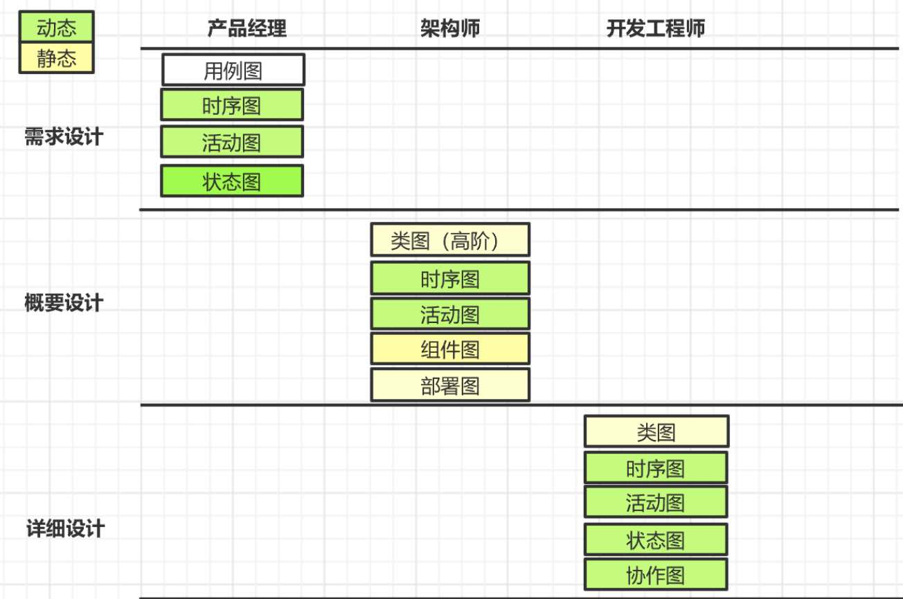

# 01周总结——架构方法

* [架构师](#架构师)
    * [角色](#角色)
      * [做架构设计、对系统架构负责的那个人](#做架构设计对系统架构负责的那个人)
      * [架构师无处不在](#架构师无处不在)
    * [分类](#分类)
      * [系统架构师](#系统架构师)
      * [业务架构师](#业务架构师)
    * [主要职责](#主要职责)
    * [核心知识产出](#核心知识产出)
      * [设计文档](#设计文档)
          * [4+1视图](#41视图)
    * [主要能力](#主要能力)
    * [架构的组成](#架构的组成)
    * [UML](#uml)
      * [静态视图](#静态视图)
      * [动态视图](#动态视图)
      * [7种主要视图对应软件开发的不同阶段](#7种主要视图对应软件开发的不同阶段)
* [胡言乱语](#胡言乱语)

## 架构师

### 角色

#### 做架构设计、对系统架构负责的那个人

#### 架构师无处不在

人人都是架构师
我们是自己生活的架构师

### 分类

#### 系统架构师
#### 业务架构师

### 主要职责

- 模块分解
- 编写架构设计文档
- 开发编程框架
- 重构软件代码
- 设计系统架构
- 进行技术选型，解决技术应用中的问题
- 优化系统性能
- 保障系统安全与高可用
- 技术创新
- 沟通管理

### 核心知识产出

#### 设计文档

##### 4+1视图

| 视图 | 用户   | 描述       |
| -------- | ---------- | -------------- |
| 逻辑视图 | 终端用户   | 功能性         |
| 过程视图 | 集成       | 性能、可伸缩性 |
| 开发视图 | 程序员     | 软件管理       |
| 物理视图 | 系统工程师 | 拓扑结构、通信 |
| 场景视图 |            |                |

### 主要能力

- 编程能力
- 基础技术的掌握能力
- 常用技术产品的理解和应用能力
- 性能优化和故障分析能力
- 常用架构模式和框架的理解和应用能力
- 建模及设计文档的方法和能力
- 业务理解与功能模块和非功能模块的理解和拆解能力
- 快速学习能力
- 沟通与领导力

### 架构的组成

- 元素

- 元素间关系

  - 架构视图
  - 系统相关方的关注点

- 表示工具——UML

- 画图的边界

  - 让相关方理解即可

  - 针对不同的相关方，使用不同的方式  ​	

### UML

对领域问题分析、抽象，完成建模，然后分析设计、抽象、开发、实现，完成系统

#### 静态视图

- 用例图
- 类图
- 组件图
- 部署图

#### 动态视图

- 时序图
  - 组件时序图
  - 系统时序图
  - 类时序图
- 活动图
  - 系统活动图
  - 组件活动图
  - 方法活动图
- 状态图

#### 7种主要视图对应软件开发的不同阶段

## 胡言乱语

用百度脑图，做了学习笔记，已经提交InfoQ写作平台。

下面是自己的感想。

整体感觉比较艰难啊，也许是离开学校太久了。虽然我每天都在学习，但自己学习的方式和训练营的方式差异还是比较大。

目前老师讲的也不难，语速不快，理论较多，听直播比较容易犯困！知识性的东西还好说，查缺补漏。可需要领悟性的、思想类的，就需要内化了。

拿到作业，可以说是字少事多，寥寥几行，认识每个字，却不知道该怎么做。。。分析题目提炼出要点，可还是没能构建出系统雏形，拼不出一个完整的场景。硬着头皮，提交了一份拼出来的文档，这对于有点完美情节的技术人来说，有点沮丧。宽慰自己，“如果我什么都知道，还来学什么？”

近两年我比较关心政治了，这和总结有啥关系？哎，这几天有点儿沮丧。我们天天牛气哄哄的淘宝、京东、微信、无现金化。。。电脑里除了吃喝玩乐是国产的，还有什么软件是国产的？就别提什么工业设计软件，什么理工科论文神器matlab。。。
