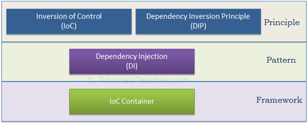

# IoC and DI

* [IoC](#ioc)
    * [编程思想的转变](#编程思想的转变)
* [DI](#di)
* [设计原则、设计模式、IoC 及 DI](#设计原则设计模式ioc-及-di)
* [参考](#参考)

## IoC 

Inversion of Control：控制反转，是一种设计思想，编程范式。设计好的对象交给容器，而不是使用者直接控制。

让我们来梳理一下以下几个问题：

- 谁控制谁？

  IoC容器控制

- 控制什么？

  IoC容器控制了对象的创建、生命周期和外部获取对象

- 为何说反转？

  传统应用程序中，客户端直接创建对象，对象直接获取依赖对象。现在是IoC容器接管了创建对象和注入依赖对象。

  

  
  
  
图片来源于网络

  

### 编程思想的转变

应用客户端原来是老大，想获取什么资源都是主动出击，但是在IoC和DI设计思想中，客户端得被动等待IoC容器创建和注入依赖资源。

IoC很好的体现了面向对象设计法则——好莱坞原则。即，IoC帮助对象找依赖对象并注入，而不是对象主动出击。

## DI

Dependency Injection 依赖注入：*被注入对象*依赖<u>IoC容器配置</u>*依赖对象*。目的是解耦合，提供一个灵活、可扩展的平台。

- 谁依赖谁？

  应用程序依赖IoC容器

- 为什么依赖？

  应用程序需要IoC容器帮助提供其需要的外部资源

- 谁注入谁？

  （？）IoC容器注入应用程序的某个对象（应用程序依赖的对象）

- 注入了什么？

  某个对象所需要的外部资源

  在系统运行中，**IoC动态的向某个对象提供它所依赖的对象，这是通过DI来实现的**

## 设计原则、设计模式、IoC 及 DI

依赖倒置DIP：依赖具体类变换为依赖抽象，是一种设计原则

控制反转IOC（inversion of control）：是DIP的一种实现方式，常用于构建框架

依赖注入DI：也是DIP的一种实现方式，类库设计的一种常用模式

IOC容器：是一种框架，包括IOC和DI功能

图片来源于tutorialsteacher

## 参考

[ IoC基础 ——跟我学Spring3](https://www.iteye.com/blog/jinnianshilongnian-1413846)

[tutorialsteacher](https://www.tutorialsteacher.com/ioc/introduction)
