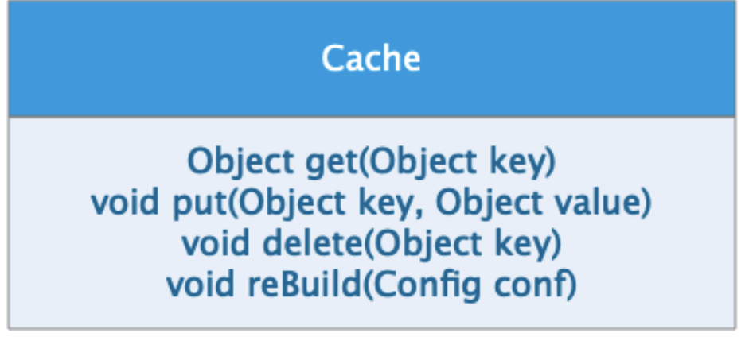

# 02周作业——面向对象设计原则

>- Depend upon Abstractions. Do not depend upon concretions.
>- Abstractions should not depend upon details. Details should depend upon abstractions.
>- High-level modules should not depend on low-level modules. Both should depend on abstractions.

1. 请描述什么是`依赖倒置原则`，为什么有时候`依赖倒置原则`又被称为`好莱坞原则`？

   - 依赖倒置原则 Dependency Inversion Principle：抽象不应该依赖于细节，细节应该依赖于抽象。高层模块不应依赖于低层模块，两者都应该依赖于抽象。

     传统软件设计的自顶向下的依赖关系结构，如图1。这种依赖结构导致任何底层的变化都会在高层产生波纹效应。为解决这个问题，**我们在较高层引入抽象接口来打破这种强依赖关系结构，降模块间的耦合度**，如图2。较高层依赖于抽象层而不是直接依赖较低层了，同时，较低层只要遵循抽象接口即可。在面向对象编程中，抽象层可以是接口（interface）或抽象类（abstract class）。

     > 解释一下所谓“反转”：本来是较高层模块依赖较低层模块，在较高层模块中加入抽象接口后，较低层模块依赖高层的抽象接口了。

   《贴图》

   - 好莱坞原则 Hollywood Principle：不要打电话给我们，我们会打电话给你。

     好莱坞原则主要是在说明，传统意义上，本来演员应该主动找导演，可实际上控制权反转了。用在编程领域，就是代码的控制流（调用/执行权）反转了（Inversion of Control）。这个原则的应用最常见的于用户界面交互。及大家熟悉的依赖注入（Dependency Injection) 也是IoC的一种常见实现方式。

     这个题目似乎更贴切的说，“为什么有时候控制反转又被称为好莱坞原则？”。参考 [wiki IoC 词条](https://en.wikipedia.org/wiki/Inversion_of_control)

   > 个人认为， IoC 是 DIP的一种表现形式，换句话说DIP是一个更大集合，IoC是子集。
   >
   > DIP的核心：**面向抽象接口编程，降低模块的耦合度**，使其易于复用、维护和扩展。

2. 请描述一个你熟悉的框架，是如何实现`依赖倒置原则`？

   这里我想要描述的是一个自己刚写的工具——轻量日志系统（虽然算不上框架）。刚学做 iOS 开发，为了容易入门，选用 Swift 编写。Objective-C 是比较成熟的语言，而基于Swift的日志库很少，但两者中都不能找到比较符合公司业务需求的。也参考了几个大厂（美团、腾讯）的日志系统，都是重量级，而且是基于Objective-C。必须自造轮子！

   依赖倒置原则在这个日志框架中的应用：面向应用的 Logger 使用关联的 xLogHandler，当需要添加新的日志处理器类时只需要遵循协议LogHandler即可，不需要更改使用Logger的地方。这里LogHandler是协议（swift 关键字 protocol），是抽象层，也就是Java等语言的接口。

   > 简单描述一下日志系统的需求：
   > 1. 需要有给开发人员调试使用的console log
   > 2. 需要有手机上持久化的file log （troubleshooting使用）
   > 3. 还需要有上传到服务器上用Elasticsearch 及工具监控查询的RS log
   
   - 创建/使用
   
   ```swift
   // 初始化logging system
   LoggerFactory.bootstrap(handlerType: .rsService, levelThreshold: .info)
   
   // 创建logger对象
   let logger = LoggerFactory.createLogger(category: .network)
   logger.i("log message")
   ```
   
   - 扩展
   
   ```swift
   public class ConsoleLogHandler: LogHandler {
     ...
   }
   ```

《贴图》

3. 请用`接口隔离原则`优化`Cache`类的设计，画出优化后的类图



接口隔离原则（Interface Segregation Principle）：没有client应该被强迫依赖于它不使用的方法。ISP拆分非常庞大臃肿的接口成为更小的和更具体的接口，这样client将会只需要知道他们感兴趣的方法。

根据ISP的优化是拆分`Cache`，请参考下图。

《贴图》