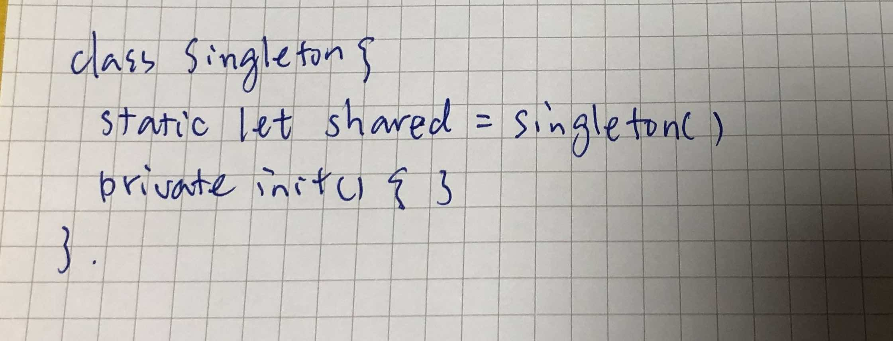
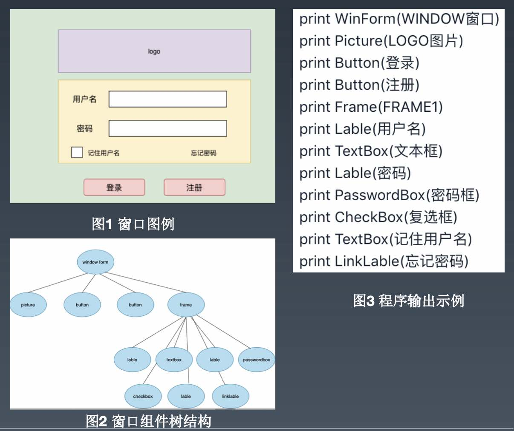
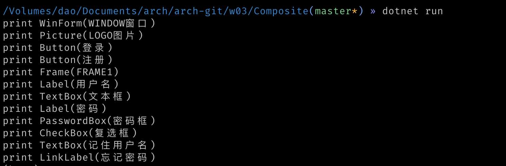

# 03周作业——设计模式

1. 请在草稿纸上手写一个单例模式的实现代码。

   保证系统中只产生Singleton的单一实例。实现方式分为`懒汉式`和`饿汉式`，需要考虑线程安全，可以使用语言的特性来实现。

   以下以`swift`来完成，实在是非常简单，构造函数私有化，类的属性自动实现*懒*初始化（swift语言特性）。

   

2. 请用组合模式编写程序，打印输出图1的窗口，窗口组件的树结构如图2所示。打印输出示例参考图3。

   

C#版的设计和实现如下：


- Component 抽象类

```c#
namespace arch.Composite
{
    using System;

    public abstract class Component
    {
        protected string name;

        public Component(string name)
        {
            this.name = name;
        }

        public abstract void Add(Component c);

        public abstract void Remove(Component c);

        public virtual void Print()
        {
            Console.WriteLine("print {0}", this.name);
        }
    }
}
```

- Container 类： 可以拆分成较多的容器类组建，比如Window, Frame, Panel 等，不一一写，统称Container

```c#
namespace arch.Composite
{
    using System;
    using System.Collections.Generic;

    /// <summary>
    /// Container Component: it can be Window, Frame, Panel ...
    /// </summary>
    public class Container : Component
    {
        private IList<Component> children = new List<Component>();

        public Container(string name) : base(name)
        { }

        public override void Add(Component c)
        {
            this.children.Add(c);
        }

        public override void Print()
        {
            Console.WriteLine("print {0}", this.name);
            foreach (var item in this.children)
            {
                item.Print();
            }
        }

        public override void Remove(Component c)
        {
            this.children.Remove(c);
        }
    }
}
```

- FormComponent 类：可以拆分成很多的单一组件，比如Button, Label, TextBox, CheckBox 等，不一一写，统称 FormComponent

```c#
namespace arch.Composite
{
    /// <summary>
    /// Form Component: it can be Button, Label, TextBox, CheckBox ...
    /// </summary>
    public class FormComponent : Component
    {
        public FormComponent(string name) : base(name)
        { }

        public override void Add(Component c)
        {
            throw new System.NotImplementedException();
        }

        public override void Remove(Component c)
        {
            throw new System.NotImplementedException();
        }
    }
}
```

- 输出结果

  

> [详细代码](https://github.com/hdouhua/arch/tree/master/w03/Composite)
