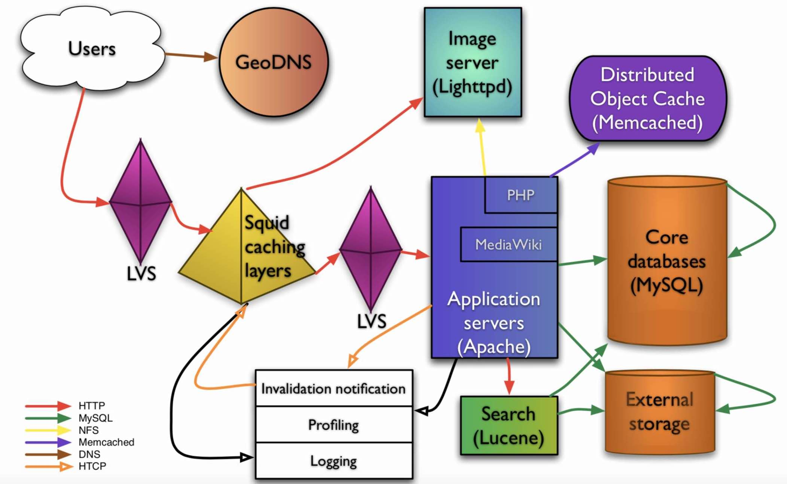

# 04周作业——互联网系统架构

## 1. 一个典型的大型互联网应用系统使用了哪些技术方案和手段，主要解决什么问题？请举例描述。

>互联网应用从单机部署到集群部署，需要很好的分层、分割、业务拆分，模块化开发、部署。得以面对高并发、大流量的访问，提供安全、快速响应、高可用的服务，存储及处理海量的用户数据。同时系统要易于维护和扩展，才能够面对快速拓展的业务和频繁变更的需求。
>
>大型互联网的应用架构可以如图1，也可以如图2

图1 - 复杂的

图2 - 较简单实用的

### 技术架构模式

- 分布式、集群化
  
  系统的横向扩展

- 缓存

  将数据存放在距离计算最近的位置以加快处理速度。

  ——改善软件性能的第一手段！

- 异步

  ——系统解耦的重要手段！
  
  - 提高系统可用性
  - 加快网站响应速度
  - 消除并发访问高峰

- 冗余

  保证在服务器宕机的情况下网站亦然可以继续服务，

- 自动化

  保证系统在无人值守的情况下可以正常运行。目前自动化架构设计主要集中于运维方面。

- 安全

  互联网的开放特性使得其面对巨大的安全挑战。

### 技术架构概览

- 前端架构

  - App 及 Web 开发技术
  
  - 浏览器及HTTP优化技术
  
  - CDN
  
  - 动静分离
  
  - 图片服务
  
  - 反向代理
  
  - DNS

- 网关及应用层架构

  - 网关架构
  - 负载均衡
  - 动态页面静态化
  - 业务拆分

- 服务层架构

  - 微服务框架
  - 分布式消息队列
  - 分布式缓存
  - 分布式一致性服务

- 存储层架构

  - 分布式文件
  - 分布式关系数据库
  - NoSQL数据库

- 后台架构

  - 大数据平台
  - 搜索引擎
  - 推荐引擎
  - 数据仓库

- 运维与安全

  - 数据采集与展示
  - 数据监控与报警
  - 攻击与防护
  - 数据加密和解密

- 数据中心机房架构

  - 托管数据中心、自建数据中心、云计算数据中心
  - 三层架构
  - 二层架构

这道题认真、细致的回答可以写一本书 :)
