# 04周总结

## 系统架构

本课时的信息量很大，写这份总结，也算是回顾了互联网技术演进的这几十年！

### 互联网系统面临的挑战？

- 高并发，大流量

  因高并发，所以需要

  - 高性能
  - 高可用

- 高可用

- 海量数据

  需要存储和管理海量数据

- 用户分布广泛，网络情况复杂

  海外数据中心

- 安全环境恶劣

  互联网攻击和数据泄露

- 需求快速变更，需要频繁发布

- 渐进式发展

  不同于传统软件产品、或企业应用系统，可以一开始就规划好全部功能和非功能需求

  几乎所有的大型互联网站都是从一个小网站开始，渐进发展而来

### 应对高并发挑战的两个技术方向

#### 垂直伸缩

指通过升级硬件和网络吞吐能力来实现伸缩。

其不需要改变应用架构，是一种简单、快速实施的短期伸缩性方案。

- 方法
  - 使用RAID（独立冗余磁盘阵列）增加I/O吞吐能力
  - 使用SSD（固态硬盘）改善I/O访问速度
  - 增加内存来减少I/O操作
  - 升级网络接口或者增加网络接口，以提高网络吞吐能力
  - 更新服务器以使用更多处理器或者更多超线程

- 缺点

  - 达到某个程度后，增加计算能力需要更多的花费

  - 有物理极限

  - 软件极限：受限于操作系统的设计或者应用自身的制约

#### 水平伸缩

指通过增加服务器来提升计算能力的一类架构方法。

——伸缩性的圣杯！

- 可以克服垂直伸缩带来的单位计算成本随计算能力增加而迅速飙升的问题。
- 总是可以增加更多服务器，克服了垂直伸缩受限于单台服务器的物理极限的问题。

### 互联网架构演进

0. 零阶段 。。。
单机版：应用+数据

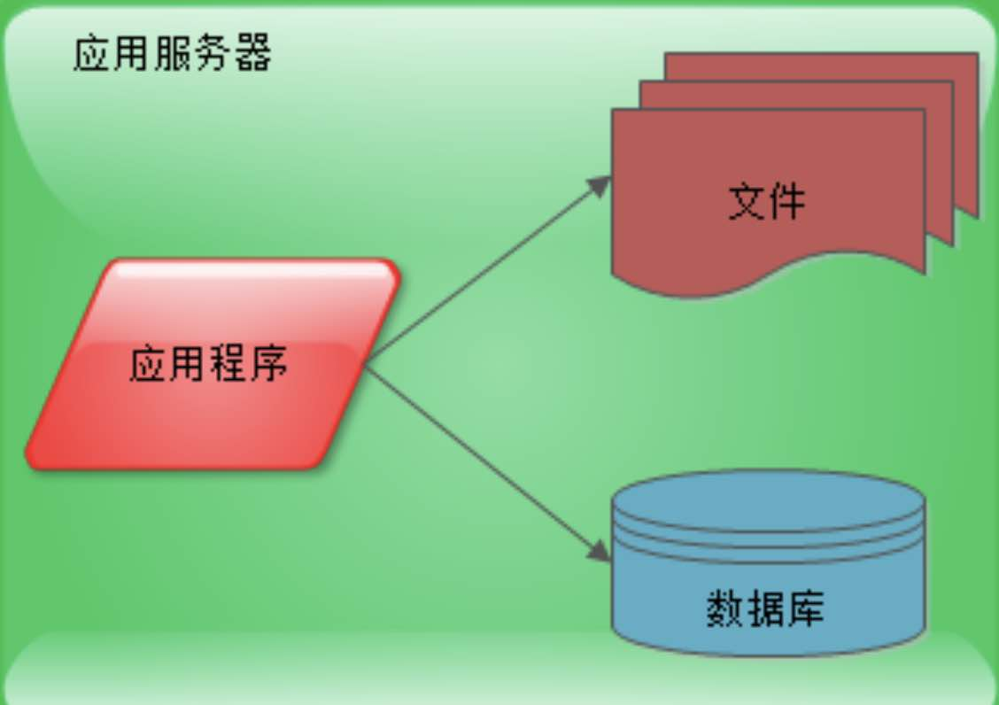

1. 应用和数据分离

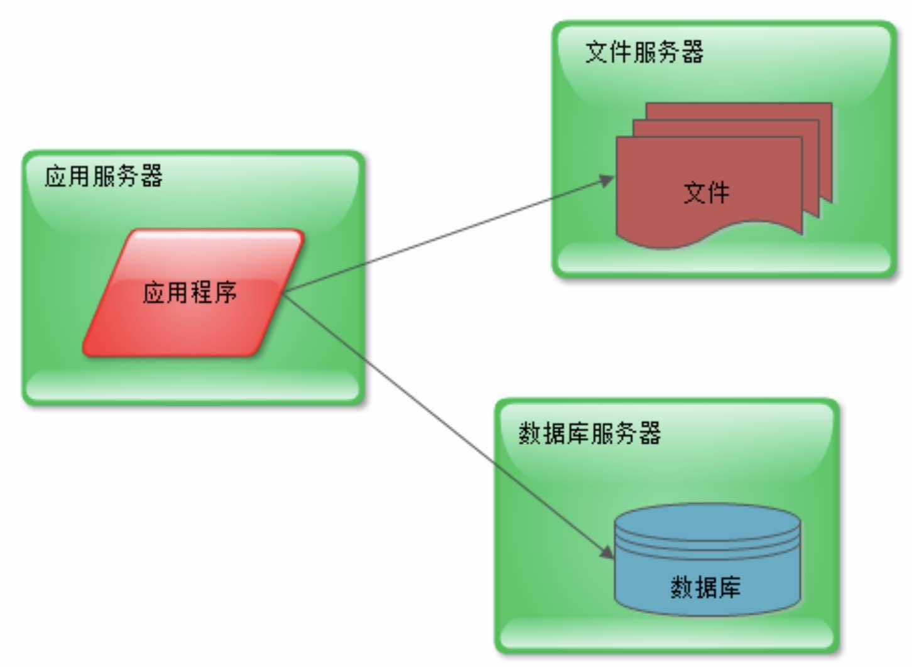

2. 引入缓存

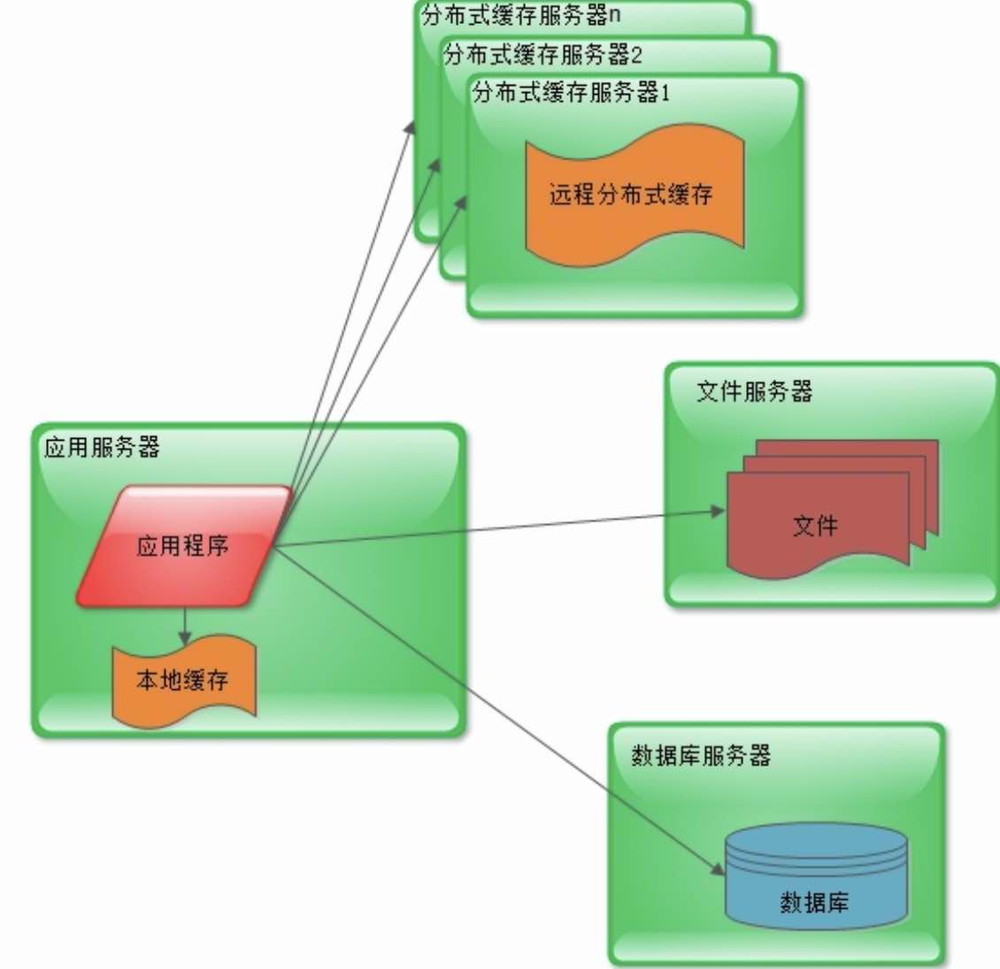

3. 应用服务器集群

改善系统的并发处理能力

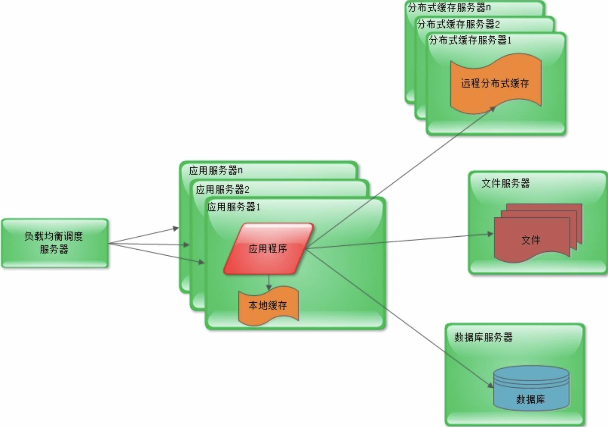

4. 数据库读写分离

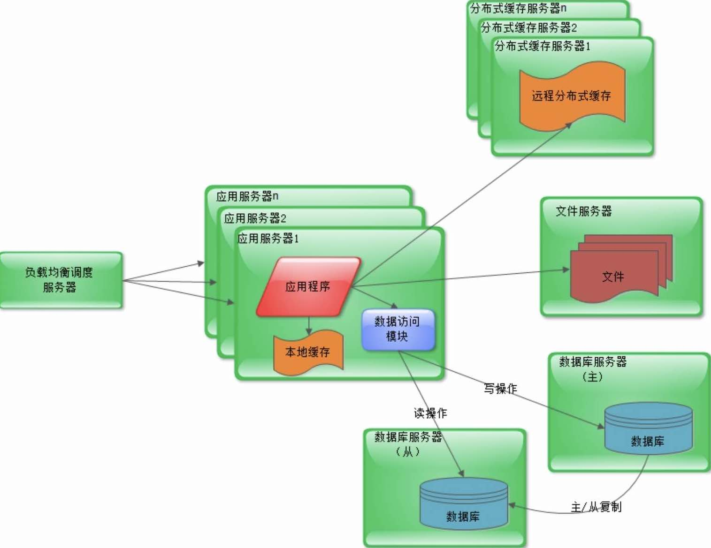

5. 反向代理 + CDN

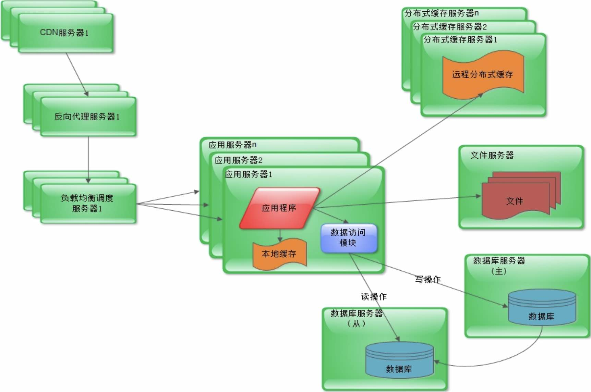

6. 分布式文件系统 + 分布式数据库

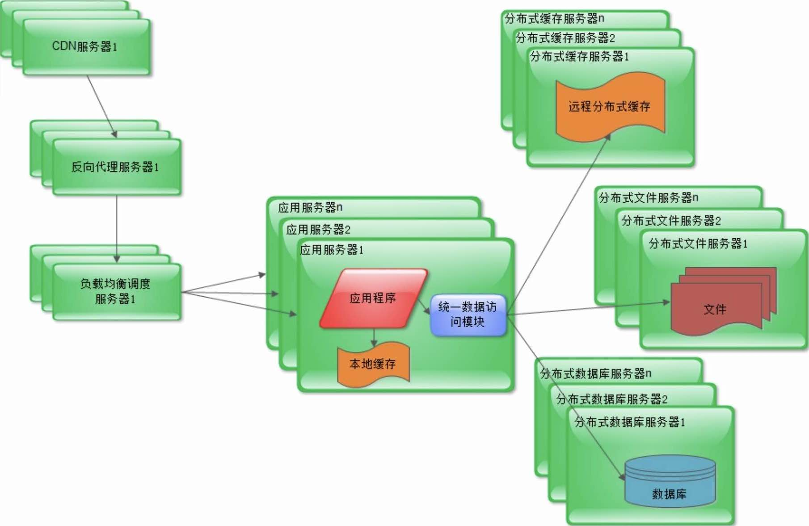

7. NoSQL + 搜索引擎

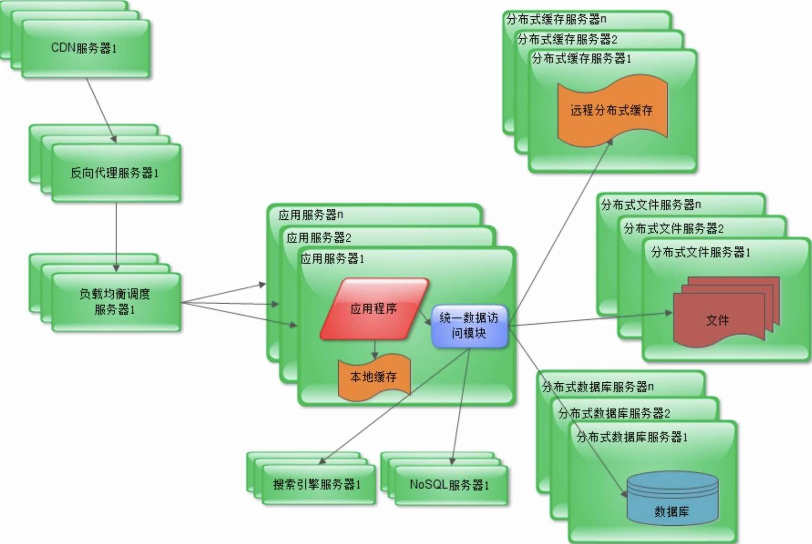

8. 业务拆分

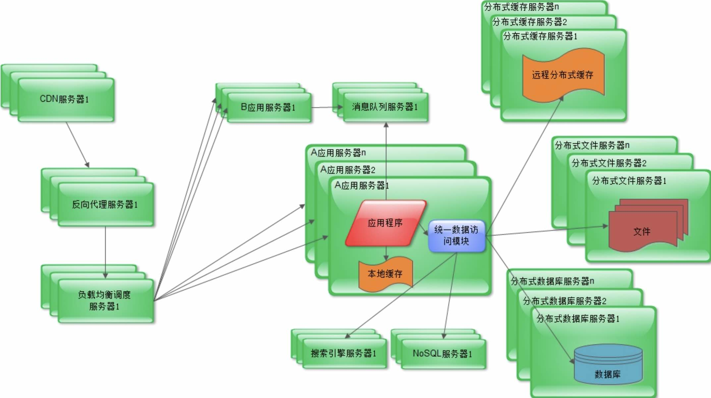

9. 微服务 + 中台化

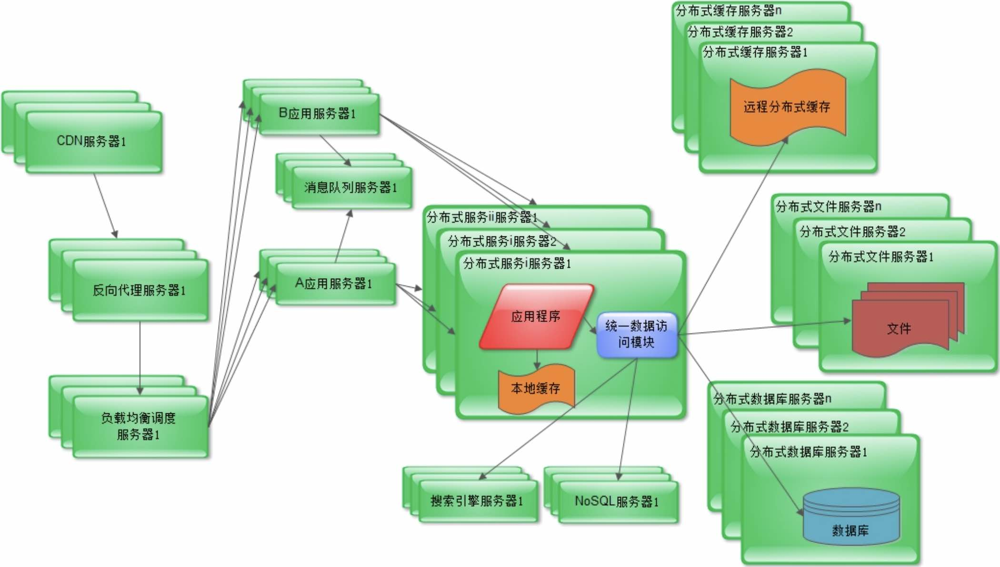

10. 待定义。。。

### 互联网架构模式

模式描述了在我们周围不断重复发生的问题，以及该问题解决方案的核心。

模式的关键在于**可重复性**，问题与场景的可重复性带来解决方案的可重复使用。

互联网架构模式：试图去描述为解决互联网系统高性能、高可用、易扩展、可伸缩、安全等目标，被很多互联网应用重复使用的一些解决方案。

#### 一些常见的架构模式

##### 分层

最常见的一种架构模式。

将系统**横向**维度上切分几个部分，每个部分负责一部分相对单一的职责，然后通过上层对下层依赖调用组成一个完整的系统。

##### 分割

将系统**纵向**维度上切分。按不同功能和不同服务把系统分割开来，然后包装成高内聚低耦合的模块。

有利于软件的开发和维护，也便于不同模块的分布式部署。

##### 分布式

分层和分割其主要目的都是为了分布式部署。将分成和分割后生成的模块部署到不同的服务器，通过远程调用协同工作。

分布式意味着提高了计算能力，能处理的更多的并发访问和数据量。

- 分布式应用和服务
- 分布式静态资源
- 分布式数据和存储
- 分布式计算

##### 集群

服务器集群化。分布式部署后，部署相同应用的多台服务器构成一个集群，通过负载均衡设备共同对外提供服务。

> 分层、分割是为了模块化  
> 模块化是为了分布式部署  
> 部署同一应用的多台服务器形成集群

##### 缓存

将数据存放在距离计算最近的位置以加快处理速度。

——改善软件性能的第一手段！

- CDN
- 反向代理
- 本地缓存
- 远程缓存

##### 异步

计算机软件发展的重要目标和驱动力——降低软件耦合性。

——系统解耦的重要手段！

- 提高系统可用性
- 加快网站响应速度
- 消除并发访问高峰

##### 冗余

保证在服务器宕机的情况下网站亦然可以继续服务，数据不会丢失，就需要一定程度的服务器冗余运行，数据的冗余备份。

##### 自动化

在无人值守的情况下可以正常运行。

目前自动化架构设计主要集中于运维方面。

##### 安全

互联网的开放特性使得其面对巨大的安全挑战。

- 身份认证
- 网络通信加密
- 敏感数据加密存储
- 验证码识别防止机器人攻击
- XSS
- SQL注入
- 编码转换
- 垃圾信息过滤

### 互联网系统架构的核心要素

#### 衡量指标

- 高性能

  任何架构设计方案都必须考虑可能带来的性能问题！

- 高可用

  主要手段就是冗余。

- 可伸缩

  衡量架构伸缩性的主要标准

  - 是否可以用多台服务器构建集群
  - 是否容易向集群添加新的服务器
  - 加入新的服务器后是否可以提供和原来的服务器无差别的服务
  - 集群中容纳的总服务器是否有限制

- 可扩展

  扩展性架构直接关注系统的功能需求。互联网应用快速发展，功能不断扩展，可扩展架构使其能够快速响应需求变更。

  衡量架构扩展性的主要标准

  - 增加新业务产品时，是否可以不改动或很少改动既有业务功能就可以上线新产品

  - 一个产品改动对其他产品和功能是否无影响

  主要手段

  - 事件驱动架构
  - 分布式架构

- 安全

  衡量系统安全架构的主要标准：针对现存和潜在的攻击和窃密手段，是否有可靠的应对策略

### 互联网架构技术一览

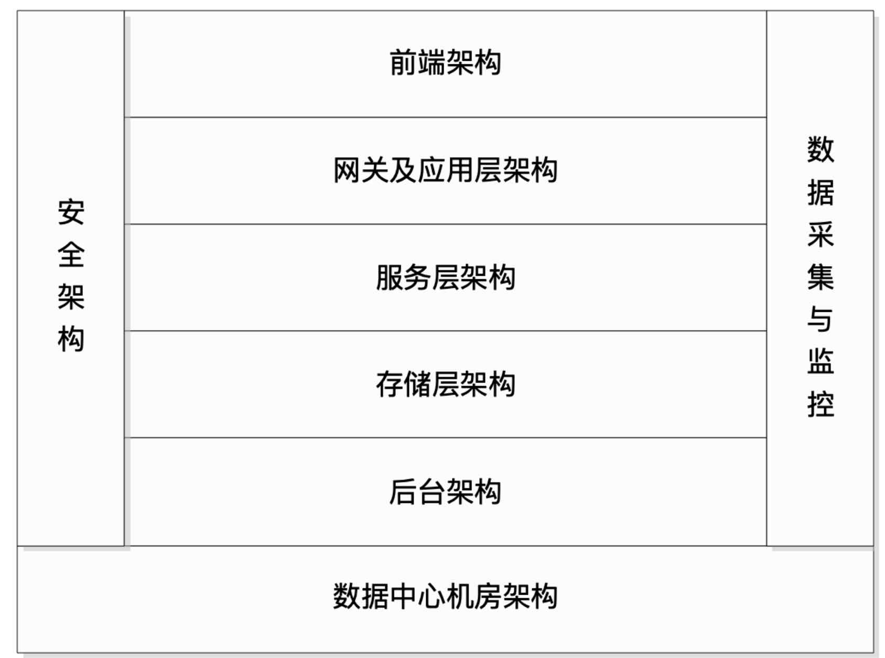

#### 前端架构

- App 及 Web 开发技术

- 浏览器及HTTP优化技术

- CDN

- 动静分离

- 图片服务

- 反向代理

- DNS

#### 网关及应用层架构

- 网关架构
- 负载均衡
- 动态页面静态化
- 业务拆分

#### 服务层架构

- 微服务框架
- 分布式消息队列
- 分布式缓存
- 分布式一致性服务

#### 存储层架构

- 分布式文件
- 分布式关系数据库
- NoSQL数据库

#### 后台架构

- 大数据平台
- 搜索引擎
- 推荐引擎
- 数据仓库

#### 运维与安全

- 数据采集与展示
- 数据监控与报警
- 攻击与防护
- 数据加密和解密

#### 数据中心机房架构

TBD

### 案例分析

#### wiki技术架构

我们在分析的是全球第6大网站 :) ——使用较简单的技术架构也可以支撑起这样的访问量！

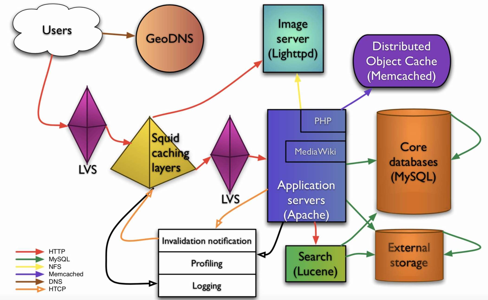

#### 淘宝早期技术架构演进

进阶阅读《淘宝技术这十年》

#### 初创互联网公司技术架构

介绍了宅米技术架构演进

### 推荐书籍

《大型网站技术架构》

