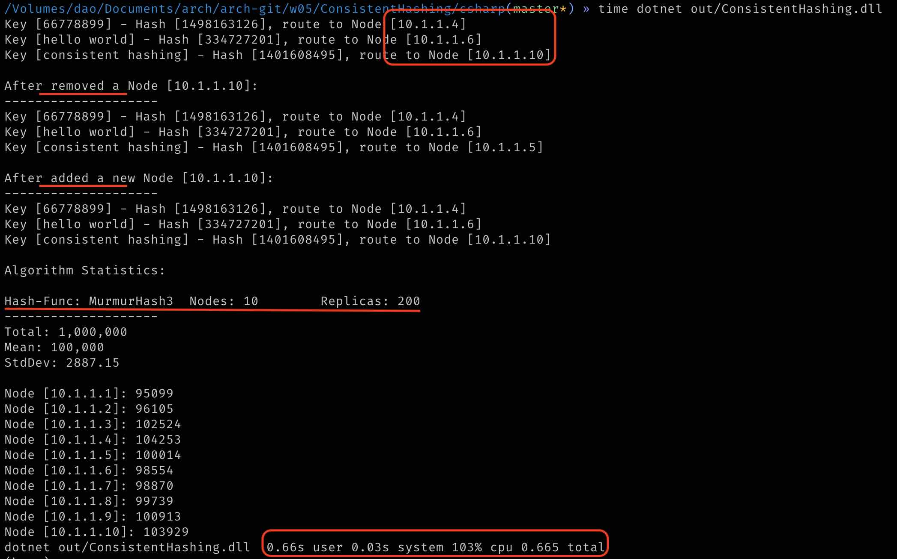

# 05周作业—技术选型能力

### 1. 用你熟悉的编程语言实现一致性hash算法。

  >一致性hash解决普通hash求余算法添加或者删除机器（节点）之后造成大量的对象存储位置失效。如果这个场景发生于缓存应用，那么添加/删除服务节点，可能造成缓存雪崩。
  >
  >一致性hash引入虚拟节点来保持平衡性（防止数据倾斜），因为有更多的节点离散在hash环上
  >
  >采取了 32bit hash 算法，大约可以容乃40亿(2^32-1)个键
  >
  >作业以csharp编写


>以下是老师的解答
>
>- 为什么用？
>
>  一致性hash是分布式缓存中为了解决当集群中服务器扩容时，数据访问的不一致。因为普通hash算法被除数发生变化了，这会导致缓存雪崩。
>
>- 如何实现？
>
>  建立一个有（2^32-1）个节点的环，将服务器节点若干个虚拟节点的hash值放到环上，将要计算的值的key的hash值也放到环上，然后沿着顺时针查找离它最近的虚拟节点就是它要放到的服务器。
>
>  

- 一致性 hash 算法

```c#
public class ConsistentHash<T> where T : class
{
    private readonly IHash _hashFunc;
    private readonly SortedDictionary<uint, T> _hashRing;
    private uint[] _sortedKeys = null;
    private readonly int _numberOfReplicas;

    public ConsistentHash(IHash hashFunc, int numberOfReplicas, List<T> nodes)
    {
        this._hashFunc = hashFunc;
        this._numberOfReplicas = numberOfReplicas;

        this._hashRing = new SortedDictionary<uint, T>();

        if (nodes != null)
        {
            foreach (var s in nodes)
            {
                this.AddToRing(s, false);
            }

            this._sortedKeys = this._hashRing.Keys.ToArray();
        }
    }

    public void AddToRing(T node, bool updateKeys = true)
    {
        for (int i = 0; i < _numberOfReplicas; i++)
        {
            uint hash = this._hashFunc.ToHash32(CombineId(node.ToString(), i));
            this._hashRing.Add(hash, node);
        }

        if (updateKeys)
        {
            this._sortedKeys = this._hashRing.Keys.ToArray();
        }
    }

    public void RemoveFromRing(T node)
    {
        for (int i = 0; i < _numberOfReplicas; i++)
        {
            uint hash = this._hashFunc.ToHash32(CombineId(node.ToString(), i));
            this._hashRing.Remove(hash);
        }

        this._sortedKeys = this._hashRing.Keys.ToArray();
    }

    public T GetNode(String key)
    {
        if (this._hashRing.Count == 0)
        {
            return null;
        }

        uint hash = this._hashFunc.ToHash32(key);

        // too slow ...
        // if (!this._hashRing.ContainsKey(hash))
        // {
        //     var tail = this._hashRing.Keys.FirstOrDefault(x => x >= hash);
        //     hash = tail == 0 ? this._hashRing.Keys.First() : tail;
        // }
        // switch to bisect
        uint first = BisectLeft(this._sortedKeys, hash);

        return this._hashRing[this._sortedKeys[first]];
    }

    //...

}
```

- 可选 hash 算法

```c#
public interface IHash
{
    public uint ToHash32(string toHash);
}

public class MD5Hash : IHash
{
    public uint ToHash32(string toHash)
    {
        // ...
    }

    public override string ToString()
    {
        return "MD5";
    }
}

public class MurmurHash3 : IHash
{
    // ...
}

public class FNVHash : IHash
{
    // ...
}

```

### 2. 编写测试用例测试这个算法，测试100万KV数据，10个服务器节点的情况下，计算这些KV数据在服务器上分布数量的标准差，以评估算法的存储负载不均衡性。

- 测试代码

```c#
class Program
{
    const int ItemCount = 100_0000;
    const int NumberOfNodes = 10;
    const int NumberOfReplicas = 200;

    static void Main(string[] args)
    {
        var nodes = new List<Node>();
        for (int i = 1; i <= NumberOfNodes; i++)
        {
            nodes.Add(new Node($"10.1.1.{i}"));
        }

        var serverCluster = new ConsistentHash<Node>(new MurmurHash3(4049661204), NumberOfReplicas, nodes);

        TestAddOrRemove(serverCluster);

        Statistics(nodes, serverCluster);
    }
    
    private static void TestAddOrRemove(ConsistentHash<Node> cluster)
    {
        var keys = new[] { "66778899", "hello world", "consistent hashing" };
        cluster.FindNode(keys);

        var newNode = new Node($"10.1.1.{NumberOfNodes + 1}");
        cluster.AddToRing(newNode);
        Console.WriteLine($"\nAfter added a new Node [{newNode}]:\n--------------------");
        cluster.FindNode(keys);

        cluster.RemoveFromRing(newNode);
        Console.WriteLine($"\nAfter removed a Node [{newNode}]:\n--------------------");
        cluster.FindNode(keys);
    }

    private static void Statistics(IList<Node> nodes, ConsistentHash<Node> cluster)
    {
        var statDict = new Dictionary<String, int>();
        foreach (var n in nodes)
        {
            statDict.Add(n.IP, 0);
        }

        for (int i = 0; i < ItemCount; i++)
        {
            var node = cluster.GetNode($"key_{i}");
            statDict[node.IP] += 1;
        }

        var mean = statDict.Values.Average();
        var std = statDict.Values.StdDev();

        Console.WriteLine(@$"
Algorithm Statistics:

{cluster.ToString()}
--------------------
Total: {ItemCount:N0}
Mean: {mean:N0}
StdDev: {std:F2}
");

        foreach (var (k, v) in statDict)
        {
            Console.WriteLine("Node [{0}]: {1}", k, v);
        }
    }

    //...

}
```

- 代码运行结果
  - 本测试结果基于 MurmurHash3 计算，使用了指定的seed
  - 测试运行结果与预期一致
    - 键的 hash 算法结果稳定
    - 键较均衡地分散在 hash 环上
    - 增加/删除节点，原有的键位置保持或分散到新的节点
    - 执行速度快，算法性能可接受




### 完整源代码，请移步[这里](./ConsistentHashing/)


### 参考

- 一致性hash算法参考

  - [consistent hashing](http://tom-e-white.com/2007/11/consistent-hashing.html)
  - [system design interview - consistent hashing](https://www.acodersjourney.com/system-design-interview-consistent-hashing/)

- Hash算法参考

  - [MurmurHash](https://en.wikipedia.org/wiki/MurmurHash)
  - [Flower-Noll-Vo Hash](https://en.wikipedia.org/wiki/Fowler–Noll–Vo_hash_function)
  - 更多hash算法，请参考[Data.HashFunction](https://github.com/brandondahler/Data.HashFunction)

- 标准差

  - 在这里提示一下，标准差公式的分母是n，而样本标准差的分母一般使用 (n-1)，因为强调的样本选择自由度。我们测试中样本数量较少（真实节点数），因此使用分母n来计算标准差
  - [标准差公式 @baike](https://baike.baidu.com/item/%E6%A0%87%E5%87%86%E5%B7%AE%E5%85%AC%E5%BC%8F)
  - [标准差 @wiki](https://zh.wikipedia.org/wiki/%E6%A8%99%E6%BA%96%E5%B7%AE)
