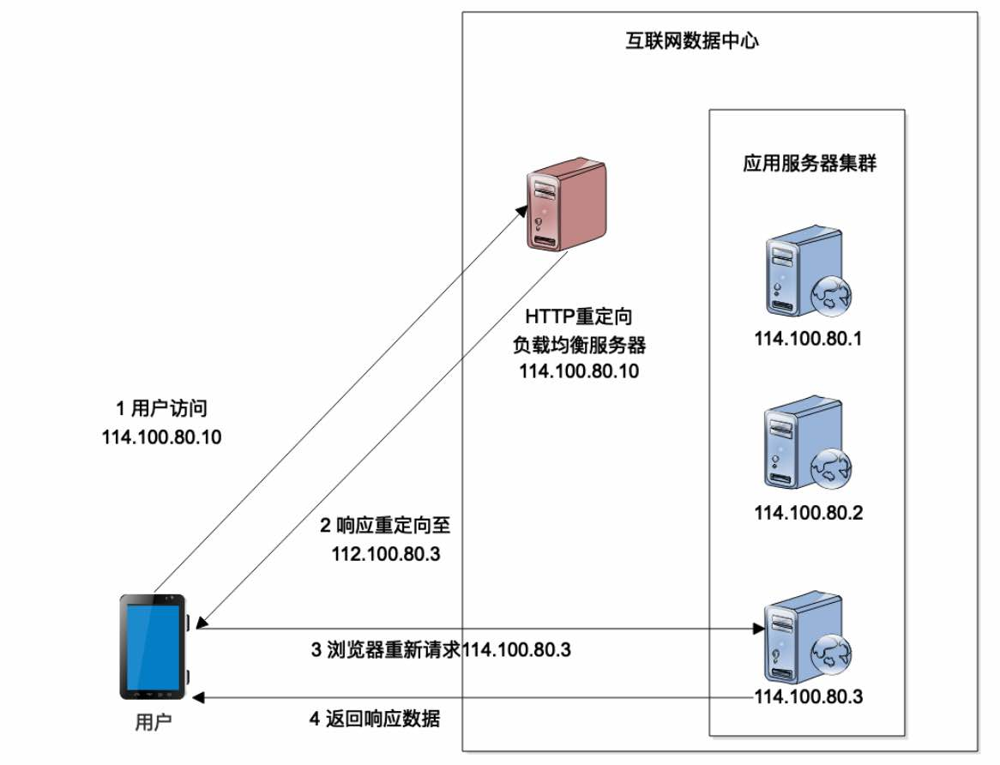

# 05周总结——技术选型1

* [分布式缓存架构](#分布式缓存架构)
    * [无处不在的缓存](#无处不在的缓存)
    * [缓存的关键指标](#缓存的关键指标)
      * [缓存命中率](#缓存命中率)
      * [影响缓存命中率的因素](#影响缓存命中率的因素)
    * [通读缓存 read-through](#通读缓存-read-through)
    * [旁路缓存 cache-aside](#旁路缓存-cache-aside)
    * [本地对象缓存](#本地对象缓存)
    * [本地/远程对象缓存构建分布式集群](#本地远程对象缓存构建分布式集群)
      * [分布式对象缓存的一致性hash算法](#分布式对象缓存的一致性hash算法)
    * [各种介质的数据访问延迟](#各种介质的数据访问延迟)
    * [技术栈各层次的缓存](#技术栈各层次的缓存)
      * [缓存为什么能显著提高性能](#缓存为什么能显著提高性能)
      * [缓存是系统性能优化的大杀器](#缓存是系统性能优化的大杀器)
      * [合理使用缓存](#合理使用缓存)
* [消息队列与异步架构](#消息队列与异步架构)
    * [消息队列构建异步调用架构](#消息队列构建异步调用架构)
    * [消息队列模型](#消息队列模型)
    * [优点](#优点)
    * [主要MQ产品](#主要mq产品)
* [负载均衡架构](#负载均衡架构)
    * [负载均衡算法](#负载均衡算法)
    * [应用服务器集群的 session 管理](#应用服务器集群的-session-管理)
* [分布式数据库](#分布式数据库)
    * [MySQL主从架构](#mysql主从架构)
      * [复制主意事项](#复制主意事项)
* [推荐书籍](#推荐书籍)

## 分布式缓存架构

介于数据访问者和数据源之间的一种高速存储，当数据需要多次读取的时候，用于加快读取的速度。

缓存cache vs 缓冲buffer ？

- 两者都是解决读写速度不匹配问题

- 区别

  - cache的目标数据始终有效，主要目的是减少数据被重复读取时的开销

  - buffer的数据则是实时生成的数据流

  - cache是为了提高性能而产生，buffer的目的不是为了提高性能

### 无处不在的缓存

- CPU 缓存
- 操作系统缓存
- 数据库缓存
- 编译缓存
- CDN缓存
- 代理与反向代理缓存
- 应用程序缓存
- 分布式对象缓存

### 缓存的关键指标

#### 缓存命中率

查询一个缓存，十次查询有九次能够得到正确结果，那么它的命中率是90%

缓存是否有效，依赖于能多少次重用同一缓存响应业务请求

#### 影响缓存命中率的因素

- 缓存键集合大小

  定位缓存对象的唯一方式就是对缓存键进行精确匹配。唯一键越多，重用的机会越小，因此我们要尽量减少缓存键

- 缓存可使用内存空间

  因为缓存通常存储在内存中，缓存可使用内存空间直接决定了缓存对象的平均大小和缓存对象数量。能缓存的对象越多，缓存命中率就越高

- 缓存对象生存时间TTL

  缓存对象的生存时间由业务场景决定。对象缓存的时间越长，被重用的可能性就越高。

### 通读缓存 read-through

通读缓存给客户端返回缓存资源，并在请求未命中缓存时获取实际数据

客户端连接的是通读缓存，而不是生成响应的原始服务器

代理缓存、反向代理缓存、CDN缓存都是通读缓存

### 旁路缓存 cache-aside

对象缓存是一种旁路缓存，通常是独立的键值对存储

应用代码通常会询问对象缓存需要的对象是否存在，如果存在，使用其；如果不存在或已过期，应用会连接主数据源来组装对象，并起将其保存回对象缓存，以便将来使用。

### 本地对象缓存

对象直接存储在应用程序内存中

对象存储在共享内存，同一台机器的多个进程可以访问它

缓存服务器作为独立的应用和应用程序部署在同一个服务器上

### 本地/远程对象缓存构建分布式集群

#### 分布式对象缓存的一致性hash算法

衡量一致性hash算法的几个标准：

- 平衡性balance
- 单调性monotonicity
- 分散性spread
- 负载性load

### 各种介质的数据访问延迟

### 技术栈各层次的缓存

#### 缓存为什么能显著提高性能

- 缓存数据通常来自内存
- 缓存存储了数据的最终结果形态，不需要中间计算，减少了CPU资源消耗
- 缓存降低了数据库、磁盘、网络的负载压力

#### 缓存是系统性能优化的大杀器

- 技术简单
- 性能提升显著
- 应用场景多

#### 合理使用缓存

不合理的使用缓存非但不能提高系统的性能，还会成为系统的累赘，甚至风险。

- 频繁修改的数据

  缓存这种数据徒增系统的负担。一般来说读写比在2:1以上，缓存才有意义

- 没有热点的访问

  应用程序访问缓存数据没有热点，不遵循二八定律，大部分数据访问不是集中在小部分数据上，即大部分数据还没有被再次访问就被挤出缓存了。

- 数据不一致和脏读

  - 对缓存数据设置失效时间，在缓存失效前，应用需要忍受一定时间的数据不一致。

  - 数据更新时立即更新缓存，会带来更多的系统开销和事务一致性问题
  - 数据更新时通知缓存失效，删除该缓存数据

- 缓存雪崩

  缓存承担了大部分的数据访问压力，数据库已经习惯了有缓存的日子，当缓存服务崩溃时，数据库会因为完全不能承受如此巨大的压力而宕机，进而导致整个网站不可用。发生这种故障时，甚至不能简单重启缓存服务器和数据库来恢复网站访问。

- 缓存预热 warm up

  缓存中存放的都是热点数据，热点数据可能是通过LRU算法计算出来的，这个过程可能要花费较长的时间，这段时间系统性能和数据库负载都不好，最好的做法是缓存系统启动时就把热点数据加载好。尤其是一些元数据。

- 缓存穿透

  不恰当的业务、或者恶意攻击持续高并发的请求某个不存在的数据，因为缓存没有保存该数据，所有的请求都会落到数据库上，会对数据库造成很大的压力，甚至崩溃。一个简单的对策是将不存在的数据也缓存起来（比如值设为null），并设置一个较短的失效时间。

## 消息队列与异步架构

> 缓存提高系统的读能力，消息队列提升系统的写能力
>
>同步调用 vs 异步调用
>

### 消息队列构建异步调用架构

- 消息生产者
- 消息队列
- 消息消费者

### 消息队列模型

- 点对点模型

- 发布订阅模型

### 优点

- 实现异步处理，提升处理性能

- 更好的伸缩性

- 削峰填谷

- 失败隔离

  - 因发布者不直接依赖消费者，所以消息系统可以将消费者系统错误与生产者系统组建隔离。

  - 也因为此，任何时刻，我们可以对后端服务执行维护和发布操作，如重启、添加、删除服务器，而不影响生产者的可用性。——简化了部署和服务管理的难度
  
- 解耦

  - 减少耦合表面积
    

### 主要MQ产品

- RabbitMQ

  - 性能好，社区活跃

  - erlang 开发，不便于二次开发和维护
  - 用户量49M（主要指开发者选择及社区活跃度）

- ActiveMQ

  - 影响广泛，跨平台
  - java开发，比较友好
  - 用户量27M

- RocketMQ

  - 性能好，可靠性比较高
  - 阿里开源产品，java开发
  - 用户量35M

- Kafka

  - 专门针对分布式场景进行了优化，分布式伸缩性比较好
  - LinkedIn出品，scala 开发
  - 用户量63M

>当我们的开发者对这几个产品都不熟悉，那我们可以参考一下**用户量**指标

## 负载均衡架构

- HTTP重定向负载均衡

  - 缺点：每次请求需要重定向

- DNS负载均衡

  - 缺点：每次请求需要域名解析，但是浏览器有本地域名缓存

- 反向代理负载均衡

- IP负载均衡

  - 三层负载均衡
  - 负载均衡服务器修改了目标IP地址
  - 缺点：用户请求和响应数据包都需要经过负载均衡服务器，因此负载均衡的负载受制于响应的出口带宽

- 数据链路层负载均衡

  - 二层负载均衡
  - 与IP负载均衡相似，只是响应的数据包不经过负载均衡服务器。实现方式是把上面的修改目标IP地址改为修改目标的MAC地址。
  - 目前大型网站主要的负载均衡方案
  - LVS可以支持IP负载均衡和数据链路层负载均衡

### 负载均衡算法

- 轮询
- 加权轮询
- 随机：简单实用，随机本身也就意味着均衡
- 最少连接：最符合负载均衡定义的算法
- 源地址散列：根据请求来源的IP地址进行hash计算，得到应用服务器，保证同一来源的请求总在同一台服务器上处理

### 应用服务器集群的 session 管理

- sesion 复制

  session在应用服务器集群间复制同步

- session 绑定

  终端用户与某一台具体的应用服务器绑定，ip绑定

- 利用cookie记录session

  与session绑定类似，但是使用cookie绑定

- session 服务器

  搭建集中式共享的session服务器集群

## 分布式数据库

### MySQL主从架构

> 我们以MySQL为例，解释数据库如何实现主从复制
>
> 主库上把DDL和DML记录到binlog，然后由专用线程同步binlog到从数据库relaylog
>
> 实际应用中，一般会关闭主数据库的DDL同步，不同步DDL到从数据库

- 主从复制/一主多从复制

  - 优势

    - 分摊负载

    - 专机专用

    - 便于冷备

    - 高可用

- 主主复制
  
  - 保证主服务器宕机时数据库的高可用
  

- 主主失效恢复/维护过程

#### 复制主意事项

- 主主复制两个数据库不能并发写入

- 复制只增加了数据库的读并发能力，没有增加写并发能力和存储能力

- 更新表结构会导致巨大的同步延迟

## 推荐书籍

《互联网创业核心技术——构建可伸缩的Web应用》
