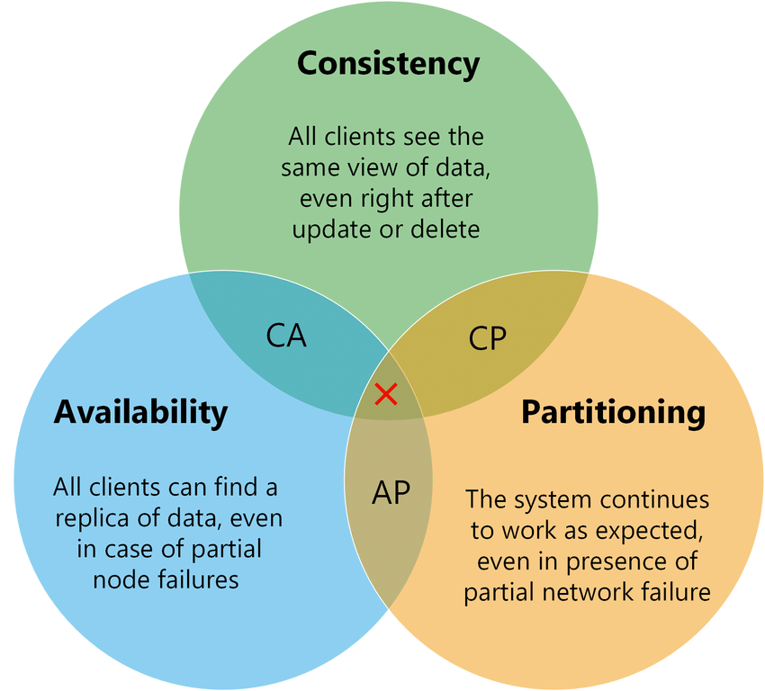

# 06周作业——技术选型能力2

## 请简述CAP原理

CAP原理是分布式系统设计的三个高度抽象化的约束。简单解释就是分布式计算系统，当涉及读写操作时，不可能**同时**满足C、A、P三个设计约束——不可能三角。

CAP关注的粒度是数据，不是整个系统。

- Consistency一致性：一个成功的写入操作后，所有的读取请求都必须能读取到这个新数据或者返回一个错误。强调数据的正确性。
- Avaliability可用性：每次请求都应该得到一个响应，而不是返回一个错误或者失去响应。强调服务的可用性，不保证数据的正确性。

- Partition tolerance分区容错性：系统中任一节点或多个节点故障，系统仍是可操作的。强调集群对分区故障的容错能力。

  
  
图片来源网络

在实际应用中，我们需要在三者之间权衡，就是策略选择，三者两两组合，那么有以下几种模式：

- CA

  分布式系统需要维持水平扩展的集群化，就离不开网络分区，而节点间的分区故障又是必然发生的，也就是分区容错性P是分布式系统必须保证的。

  舍弃了网络分区，就相当于舍弃了分布式系统。这样P就变成分布式系统的必选项，因此，这个策略仅适用于单点系统。

- CP

  此策略，系统保持很强的数据一致性，可以容忍系统无响应的情况。

  当发生网络分区故障，会导致节点间数据无法同步，此时会影响系统的可用性和降低用户体验，直到节点间数据达到一致后再响应用户。

- AP

  此策略，实现了系统的高可用，系统始终可以响应用户请求。

  当发生网络分区故障，一些节点无法返回最新的数据，而是返回自己当前的数据。

大多数情况下，我们选择AP策略。因多数应用不需要时刻保持数据的一致性，而是保持最终数据的一致性。

数据一致性基本上由业务决定，当业务要求强一致性时，就不可以采取最终数据一致性策略。

  
  
策略选择参考，来源：https://time.geekbang.org/column/article/166582

对于一个分布式系统，网络失效一定会发生——分区容错性是一定要保证的。那么，关于CAP原理，更准确的说法是，在分布式系统必须满足分区容错性的前提下，可用性和一致性无法同时满足。

## 针对Doris案例，请用UML时序图描述Doris临时失效的处理过程（包括判断系统进入临时失效状态，临时失效中的读写过程，失效恢复过程）

本周工作较多，待空闲时补上本题解答。