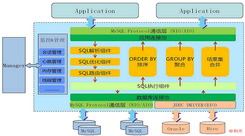

# 06周总结——技术选型2
* [数据库分片](#数据库分片)
    * [数据分片的算法](#数据分片的算法)
    * [数据分片的挑战](#数据分片的挑战)
    * [分布式数据库中间件](#分布式数据库中间件)
      * [Mycat](#mycat)
      * [Amoeba/Cobar 架构](#amoebacobar-架构)
    * [分布式数据库部署方案](#分布式数据库部署方案)
      * [单服务，单数据库](#单服务单数据库)
      * [服务集群，主从复制](#服务集群主从复制)
      * [多服务集群，多主从复制](#多服务集群多主从复制)
      * [综合部署](#综合部署)
* [NoSQL](#nosql)
    * [CAP 原理](#cap-原理)
    * [CAP原理与数据一致性冲突](#cap原理与数据一致性冲突)
      * [最终一致性](#最终一致性)
    * [ACID与BASE](#acid与base)
      * [ACID](#acid)
      * [BASE](#base)
* [分布式一致 ZooKeeper](#分布式一致-zookeeper)
    * [分布式系统脑裂](#分布式系统脑裂)
      * [分布式一致算法paxos](#分布式一致算法paxos)
    * [ZooKeeper架构](#zookeeper架构)
    * [zab协议](#zab协议)
    * [ZooKeeper的树状记录结构](#zookeeper的树状记录结构)
* [Doris 架构分析](#doris-架构分析)
    * [逻辑架构](#逻辑架构)
    * [概念模型](#概念模型)
    * [关键技术点](#关键技术点)
      * [数据分区](#数据分区)
      * [可用性](#可用性)
      * [扩容时的数据迁移](#扩容时的数据迁移)
* [搜索引擎](#搜索引擎)
    * [互联网搜索引擎整体架构](#互联网搜索引擎整体架构)
    * [爬虫系统架构](#爬虫系统架构)
    * [文档矩阵与倒排索引](#文档矩阵与倒排索引)
    * [文档与倒排索引](#文档与倒排索引)
    * [带词频的倒排索引](#带词频的倒排索引)
    * [带词频与位置的倒排索引](#带词频与位置的倒排索引)
    * [Lucene架构](#lucene架构)
    * [ElasticSearch架构](#elasticsearch架构)
    * [PageRank 算法](#pagerank-算法)
* [说明](#说明)
## 数据库分片

数据库特别大，写压力特别大时，就需要考虑数据分片了！

### 数据分片的算法

- 代码实现分片key映射到服务器编号

  

    
  

- 外部映射表存储

  

    
  

### 数据分片的挑战

- 需要大量的额外代码，处理逻辑变得更加复杂
- 无法执行多分片的联合查询
- 无法使用数据库的事务
- 数据增长需要更多的服务器

### 分布式数据库中间件

#### Mycat

  

#### Amoeba/Cobar 架构

  

- 组件模型

  

    
  

- 路由配置

- 集群伸缩

  

    
  

- 扩容策略

### 分布式数据库部署方案

#### 单服务，单数据库

  

#### 服务集群，主从复制

  

#### 多服务集群，多主从复制

  

#### 综合部署

  

## NoSQL

### CAP 原理

- Consistency 一致性

  每次读取的数据都应该是最近写入的数据或者返回一个错误，而不是过期数据。

- Avaliability 可用性

  每次请求都应该得到一个响应，而不是返回一个错误或失去响应。响应的数据不需要保证是最近写入的。

- Partition tolerance 分区容错性

  因为网络原因，部分服务器节点之间消息丢失或者延迟了，系统依然应该是可操作的。

  
  
图片来源网络

解释：

对于一个分布式系统，网络失效一定会发生，那么分区容错性是一定要保证的，那么在一致性和可用性上就必须二选一。

- 我们要么取消操作，这样数据就是一致的，但系统却不可用；
- 要么我们继续写入数据，但数据的一致性得不到保证。

- 如果选择了一致性，系统就可能返回一个错误码或干脆超时，即系统不可用。
- 如果选择可用性，那么系统总是可以返回一个数据，但是并不能保证这个数据是最新的。

所以，关于CAP原理，更准确的说法是，在分布式系统必须满足分区容错性的前提下，可用性和一致性无法同时满足。

### CAP原理与数据一致性冲突

  

#### 最终一致性

- 最终一致写冲突

  简单策略：根据时间戳，最后写入覆盖

- 客户端冲突解决

  客户端获得多份数据，然后合并

  

    
  

- 投票解决冲突（cassendra）

  TBD

### ACID与BASE

#### ACID

- 原子性 Atomicity

  事务要么全部完成，要么全部取消。

- 隔离性 Isolation

  如果两个事务T1和T2同时运行，不管T1和T2谁先结束，最终的结果是相同的。隔离性主要依靠锁实现。

- 持久性 Durability

  一旦事务提交，不管发生什么（崩溃或出错），数据都要保存到数据库中。

- 一致性 Consistency

  只有合法的数据才能写入数据库。所谓合法是依照关系约束和函数约束。

#### BASE

- 基本可用 Basicall Avaliability

  系统在出现不可预知故障时，允许损失部分可用性，如响应时间上的损失或功能上的损失。

- 弱状态 Soft state

  允许系统中的数据存在中间状态，并认为该中间状态的存在不会影响系统的整体可用性。即，允许系统在不同节点的数据副本之间进行数据同步的过程存在延时。

- 最终一致性 Eventually consistent

  系统中所有数据副本，在经过一段时间的同步后，最终能达到一个一致的状态。因此，最终一致性的本质是需要系统保证数据能够达到一致，而不需要实时保证系统数据的强一致性。

## 分布式一致 ZooKeeper

这部分讲义也比较乱，需要自己去学习补充。

### 分布式系统脑裂

在一个分布式系统中，不同服务器获得了互相冲突的数据信息或指令，导致整个集群陷入混乱，数据损坏。

#### 分布式一致算法paxos

三个角色

- proposer
- acceptor
- learner

### ZooKeeper架构

  

### zab协议

  
  

### ZooKeeper的树状记录结构

## Doris 架构分析

海量数据的KV Engine

### 逻辑架构

- 二层架构
  - Client
  - DataServer + Store
- 四个核心组件
  - Client
  - DataServer
  - Store
  - Administration

  

### 概念模型

- machine：物理机器
- node：分区单元，一台物理机可以运行多个node
- namespace：数据逻辑划分 Tag，让client识别

  

### 关键技术点

#### 数据分区

- 基于虚拟节点的分区算法，兼顾

  - 均衡性
  - 波动性：优于一致性hash

#### 可用性

- 瞬时失效
- 临时失效
  - 服务端升级或网络暂时不可用
  - 失效机器在短时内可恢复
  - 恢复后数据和失效前一致
  - failover故障恢复
    - TBD

- 永久失效
  - 机器下线
	- faliover
	  - TBD

#### 扩容时的数据迁移

TBD

## 搜索引擎

### 互联网搜索引擎整体架构

### 爬虫系统架构

### 文档矩阵与倒排索引

### 文档与倒排索引

### 带词频的倒排索引

### 带词频与位置的倒排索引

### Lucene架构

### ElasticSearch架构

- 索引分片，实现分布式

- 索引备份，实现高可用

- API更简单、更高级

### PageRank 算法

## 说明

本周工作较忙，Mycat、Cobar、zookeeper 和 Doris 的研究待完成。
