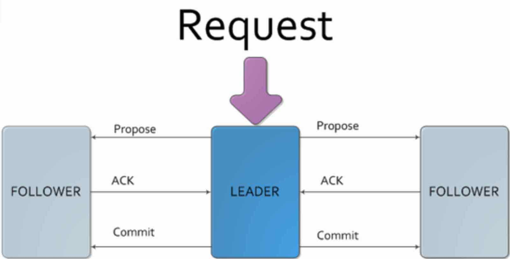

# 06周总结——技术选型2

* [数据库分片](#数据库分片)
    * [数据分片的算法](#数据分片的算法)
    * [数据分片的挑战](#数据分片的挑战)
    * [分布式数据库中间件](#分布式数据库中间件)
      * [Mycat](#mycat)
      * [Amoeba/Cobar 架构](#amoebacobar-架构)
    * [分布式数据库部署方案](#分布式数据库部署方案)
      * [单服务，单数据库](#单服务单数据库)
      * [服务集群，主从复制](#服务集群主从复制)
      * [多服务集群，多主从复制](#多服务集群多主从复制)
      * [综合部署](#综合部署)
* [NoSQL](#nosql)
    * [CAP 原理](#cap-原理)
    * [CAP原理与数据一致性冲突](#cap原理与数据一致性冲突)
      * [最终一致性](#最终一致性)
    * [ACID与BASE](#acid与base)
      * [ACID](#acid)
      * [BASE](#base)
* [分布式一致 ZooKeeper](#分布式一致-zookeeper)
    * [分布式系统脑裂](#分布式系统脑裂)
      * [分布式一致算法paxos](#分布式一致算法paxos)
    * [ZooKeeper架构](#zookeeper架构)
    * [zab协议](#zab协议)
    * [ZooKeeper的树状记录结构](#zookeeper的树状记录结构)
* [Doris 架构分析](#doris-架构分析)
    * [逻辑架构](#逻辑架构)
    * [概念模型](#概念模型)
    * [关键技术点](#关键技术点)
      * [数据分区](#数据分区)
      * [可用性](#可用性)
      * [扩容时的数据迁移](#扩容时的数据迁移)
* [搜索引擎](#搜索引擎)
    * [互联网搜索引擎整体架构](#互联网搜索引擎整体架构)
    * [爬虫系统架构](#爬虫系统架构)
    * [文档矩阵与倒排索引](#文档矩阵与倒排索引)
    * [文档与倒排索引](#文档与倒排索引)
    * [带词频的倒排索引](#带词频的倒排索引)
    * [带词频与位置的倒排索引](#带词频与位置的倒排索引)
    * [Lucene架构](#lucene架构)
    * [ElasticSearch架构](#elasticsearch架构)
    * [PageRank 算法](#pagerank-算法)
* [说明](#说明)

## 数据库分片

数据库特别大，写压力特别大时，就需要考虑数据分片了！

### 数据分片的算法

- 代码实现分片key映射到服务器编号

  

    
  

- 外部映射表存储

  

    
  

### 数据分片的挑战

- 需要大量的额外代码，处理逻辑变得更加复杂
- 无法执行多分片的联合查询
- 无法使用数据库的事务
- 数据增长需要更多的服务器

### 分布式数据库中间件

#### Mycat

  

#### Amoeba/Cobar 架构

  

- 组件模型

  

    
  

- 路由配置

- 集群伸缩

  

    
  

- 扩容策略

### 分布式数据库部署方案

#### 单服务，单数据库

  

#### 服务集群，主从复制

  

#### 多服务集群，多主从复制

  

#### 综合部署

  

## NoSQL

### CAP 原理

- Consistency 一致性

  每次读取的数据都应该是最近写入的数据或者返回一个错误，而不是过期数据。

  一句话概括：所有节点同时看到相同的数据。

- Avaliability 可用性

  每次请求都应该得到一个响应，而不是返回一个错误或失去响应。响应的数据不需要保证是最近写入的。

  一句话概括：任何时候，读写都是成功的。

  系统稳定性已经做到  N 个 9 就是对可用性的一个描述，叫做 SLA，即服务水平协议。

- Partition tolerance 分区容错性

  因为网络原因，部分服务器节点之间消息丢失或者延迟了，系统依然应该是可操作的。

  
  
图片来源网络

解释：

对于一个分布式系统，网络失效一定会发生，那么分区容错性是一定要保证的，那么只能在一致性 C 和 可用性 A 上二选一。

- 我们要么取消操作，这样数据就是一致的，但系统却不可用；要么我们继续写入数据，但数据的一致性得不到保证。
- 如果选择了一致性，系统就可能返回一个错误码或干脆超时，即系统不可用。
- 如果选择可用性，那么系统总是可以返回一个数据，但是并不能保证这个数据是最新的。

所以，关于CAP原理，更准确的说法是，在分布式系统必须满足分区容错性的前提下，可用性和一致性无法同时满足。

**CAP 理论提醒我们，在架构设计中，不要把精力浪费在如何设计能满足三者的完美分布式系统上，而要合理进行取舍。放弃强一致性，追求分区容错性和可用性，这是很多分布式系统设计时的选择。**

### CAP原理与数据一致性冲突

  

#### 最终一致性

一般来说，数据一致性模型可以分为强一致性和弱一致性，强一致性也叫做线性一致性，除此以外，所有其他的一致性都是弱一致性的特殊情况。弱一致性根据不同的业务场景，又可以分解为更细分的模型，不同一致性模型又有不同的应用场景。

在互联网领域的绝大多数场景中，都需要牺牲强一致性来换取系统的高可用性，系统往往只需要保证“最终一致性”，只要这个最终时间是在用户可以接受的范围内即可。我们称这个时间为“不一致性窗口”。

- 最终一致写冲突

  简单策略：根据时间戳，最后写入覆盖

- 客户端冲突解决

  客户端获得多份数据，然后合并

  

    
  

- 投票解决冲突（cassendra）

  TBD

### ACID与BASE

ACID 是一种强一致性模型，强调原子性、一致性、隔离性和持久性，主要用于在数据库实现中。

BASE 理论面向的是高可用、可扩展的分布式系统。

ACID 适合传统金融等业务，在实际场景中，不同业务对数据的一致性要求不一样，ACID 和 BASE 理论往往会结合使用。

#### ACID

- 原子性 Atomicity

  事务要么全部完成，要么全部取消。

原子性意味着事务是原子的并且采取 “all or nothing” 的方法。
也就是，要么整个操作成功，从头到尾完成，要么不成功，整个操作“回滚”。
所有操作都保证以成功或失败结束，不存在部分成功。

- 一致性 Consistency

  只有合法的数据才能写入数据库。所谓合法是依照关系约束和函数约束。

一致性是确保数据库结构从事务开始到结束保持不变。一致性确保进入数据库的任何数据都遵循已设置的规则和约束。它可以保护和维护关系数据库中数据的完整性。

- 隔离性 Isolation

  如果两个事务T1和T2同时运行，不管T1和T2谁先结束，最终的结果是相同的。隔离性主要依靠锁实现。

事务隔离意味着尽管在任何时候都发生了许多事务，但每个事务都被视为一个原子的、独立的单元，并且事务似乎是按顺序发生的。
例如，如果两个事务同时发生，此属性可确保一个事务以及那里发生的更改不会以任何方式影响另一个事务。

- 持久性 Durability

  一旦事务提交，不管发生什么（崩溃或出错），数据都要保存到数据库中。

持久性意味着事务的任何结果和更改都已提交，因此是永久性的，并且将持续存在，即使出现系统故障也是如此。

#### BASE

BASE 理论的核心思想是最终一致性，即使无法做到强一致性（Strong Consistency），但每个应用都可以根据自身的业务特点，采用适当的方式来使系统达到最终一致性（Eventual Consistency）。

- 基本可用 Basic Availability

  基本可用，该模型不关注数据的即时一致性。系统在出现不可预知故障时，允许损失部分可用性，如响应时间上的损失或功能上的损失。

- 弱/软状态 Soft State

  允许系统中的数据存在中间状态，并认为该中间状态的存在不会影响系统的整体可用性。即，允许系统在不同节点的数据副本之间进行数据同步的过程存在延时。软状态意味着系统不需要写一致性。

- 最终一致性 Eventual Consistency

  最终一致性，主要优先事项是数据的持续可用，而不是数据一致性。
  系统中所有数据副本，在经过一段时间的同步后，最终能达到一个一致的状态。因此，最终一致性的本质是需要系统保证数据能够达到一致，而不需要实时保证系统数据的强一致性。

### CAP 及 BASE 的关系

BASE 理论是在 CAP 上发展的，CAP 理论描述了分布式系统中数据一致性、可用性、分区容错性之间的制约关系。Base 理论则是对 CAP 理论的实际应用，也就是在分区和副本存在的前提下，通过一定的系统设计方案，放弃强一致性，实现基本可用，这是大部分分布式系统的选择。

## 分布式一致 ZooKeeper

这部分讲义也比较乱，需要自己去学习补充。

### 分布式系统脑裂

在一个分布式系统中，不同服务器获得了互相冲突的数据信息或指令，导致整个集群陷入混乱，数据损坏。

#### Quorum 选举算法 vs WARO

主要数学思想来源于抽屉原理，用一句话解释那就是，在 N 个副本中，一次更新成功的如果有 W 个，那么在读取数据时是要从大于 N－W 个副本中读取，这样就能至少读到一个更新了的数据。

N+1-W = R

和 Quorum 机制对应的是 WARO Write All Read one，是一种简单的副本控制协议，当客户端请求向某副本写数据时（更新数据），只有当所有的副本都更新成功之后，这次写操作才算成功，否则视为失败。

WARO 牺牲了更新服务的可用性，最大程度地增强了读服务的可用性，而 Quorum 就是在更新服务和读服务之间进行的一个折衷。

Quorum 机制无法保证强一致性，但它是分布式系统中常用的一种机制，用来保证数据冗余和最终一致性的投票算法，在 Paxos、Raft 和 Zab 等算法中，都可以看到 Quorum 机制的应用。

#### 分布式一致算法paxos

Paxos 描述的是在一个由多个 Proposer 和多个 Acceptor 构成的系统中，如何让多个 Acceptor 针对 Proposer 提出的多种提案达成一致的过程，而 Learner 只是“学习”最终被批准的提案。

三个角色

- proposer 提案者

  在流程开始时，Proposer 提出议案，也就是value

- acceptor 批注者

  Proposer 提出的 value 必须获得超过半数（N/2+1）的 Acceptor 批准后才能通过。

- learner 学习者

  Learner 不参与选举，而是学习被批准的 value。在Paxos中，Learner主要参与相关的状态机同步流程。Leaner的流程就参考了Quorum 议会机制，某个 value 需要获得 W=N/2 + 1 的 Acceptor 批准，Learner 需要至少读取 N/2+1 个 Accpetor，最多读取 N 个 Acceptor 的结果后，才能学习到一个通过的 value。

#### Raft 算法

一个 Raft 集群包含若干节点，Raft 把这些节点分为三种状态：Leader、 Follower 、Candidate，每种状态负责的任务也是不一样的，正常情况下，集群中的节点只存在 Leader 与 Follower 两种状态。

- **Leader（领导者）**：负责日志的同步管理，处理来自客户端的请求，与 Follower 保持 heartBeat 的联系；
- **Follower（追随者）**：响应 Leader 的日志同步请求，响应 Candidate 的邀票请求，以及把客户端请求到 Follower 的事务转发（重定向）给 Leader；
- **Candidate（候选者）**：负责选举投票，集群刚启动或者 Leader 宕机时，状态为 Follower 的节点将转为 Candidate 并发起选举，选举胜出（获得超过半数节点的投票）后，从 Candidate 转为 Leader 状态；

通常，Raft 集群中只有一个 Leader，其它节点都是 Follower 。Follower 都是被动的：它们不会发送任何请求，只是简单的响应来自 Leader 或者 Candidate 的请求。Leader 负责处理所有的客户端请求（如果一个客户端和 Follower 联系，那么 Follower 会把请求重定向给 Leader）。为简化逻辑和实现，Raft 将一致性问题分解成了三个相对独立的子问题：

- **选举（Leader election）**：当 Leader 宕机或者集群初创时，一个新的 Leader 需要被选举出来；
- **日志复制（Log replication）**：Leader 接收来自客户端的请求并将其以日志条目的形式复制到集群中的其它节点，并且强制要求其它节点的日志和自己保持一致。
- **安全性（Safety）**：如果有任何的服务器节点已经应用了一个确定的日志条目到它的状态机中，那么其它服务器节点不能在同一个日志索引位置应用一个不同的指令。

##### 选主

根据 Raft 协议，一个应用 Raft 协议的集群在刚启动时，所有节点的状态都是 Follower，由于没有 Leader，Followers 无法与 Leader 保持心跳（Heart Beat），因此，Followers 会认为 Leader 已经 down，进而转为 Candidate 状态。然后，Candidate 将向集群中其它节点请求投票，同意自己升级为 Leader，如果 Candidate 收到超过半数节点的投票（N/2 + 1），它将获胜成为 Leader。

### ZooKeeper架构

  

在 ZooKeeper 集群中，所有客户端的请求都是写入到 Leader 进程中的，然后，由 Leader 同步到其他节点，称为 Follower。在集群数据同步的过程中，如果出现 Follower 节点崩溃或者 Leader 进程崩溃时，都会通过 Zab 协议来保证数据一致性。

### zab协议

ZooKeeper 是通过 Zab（ZooKeeper Atomic Broadcast，ZooKeeper 原子广播协议）协议来保证分布式事务的最终一致性。Zab支持崩溃恢复，基于该协议，ZooKeeper 实现了一种主备模式的系统架构来保持集群中各个副本之间数据一致性。

  
  

### ZooKeeper的树状记录结构

ZooKeeper 维护了一个类似文件系统的数据结构，每个子目录都被称作为 `znode` 即节点。和文件系统一样，可以很轻松的对 `znode` 节点进行增加、删除等操作，而且还可以在一个`znode`下增加、删除`子znode`。区别于文件系统的是，`znode`可以存储数据（严格说是必须存放数据，默认是个空字符）。

因为是目录节点结构，因此在获取和创建节点时，必须要以`“/”` 开头，否则在获取节点时会报错 `Path must start with / character`。

`znode`被用来存储 `byte级` 或 `kb级` 的数据，可存储的最大数据量是`1MB`（**请注意**：一个节点的数据量不仅包含它自身存储数据，它的所有子节点的名字也要折算成Byte数计入，因此`znode`的子节点数也不是无限的）虽然可以手动的修改节点存储量大小，但一般情况下并不推荐这样做。

## Doris 架构分析

海量数据的KV Engine

### 逻辑架构

- 二层架构
  - Client
  - DataServer + Store
- 四个核心组件
  - Client
  - DataServer
  - Store
  - Administration

  

### 概念模型

- machine：物理机器
- node：分区单元，一台物理机可以运行多个node
- namespace：数据逻辑划分 Tag，让client识别

  

### 关键技术点

#### 数据分区

- 基于虚拟节点的分区算法，兼顾

  - 均衡性
  - 波动性：优于一致性hash

#### 可用性

- 瞬时失效
- 临时失效
  - 服务端升级或网络暂时不可用
  - 失效机器在短时内可恢复
  - 恢复后数据和失效前一致
  - failover故障恢复
    - TBD

- 永久失效
  - 机器下线
  - faliover
    - TBD

#### 扩容时的数据迁移

TBD

## 搜索引擎

### 互联网搜索引擎整体架构

### 爬虫系统架构

### 文档矩阵与倒排索引

### 文档与倒排索引

### 带词频的倒排索引

### 带词频与位置的倒排索引

### Lucene架构

### ElasticSearch架构

- 索引分片，实现分布式

- 索引备份，实现高可用

- API更简单、更高级

### PageRank 算法

## 说明

本周工作较忙，Mycat、Cobar 和 Doris 的研究待完成。

## 扩展：关系型数据库 & 非关系型数据库

关系型数据库：

- 存储的是行记录。不能存储数组、嵌套字段等格式的数据。
- 数据库提供 ACID 数据一致性模型。ACID 模型可确保数据库可靠且安全。
- 不同表中的数据可以有不同的关系：
   - 一对一的关系：在这种情况下，一个表中的记录仅与另一个表中的一条记录相关。电商网站中一对一关系的示例是，一个用户只能拥有一个电子邮件地址，且一个电子邮件地址只能属于一个用户。
   - 一对多关系：在这种情况下，一张表中的一条记录与另一张表中的多条其他记录相关。例如，在电商网站中，一个用户可以下许多订单，但每个订单都是由一个用户下的。
   - 多对多关系：在这种情况下，一个表中的一个或多个记录可以与另一个表中的一个或多个记录相关。例如，在电商网站中，一个订单可以有很多产品，而一个产品可以被购买多次。

非关系型数据库：

- 数据库提供 BASE 数据库一致性模型。该模型不像关系数据库的 ACID 模型那样严格。
- 四种主要类型的非关系数据库：
   - 键值数据库：Redis、Memcached、Riak。
   - 列式数据库：Bigtable、HBase、Cassandra。
   - 文档数据库：MongoDB、CouchDB、MarkLogic。
   - 图数据库：Neo4j、InfoGrid。
