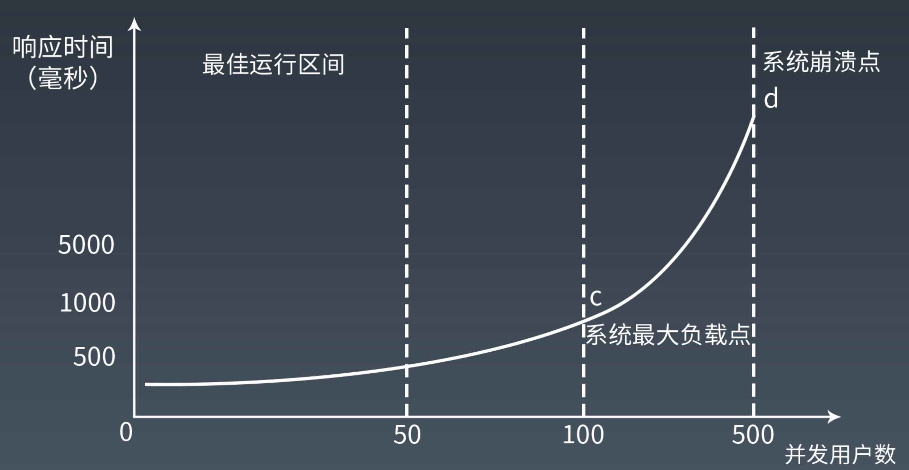
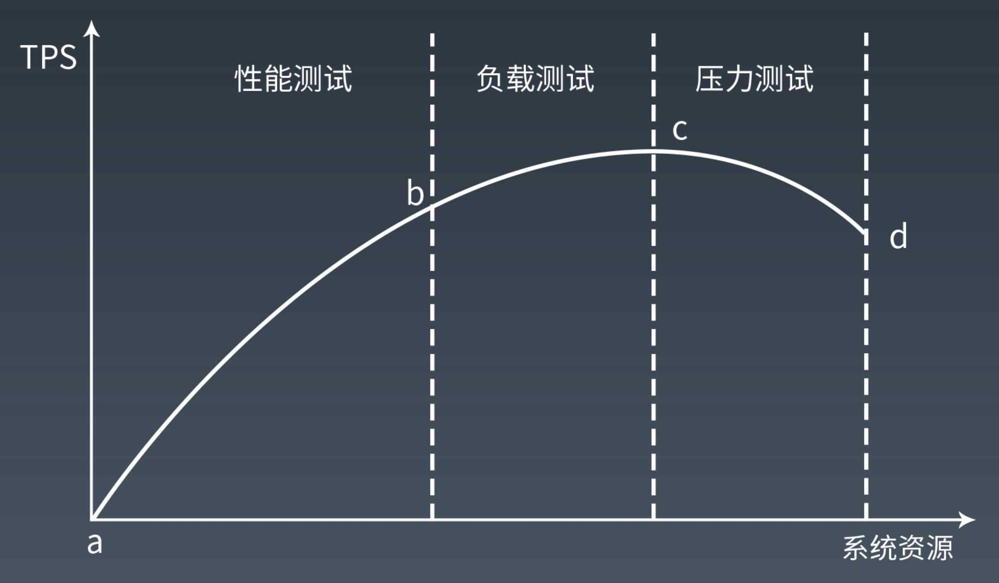
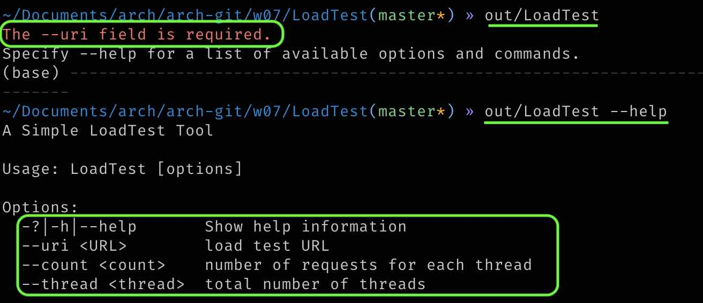
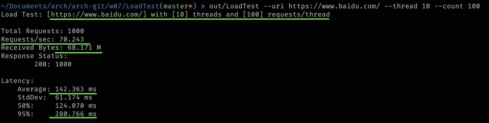
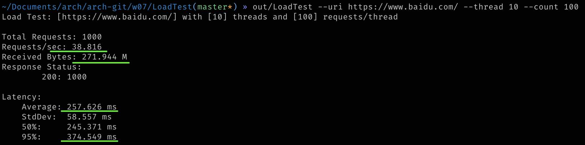

# 07周作业——性能测试

## 性能压测的时候，随着并发压力的增加，系统响应时间和吞吐量如何变化，为什么？

吞吐量 = 1000 ➗系统响应时间(ms) ✖️ 并发数量

在压测临界点（系统最大负载点）前，随着并发压力增加，也就是并发数量增加，系统响应时间（毫秒）增加并不明显，此时吞吐量(TPS)也在增加；压测的并发量持续增加，达到压测临界点，系统资源接近耗尽，系统的响应时间越来越长，此时反而使系统吞吐量开始下降。

一图胜千言啊，请看下图。

<div align=center>


</div>

## 用你熟悉的编程语言写一个 web 性能压测工具，输入参数：URL，请求总次数，并发数。输出参数：平均响应时间，95% 响应时间。用这个测试工具以 10 并发、100 次请求压测 www.baidu.com。

- 代码以 .net core C# 来完成，整体是比较简单的一个控制台程序，输入如下命令

<div align=center>

</div>

- 得到如下输出结果，两个结果一个

<div align=center>

<div>加了gzip头</div>

<div>没有加压缩头</div>
</div>

- 源代码，请移步[这里](./LoadTest)。

  关于`gzip`请求头的代码

  ```csharp
  _httpClient.DefaultRequestHeaders.Add("Accept-Encoding", "gzip, deflate");
  ```

  关于`95%响应时间`，这是网络中使用的神奇数字，因为95%嘛，代表了绝大多数的情况下的结果了。计算公式也相当简单，就是对结果数据先从小到大排序，然后取排在第95%的那个位置的数就是了。

## 参考
[百分位](https://www.shuxuele.com/data/percentiles.html)
