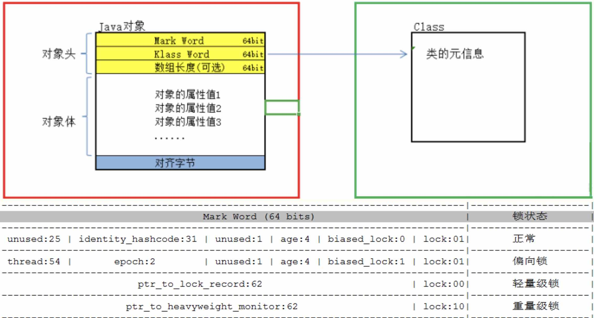
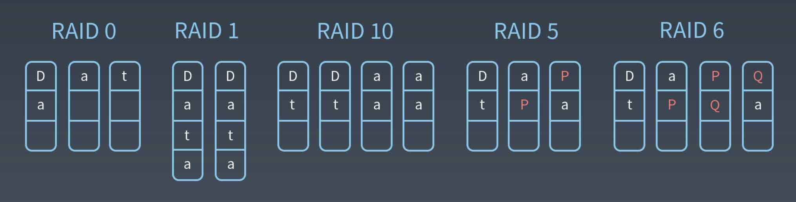
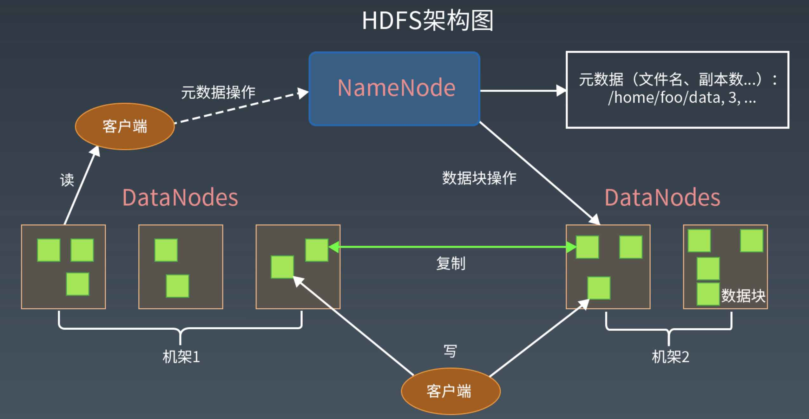

# 07周总结

## 性能测试

性能测试是性能优化的前提和基础，也是性能优化结果的检查和度量标准。

### 性能测试视角

- 主观视角：用户感受到的性能
- 客观视角：性能指标衡量的性能

### 性能测试指标

- 响应时间（完成一次任务花费的时间）

  从发出请求开始到接收到最后响应数据所需要的时间。

  ——最重要的性能指标，直观反映了系统的“快慢”
  
- 并发数（同时处理的任务数）

  系统能够同时处理请求的数量，反映了系统的负载特性。对于网站而言，并发数即并发用户数，指同时提交请求的用户数目。与此相对应的还有

  - 在线用户数：当前登录系统的用户数
  - 系统用户数：可能访问系统的总用户数
  
- 吞吐量（单位时间完成的任务数）

  单位时间内系统处理的请求的数量，体现系统的处理能力。

  吞吐量 = （1000/响应时间ms）* 并发数

  还有以下相关指标

  - 请求数/秒

  - 页面数/秒

  - 访问人数/天

  - 处理业务数/小时

  - TPS：transaction per second

  - QPS：query per second

  - HPS：每秒HTTP请求数

- 性能计数器

  描述服务器或操作系统性能的一些数据指标。包括系统负载、对象与线程数、内存使用、CPU使用、磁盘IO和网络IO等。这些指标也是系统监控的重要参数。
  
  系统负载：当前正在运行+等待运行的进程数
### 性能测试方法

是个总称，可以细分为性能测试、负载测试、压力测试、稳定性测试

  

- 性能测试

  以系统设计初期规划的性能指标为预期目标，对系统不断施加压力，验证系统在资源的可接受范围内，是否能达到性能预期。

- 负载测试

  对系统不断增加并发请求以增加系统压力，直到系统的某项或多项性能指标达到安全临界值，如某种资源已呈现饱和状态，这时候继续对系统施加压力，系统的处理能力不但不能提高，反而会下降。

- 压力测试

  超过安全负载的情况下，继续对系统施加压力，直到系统崩溃或不能再处理任何请求，以此获得系统最大压力承受能力。

- 稳定性测试

  被测试系统在特定硬件、软件、网络环境条件下，给系统加载一定业务压力，使系统运行一段较长的时间，以此检测系统是否稳定。在生产环境，请求压力是不均匀的，呈波浪特性，因此为了更好模拟生成环境，稳定性测试也应该不均匀地对系统施加压力。

### 全链路压力测试

指在特定业务场景下，将相关链路完整的串联起来同时施加压力，尽可能模拟出真实的用户行为，当系统整站流量都被打上来的时候，必定会暴露出性能的瓶颈，才能探测出系统整体的真实处理能力，以及有指导的在大流量前进行容量规划和3性能优化，这便是线上实施全链路压测的真正目的。

#### 全链路压测的挑战

- 压测相关的业务系统众多，并且牵涉到整条链路上所有的基础设施和中间件，如何确保压测流量能够畅通无阻，没有死角？

  - 压测的数据怎么构造，数据模型如何与真实贴近？

  - 压测直接在线上的真实环境进行模拟，如何保障对线上无影响？

  - 巨大流量要怎样制作出来？

##### 数据构造

  

##### 数据隔离

- 逻辑隔离

  直接把压测数据和真实数据写到一起，通过特殊标记区分开

  可能污染线上数据，破坏线上数据的安全性

- 虚拟隔离

  在所有写数据的地方做mock，并不真正的写进去

  不会污染线上数据，但是mock对整个压测结果的准确性会产生干扰

- 物理隔离

  所有写数据的地方对压测流量进行识别，判断一旦是压测流量的写，就写到隔离的位置，包括存储、缓存、搜索引擎等。

##### 流量构造

以天猫双十一全链路压测的流量平台为例：整套全链路压测的流量平台在压测过程当中平稳输出 1000w+/s 的用户请求，同时保持过亿的无线用户长连接。

该流量平台是一个典型的master + slave结构

- master作为压测管控台管理着上千个slave节点；

- slave节点作为压测引擎，负责具体的请求发送。

- master作为整个压测平台的大脑，负责整个平台的运转控制、命令发送、数据收集、决策等；

- slave节点部署在全球各地的cdn节点上，从而模拟从全球各地过来的用户请求。

  
  

## 大规模分布式系统性能优化的7层协议及案例分析

### 软件性能优化的两个基本原则

- 不能优化一个没有测试的软件

- 不能优化一个不了解的软件

  ### 性能测试的主要性能指标

  请参考性能测试指标

### 性能优化的一般方法

1. 性能测试，获得性能指标

2. 指标分析，发现性能与资源瓶颈点

3. 架构与代码分析，寻找性能与资源瓶颈关键所在

4. 架构与代码优化，优化关键技术点，平衡资源利用

5. 性能测试，进入性能优化环节

### 性能优化的分层思想

#### 机房和骨干网络的性能优化

- 异地多活的多机房架构
- 专线网络与自主CDN建设

#### 服务器与硬件的性能优化

使用更优的CPU、磁盘、内存、网卡，对软件的性能优化可能是**数量级的**，有时候远远超过对代码和架构的性能优化。

#### 操作系统性能优化

##### 案例分析：

对资源利用分析，发现大量CPU操作为sys类型，消耗大量计算资源

调查后发现，起因是部分Linux版本缺省情况打开了transparent huge page导致

优化方案：关闭transparent huge page

#### 虚拟机性能优化

#### 基础组件性能优化

#### 软件架构性能优化

##### 三板斧

1. 缓存

- 从内存获取数据，减少响应时间
- 减少数据库访问，降低存储设备负载压力
- 缓存结果对象，而不是原始数据，减少CPU计算
- 缓存主要优化**读操作**

2. 异步

- 即时响应，更好的用户体验

- 控制消费速度，合适的负载压力
- 异步主要优化**写操作**

3. 集群

单一服务器计算资源的增加是有极限的，所以需要增加更多的服务器。

**集群的技术目标**：如何使很多台服务器对使用者而言，**看起来像一台服务器**。

#### 软件代码性能优化

遵循面向对象设计原则与设计模式编程，很多时候程序性能不好不是因为性能上有什么技术挑战，仅仅是因为代码太烂了。

- 并发编程，多线程与锁

- 资源复用，线程池与对象池

- 异步编程，生产者消费者

- 数据结构，数组、链表、hash表、树

## 操作系统

### 程序运行时架构

程序是静态的，跑起来后被称为进程。

进程是活的，是有生命的！

### 操作系统的多任务运行环境

计算机的CPU核心数是有限的，但是，服务器可以同时处理数以百计甚至数以千计的并发用户请求。如何做到的？因为进程分时执行。

#### 程序的运行期状态

- 运行

  当一个进程在CPU上运行时，则称该进程处于运行状态。处于运行状态的进程数目小于等于CPU的数目。

- 就绪

  当一个进程获得了除CPU以外的一切所需资源，只要得到CPU即可运行，则称此进程处于就绪状态，有时也被称为等待运行状态。

- 阻塞

  也称为等待或睡眠状态，当一个进程正在等待某一事件发生（如等待I/O完成，等待锁）而暂时停止运行，这时即使把CPU分配给进程也无法运行，顾称该进程处于阻塞状态。

#### 进程 vs 线程
不同进程轮流在CPU上执行，每次都要进行<u>进程间CPU的切换</u>，代价非常大。因此服务器应用通常是**单进程多线程**。

进程从操作系统获得基本的内存空间，<u>所有的线程共享着进程的内存地址空间</u>。而每个线程也会拥有自己私有的内存地址范围，其它线程不能访问它。

#### 线程安全

当某些代码修改内存堆（进程共享内存）里的数据的时候，如果有多个线程在同时执行，就可能会出现同时修改数据的情况。比如，两个线程同时对一个堆中的数据执行+1操作，期望结果是这个数据只会+1，这就是人们常说的线程安全问题。而实际上，运行的结果是依次+1，即最终的结果是+2。

##### 临界区

多个线程访问共享资源的这段代码被称为临界区，解决线程安全问题的主要方法是使用锁，将临界区的代码加锁，只有获得锁的线程才能执行临界区的代码。

##### 阻塞导致高并发系统崩溃

锁（IO）会引起线程阻塞。阻塞导致线程既不能继续执行，也不能释放资源。进而导致资源耗尽，最终导致系统崩溃。

##### 避免阻塞引起的崩溃

限流：控制进入系统的请求数，进而减少创建的线程数。

降级：关闭部分功能程序的执行，尽早释放线程。

避免阻塞：异步I/O，无临界区（actor模型）

##### 锁

##### 锁原语（CAS）

是一种系统原语，原语的执行必须是连续的，在执行过程中不允许被中断。

- 若V值等于E值，则将V的值设为N
- 若V值和E值不同，什么都不做

> - V表示更新的变量
> - E表示预期的值
> - N表示新的值

Java通过CAS原语在对象头中修改Mark Word实现加锁

偏向锁

指一段同步代码一直被一个线程所访问，那么该线程会自动获取锁，降低获取锁的代价

轻量级锁

当锁是偏向锁时，被另一线程所访问，偏向锁就会升级成轻量级锁，其它线程会通过自旋的形式尝试获取锁，不会阻塞，提高性能

重量级锁

当锁是轻量级锁时，另一个线程虽然自旋，但自旋不会一直持续下去，当自旋到一定次数时，还没有获取到锁，就会进入阻塞，该锁膨胀为重量级锁，重量级锁会让其它申请的线程进入阻塞，性能降低。

##### 多CPU下的锁机制

- 总线锁（是悲观锁）

  使用处理器的LOCK#信号，当一个处理器在内存总线上输出此信号的时候，其它处理器的请求将被阻塞，该处理器独占内存

- 缓存锁（是乐观锁）

  内存区域如果被缓存在处理器的缓存行中，并且在Lock操作期间被锁定，那么当它执行锁操作回写到内存时，处理器不在总线上声明LOCK#信号，而是修改内部的内存地址，并允许它的缓存一致机制来保证操作的原子性。因为缓存一致性机制会阻止同时修改由两个以上处理器缓存的内存区域数据，当其他处理器回写已被锁定的缓存行数据时，会使缓存行无效。

- 公平锁

  就是多个线程按照申请锁的顺序来获取锁

- 非公平锁

  就是多个线程获取锁的顺序并不是按照申请锁的顺序，有可能后申请的线程比先申请锁的线程优先获取锁。这可能会导致饥饿现象。

- 可重入锁

  就是某个线程已经获得了某个锁，可以再次获取锁而不会出现死锁。

- 独享锁/互斥锁

  该锁只能被一个线程所持有

- 共享锁

  该锁可以被多个线程所持有

- 读写锁

  多个读线程之间并不互斥，而写线程则要求与任何线程互斥

- 乐观锁

  认为对于同一数据的并发操作，是不会发生修改的。在更新数据的时候，检查是否已经被修改过，如果修改过了，就放弃。

- 悲观锁

  认为对于同一数据的并发操作，一定会发生修改，哪怕没有修改，也会认为修改。因此对于同一数据的并发操作，悲观采取加锁的形式。悲观地认为不加锁的并发操作一定会出问题。

- 分段锁

  设计的目的是细化锁的粒度，当操作不需要更新整个数组的时候，就仅仅针对数组的一段进行加锁操作。

  java hashmap就是分段锁

- 自旋锁

  尝试获取锁的线程不会立即阻塞，而是采取循环的方式去尝试获取锁，这样的好处是减少线程上下文切换的消耗，缺点是循环会消耗CPU

> Akka就是一个锁的替代，很容易实现分布式，无论是单机还是集群。
>
> 是一种面向actor的编程模型。

## 文件与硬盘I/O

### B+树

B+树是应文件系统所需而产生的一种B树的变形树。关键字全部存放在叶子节点中，非叶子节点用来做索引，而叶子节点中有一个指针指向下一个叶子节点。这样的设计提高区间访问的性能，也是这个特性决定了B+树更适合来存储外部数据。MySQL也是用B+树作为索引。

### LSM树

日志结构合并树 Log-Structured-Merge-Tree，和B+树类似，被设计出来为了更好地把数据存储到大容量磁盘中。相对于B+树，LSM树拥有更好的随机写性能。目前被用于HBase、Cassandra、LevelDB、RocksDB等。

### 文件控制块FCB

文件系统将硬盘空间以`块`为单位进行划分，每个文件占据若干个块，然后再通过一个文件控制块FCB记录每个文件所占据的硬盘数据块。

### Linux inode文件控制块

- inode中记录着文件权限、所有者、修改时间和文件大小等文件属性信息，以及文件数据块硬盘地址索引

- inode是固定结构的，能够记录的硬盘地址索引数也是固定的，只有15个索引

- 每个inode可以存储12+256+256 ✖️ 256+256 ✖️256 ✖️256个数据块，如果每个数据块的大小是4K，也就是单个文件最大不超过70G

### RAID独立磁盘冗余阵列

为了提高磁盘的读取速度，磁盘阵列出现了。多个独立的I/O请求可以并行地进行处理，只要它们所需要的数据驻留在不同的磁盘中。但是磁盘阵列的安全性是一个问题：如果阵列中的某个磁盘损坏，则整个盘区的数据都将永久丢失。对此RAID7级方案（0-6）出现了。

### 分布式文件系统HDFS

架构师需要的储备真的是很全面！