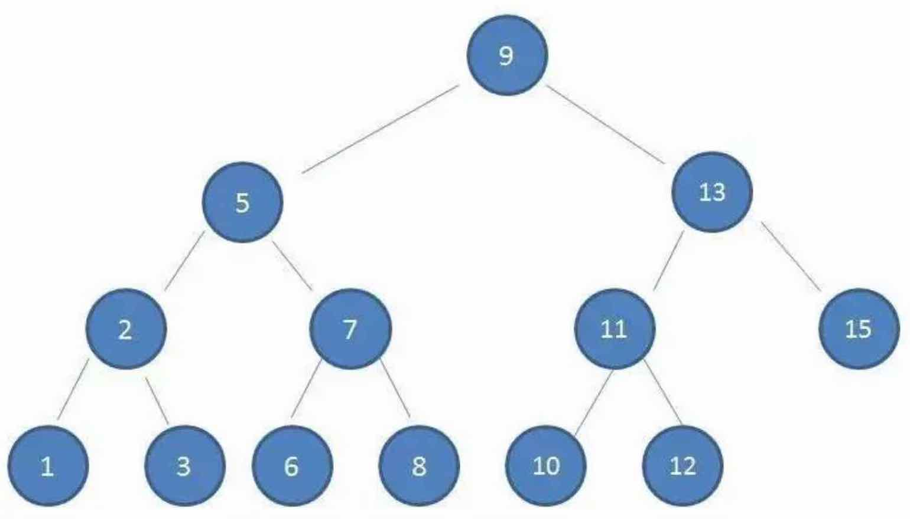

# 08周总结

## 数据结构与算法

### 时间复杂度

不是计算程序具体运行时间，而是算法执行语句的**次数**

O(2^n)对n个数据处理需要进行2^n次计算

多项式时间复杂度：O(1)、O(logn) 和 O(n^a)

非多项式时间复杂度：O(a^n) 和 O(n!)

### 空间复杂度

一个算法在运行过程中临时占用存储空间大小的度量

O(n)表示需要临时存储n个数据

### NP问题

理论信息学的计算复杂度理论领域的未解之谜。[参考]([https://zh.wikipedia.org/wiki/P/NP%E9%97%AE%E9%A2%98](https://zh.wikipedia.org/wiki/P/NP问题))

**[P](https://zh.wikipedia.org/wiki/P_(复杂度))**类复杂度：能在多项式表达的时间复杂度内解决的问题

**[NP](https://zh.wikipedia.org/wiki/NP_(复杂度))**类复杂度：能在多项式时间复杂度内验证它的解是否正确的问题集合

P=NP，但计算机科学家认为 P !=  NP，所以  P ?= NP 未解

NP-hard：比 NP 问题更难的问题

NP-complete：是一个 NP-hard 问题，也是一个 NP 问题

### 基本数据结构

#### 数组

- 内存中一块连续的存储空间
- 存放相同数据类型
- 随机读写是数组的一个重要特性，按数组下标访问数据，时间复杂度是O(1)

#### 链表

- 链表中节点元素包含数据和指向下一节点的内存地址的指针

- 可以使用零散的内存空间，存储不同类型数据

- 在链表中查找元素，只能遍历链表；链表查找的时间复杂度是O(n)，删除节点的时间复杂度是O(1)

是否可以结合数组和链表的优势来实现快速查找和快速增删？

##### 哈希表 （散列表 hash table）

根据键值对（key-value）来直接进行访问的数据结构。把key映射到列表中一个位置来访问记录，以加快查找的速度。这个映射函数叫作散列函数/哈希函数，存放记录的数组叫作散列表/哈希表。

##### 哈希表key冲突

由于hash算法的局限性，key计算后的键值难免冲突，这时我们常用的一种解决方案是链地址法，也称为拉链法。

将键值相同的元素构成一个单链表，hash表里存放的是单链表的头指针，而不是元素了。

#### 栈

数组和链表都被称为线性表

栈是在线性表的基础上加上限制条件：LIFO ——后面添加的数据，在删除的时候必须先删除

线程运行时专有内存为什么被称为线程栈？

#### 队列

队列也是一种受限的线性表，FIFO——先进先出。

阻塞等待的线程被放入队列。

##### 应用场景

- 生产者消费者

- 用队列搜索好友中关系最近的有钱人

- 用队列搜索最短路径

#### 树

##### 二叉排序树/二叉搜索树 BST

- 左子树上所有节点的值均小于或等于它的根节点的值

- 右子树上所有节点的值均大于或等于它的根节点的值

- 左、右子树也分别为二叉树

###### 平衡二叉排序树 AVL

- 从任何一个节点出发，左右子树深度之差绝对值不超过1
- 左右子树仍然为平衡二叉树

###### 旋转二叉排序树恢复平衡

- 插入时，最多只需要两次旋转就会重新恢复平衡。

- 删除时，需要维护从被删除节点到根节点这条路径上所有节点的平衡性，时间复杂度O(logn)

##### 红黑树 RBT

- 每个节点只有两种颜色：红色、黑色

- 根节点是黑色

- 每个叶子节点（NIL）都是黑色的空节点

- 从根节点到叶子节点，不会出现两个连续的红色节点

- 从任何一个节点出发，到叶子节点，这条路径上都有相同数目的的黑色节点
  

增删节点时，红黑树通过染色和旋转，保持红黑树满足定义

##### 红黑树 vs 平衡二叉树

- 红黑树最多只需要3次旋转就会重新达成红黑平衡，时间复杂度O(1)
- 在大量增删的情况下，红黑树的效率更高
- 红黑树的平衡性不如平衡二叉树，因此查找效率要差一些

#### 跳表（跳跃列表 skip list）

使得包含n个元素的有序序列的查找和插入操作的平均时间复杂度O(logn)，优于数组的O(n)复杂度。

通过维护一个多层次的链表来实现的

### 常用算法

- 穷举法

- 递归算法
  - 注意递归栈
  - 递归退出条件
  - 举例：快速排序
- 贪心算法
- 动态规划算法
- 遗传算法

### 背包问题

背包问题 Knapsack problem 是一个组合优化的NP完全问题。

一个比较特别的背包问题的描述：小偷背了4磅背包去商场偷东西，将哪些商品放入背包才能收益最大化？

#### 贪心算法

- 普通贪心算法

- 改进贪心算法——狄杰斯特拉算法（最短/最快路径）

**核心是找到起点到每个节点的最快路径。**

1. 找出“最便宜”的节点，即可在最短时间内到达的节点
2. 更新该节点的邻居的开销，检查是否有前往它们的更短路径，如果有，就更新其开销
3. 重复这个过程，直到对图中的每个节点都这样做了
4. 计算最终路径

#### 动态规划算法解决背包问题

通过找到合适的角度，将所求解的目标值在某几个维度上展开，将一个大问题拆解为若干小问题，小问题的最优解，寻找大问题的最优解。

每个动态规划算法都从一个网格开始，如下背包问题的网格

#### 遗传算法解决背包问题

遗传算法（genetic algorithm）是模拟达尔文生物进化论的自然选择和遗传学机理的生物进化过程的计算机模型，是一种通过模拟自然进化过程搜索最优解的方法。

遗传算法以一种群体中的所有个体为对象，并利用随机化技术指导对一个被编码的参数空间进行高效搜索。其中，选择、交叉和变异构成了遗传算法的遗传操作；参数编码、初始群体的设定、适应度函数的设计、遗传操作设计、控制参数设定五个要素组成了遗传算法的核心内容。

遗传算法得到的不是最优解。

>**数据结构与算法是必备基础，但算法不是必须能写出！**

## 网络与数据库

### 网络通信协议

- web请求的一次网络通信历程

- OSI七层模型 vs TCP/IP四层模型

- 网络数据包格式

- 物理层

  物理层负责数据的物理传输，计算机输入输出的只能0、1这样的二进制数据，但是在真正的通信线路里有光纤、电缆、无线各种设备。光信号和电信号，以及无线电磁信号，在物理上是完全不同的，如何让这些不同的设备能够理解、处理相同的二进制数据，这就是物理层要解决的问题。

- 链路层

  链路层就是将数据进行封装后交给物理层进行传输，主要就是将数据封装成数据帧，以帧为单位通过物理层进行通信，有了帧，就可以在帧上进行数据校验，进行流量控制。
  
  链路层会定义帧的大小，这个大小也被称为最大传输单元。
  
  同 HTTP 要在传输数据上添加一个HTTP头一样，数据链路层也会将封装好的帧添加一个帧头，帧头里记录的一个重要信息就是发送者和接收者的MAC地址。MAC地址是网卡的设备标识符，是唯一的，数据帧通过这个信息确保数据发送到达正确的目标机器。

  - 数据链路层负载均衡

- 网络层

  网络层IP协议使得互联网应用根据IP地址就能访问到目标服务器，请求离开App后，到达运营服务商的交换机，交换机会根据这个IP地址进行路由转发，可能中间会经过很多个转发节点，最后到达目标服务器。

  网络层的数据需要交给链路层处理，那么网络层的IP数据包必须要小于链路层数据帧的最大传输单元，这个数据包也有个IP头，主要包括的就是发送者和接收者的IP地址。

  - IP 层负载均衡

- 传输层

  IP协议不是一个可靠的通信协议，不会建立稳定的通信链路，并不会确保数据一定送达。要保证通信的稳定可靠，需要传输层协议TCP。

  TCP协议是一种面向连接的、可靠的、基于字节流的传输层协议。TCP作为一个比较基础的通信协议，有很多重要机制保证了TCP协议的可靠性和强壮性：

  - 使用序号，对收到的TCP报文段进行排序和检测重复的数据
  - 无错传输，使用校验码检测报文段的错误
  - 使用确认和计时器来检测和纠正丢包或延时
  - 流量控制，避免主机分组发送过快而使接收方来不及完全收下
  - 拥塞控制，发送方根据网络承载情况控制分组的发送量，以获得高性能同时避免拥塞崩溃丢失包的重传

  TCP 的3次握手和4次挥手

  

    
  

- 应用层

  应用层代表之一HTTP 协议：

  互联网应用需要在全球范围为用户提供服务，将全球的应用和全球的用户联系在一起，需要一个统一的应用层协议，这个协议就是HTTP协议。

  - HTTP请求的7中方法
  
    - get：只读请求，请求处理过程不应该产生副作用，即web应用不应该因为get请求而发生任何状态改变
    - head：和get方法一样，但只返回响应头
    - post：提交请求
    - put：上传请求
    - delete：删除URL标识的资源
    - trace：回显服务器收到的请求，用于测试或诊断
    - options：请求服务器返回所有支持的请求方法，测试服务器是否正常

  

  - HTTP响应的5种状态
    - 1xx消息：请求已被服务器接收，继续处理
    - 2xx成功：请求已成功被服务器接收、理解并接受
    - 3xx重定向：需要后续操作才能完成这一次请求
    - 4xx请求错误：请求含有词法错误或无法执行
    - 5xx服务器错误：服务器在处理请求时发生错误

  

- HTTP 协议版本

  - HTTP/1.0 客户端请求到资源后会立即关闭连接，并发量大的时候会导致频繁创建、关闭TCP连接，而TCP三次握手、四次挥手会消耗一定的时间。

  - HTTP/1.1 默认启用长连接模式，即客户端可以使用同一个TCP连接顺序发送多个请求，新版本也引入了管道机制，客户端可以不用等上一个请求的响应结果就可以发送下一个请求，但是服务器端也是按照客户端请求的顺序进行响应的，可以理解为半双工模式。

  - HTTP/2 复用TCP连接的方式则不同，依然遵循请求-响应模式，但客户端发送多个请求和服务端给出多个响应的顺序不受限制，这样既避免了“队头阻塞”，又能快速获取响应。

应用层代表之二DNS协议：

  

### 非阻塞网络IO

计算机之间如何进行网络请求？

