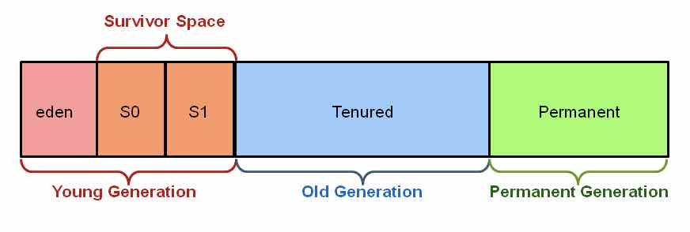
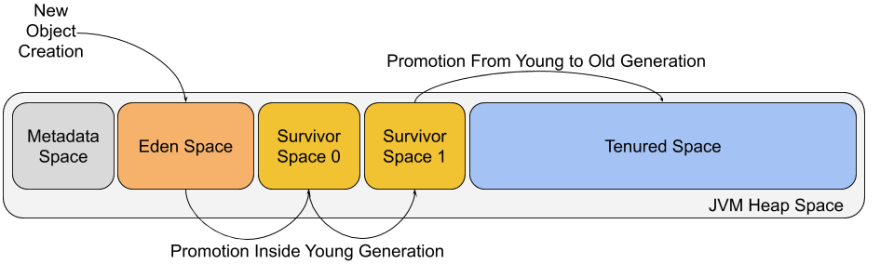

# 09周作业

以下两题，至少完成一道

## 请简述 JVM 垃圾回收原理。

JVM 垃圾回收就是将 JVM 堆中的已经不再被使用的对象清理掉，释放宝贵的内存资源用于创建新的对象。
`堆`可以细分为：新生代(Young generation)、老年代(Old/Tenured generation)和永久代(Permanent generation，这个常驻内存由JVM自身使用的，不在此讨论)。新生代可进一步细分为：Eden 空间、Survivor0 空间、Survivor1 空间等，参考下图。

整个 JVM 垃圾回收的过程分为标记和回收。

- JVM 通过一种可达性分析算法进行垃圾对象的标识，那些没有被标记的对象就是可回收的垃圾对象了。

  具体标记过程：从线程栈帧中的局部变量、方法区的静态变量出发，将这些变量引用的对象进行标记，然后看这些被标记的对象是否引用了其它对象，继续进行标记，所有被标记过的对象都是被使用的对象，而那些没有被标记的对象就是可回收的垃圾对象了。

- 进行标记以后，JVM 就会对垃圾对象占用的内存进行回收。回收的主要步骤是清理、压缩、复制。

  - 将垃圾对象占据的内存清理掉，其实JVM并不会真的将这些垃圾内存进行清理，而是将这些垃圾对象占用的内存空间标记为空闲，记录在一个空闲列表里，当应用程序需要创建新对象时，就从空闲列表中找一段空闲内存分配给这个新对象。

  - 从堆空间的头部开始，将存活的对象拷贝放在一段连续的内存空间中，那么其余的空间就是连续的空闲空间。

  - 将堆空间分成两部分，只在其中一部分创建对象，当这个部分的空间用完的时候，将标记过的可用对象复制到另一部分空间中。

  下图是垃圾回收前后示意图

## 设计一个秒杀系统，主要的挑战和问题有哪些？核心的架构方案或者思路有哪些？

待有空时补上。

## 参考

[JVM/垃圾回收](https://github.com/Snailclimb/JavaGuide/blob/master/docs/java/jvm/JVM垃圾回收.md)

[Java Garbage Collection Basics](https://www.oracle.com/webfolder/technetwork/tutorials/obe/java/gc01/index.html)

[UNDERSTANDING GARBAGE COLLECTION](https://hiteshkitty.wordpress.com/2016/07/06/understanding-garbage-collection/)

