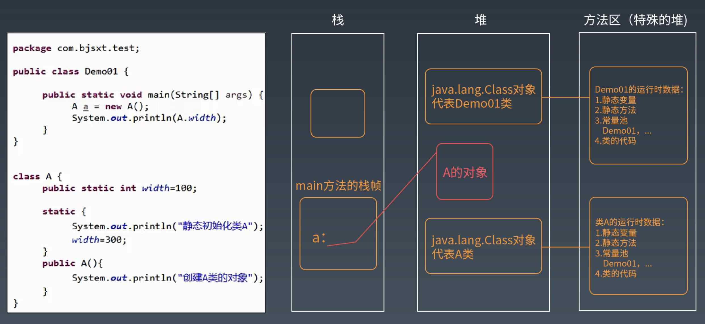

# 09周总结——性能优化3

* [JVM虚拟机的原理和编译优化](#jvm虚拟机的原理和编译优化)
    * [JVM组成架构](#jvm组成架构)
      * [Java字节码文件](#java字节码文件)
      * [Java字节码执行流程](#java字节码执行流程)
      * [Java字节码文件编译过程](#java字节码文件编译过程)
      * [类加载器的双亲委托模型](#类加载器的双亲委托模型)
          * [自定义类加载器](#自定义类加载器)
      * [堆 和 栈](#堆-和-栈)
      * [方法区 和 程序计数器](#方法区-和-程序计数器)
      * [Java线程栈](#java线程栈)
      * [线程工作内存 和 volatile](#线程工作内存-和-volatile)
      * [Java运行环境](#java运行环境)
      * [JVM的垃圾回收](#jvm的垃圾回收)
          * [标记](#标记)
          * [回收](#回收)
          * [JVM分代回收](#jvm分代回收)
          * [JVM垃圾回收器算法](#jvm垃圾回收器算法)
          * [G1垃圾回收内存管理机制](#g1垃圾回收内存管理机制)
    * [JVM性能诊断工具](#jvm性能诊断工具)
    * [Java代码优化](#java代码优化)
      * [合理并谨慎使用多线程](#合理并谨慎使用多线程)
* [秒杀](#秒杀)
    * [X网站性能现状](#x网站性能现状)
    * [秒杀案例](#秒杀案例)
      * [商业需求](#商业需求)
      * [技术挑战](#技术挑战)
      * [服务器和网络准备](#服务器和网络准备)
      * [架构目标](#架构目标)
      * [组成](#组成)
      * [设计原则](#设计原则)
      * [三道阀门的设计](#三道阀门的设计)
      * [秒杀器的预防](#秒杀器的预防)
      * [Web Server 调优](#web-server-调优)
      * [静态页面优化](#静态页面优化)
      * [下单页面优化](#下单页面优化)
      * [交易系统性能优化](#交易系统性能优化)
      * [应急预案](#应急预案)
      * [改进](#改进)
* [参考](#参考)

## JVM虚拟机的原理和编译优化

JVM Java Virtual Machine，一种能够运行java bytecode 的虚拟机，以堆栈结构机器来实现。最早由Sun微系统研发并实现了第一个版本，是Java平台的一部分，

### JVM组成架构

Java是一种跨平台的语言，JVM屏蔽了低层系统的不同，为Java字节码文件构造了一个统一的运行环境。

JVM 主要由三部分组成：类装载器、运行期数据区、执行引擎。

#### Java字节码文件

Java如何实现在不同的操作系统、不同硬件平台上，都可以不用修改代码就能舒畅地执行？

这得益于Java虚拟机——JVM

**计算机领域的任何问题都可以通过增加一个中间层（虚拟层）来解决**

Java所有的指令有200个左右，一个字节就可以存256种不同的指令集，一个这样的字节称为字节码 bytecode。在代码的执行过程中，JVM将字节码解释执行，屏蔽对底层操作系统的依赖，JVM也可以将字节码编译执行，如果是热点代码，会通过JIT动态地编译为机器码，提高执行效率。

#### Java字节码执行流程

#### Java字节码文件编译过程

#### 类加载器

##### 双亲委托模型 Parents Delegation Model

低层次的当前类加载器，不能覆盖更高层次类加载器已经加载的类。如果低层次的类加载器想加载一个未知类，需要上级类加载器确认，只有当上级类加载器没有加载过这个类，也允许加载的时候，才能加载。

##### 自定义类加载器

隔离加载类：同一个JVM中不同组件加载同一个类的不同版本。

扩展加载源：从网络、数据库等处加载字节码。

字节码加密：加载自定义的加密字节码，在ClassLoader中解密。

#### 堆 和 栈

堆：每个JVM实例唯一对应一个堆。应用程序在运行中所创建的所有类实例或数组都放在这个堆中，并由应用的所有线程共享。

堆栈：JVM为每个新创建的线程都分配一个堆栈。也就是说，对于一个Java程序来说，它的运行就是通过对堆栈的操作来完成的。

Java中所有对象的存储空间都是在堆中分配的，但是这个对象的引用却是在堆栈中分配，也就是说在创建一个对象时两个地方都分配内存，在堆中分配的内存存储实际对象，而在堆栈中分配的内存存储的是一个指向这个堆对象的引用（指针）。

#### 方法区 和 程序计数器

方法区主要存从磁盘加载进来的类字节码，而在程序运行过程中创建的类实例则存放在堆里。程序运行的时候，实际上是以线程为单位运行的，当JVM进入启动类的main方法时，就会为应用程序创建一个主线程，main方法里的代码就会被这个主线程执行，每个线程有自己的Java栈，栈里存放着方法运行期的局部变量。而当前线程执行到哪一行字节码指令，这个信息则存放在程序计数寄存器。

#### Java线程栈

所有的方法内定义的基本类型变量，都会被每个运行这个方法的线程存放入自己的栈中，线程的栈彼此隔离，所以这些变量一定是线程安全的。

#### 线程工作内存 和 volatile

Java内存模型规定在多线程情况下，线程操作主内存变量，需要通过线程独有的工作内存拷贝主内存变量副本来运行。

一个共享变量（类的成员变量、类的静态成员变量）被volatile修饰后，那么就具备了两层语义：

- 保证了不同线程对这个变量进行操作时的可见性，即一个线程修改了某个变量的值，这新值对其它线程来说是立即可见的。
- 禁止进行指令重排序。

#### Java运行环境

来张彩图 :)

#### JVM的垃圾回收

JVM垃圾回收就是将JVM堆中的已经不再被使用的对象清理掉，释放宝贵的内存资源。

##### 标记

JVM通过一种可达性分析算法进行垃圾对象的标记，具体过程：

从线程栈帧中的局部变量、方法区的静态变量出发，将这些变量引用的对象进行标记，然后看这些被标记的对象是否引用了其它对象，继续进行标记，所有被标记过的对象都是被使用的对象，而那些没有被标记的对象就是可回收的垃圾对象了。

##### 回收

进行标记以后，JVM就会对垃圾对象占用的内存进行回收，回收主要有三种方法

- 清理

  将垃圾对象占据的内存清理掉，其实JVM并不会真的将这些垃圾内存进行清理，而是将这些垃圾对象占用的内存空间标记为空闲，记录在一个空闲列表里，当应用程序需要创建新对象时，就从空闲列表中找一段空闲内存分配给这个新对象。

- 压缩

  从堆空间的头部开始，将存活的对象拷贝放在一段连续的内存空间中，那么其余的空间就是连续的空闲空间。

- 复制

  将堆空间分成两部分，只在其中一部分创建对象，当这个部分的空间用完的时候，将标记过的可用对象复制到另一部分空间中。

##### JVM分代回收

##### JVM垃圾回收器算法

##### G1垃圾回收内存管理机制

### JVM性能诊断工具

- 基本工具：

  - JPS

    JPS 用来查看host上运行的所有java进程的pid(jvm-id)，一般情况下使用这个工具的目的只是为了找出运行的JVM进程ID，然后可以进一步使用其它的工具来监控和分析JVM。

  - JSTAT

    Java Virtual Machinet satistics mornitoring tool 是JDK自带的一个轻量级小工具。主要对Java应用程序的资源和性能进行实时的命令行监控，包括了对Heap size和垃圾回收状况的监控。

  - JMAP

    一个可以输出所有内存中对象的工具，甚至可以将JVM中的heap，以二进制输出成文本。

- 集成工具
  - JConsole 
  - JVisualVM

> 关于工具可以参考这篇文章 [guide-to-java-profiler](https://medium.com/platform-engineer/guide-to-java-profilers-e344ce0339e0)

### Java代码优化

java-optimization-parts

#### 合理并谨慎使用多线程

- 使用场景：I/O阻塞，多CPU并发

  资源竞争与同步问题

  启动线程数 = 任务执行时间 / (任务执行时间 - I/O等待时间) ✖️ CPU内核数

  最佳启动线程数和CPU内核数量成正比，和I/O阻塞时间成反比。如果任务都是CPU计算型任务，那么线程数量最多不超过CPU内核数，因为启动再多线程，CPU也来不及调度；相反如果是任务需要等待磁盘操作、网络响应，那么，启动线程有助与提高任务并发度，提高系统的吞吐能力，改善系统性能。

- 竞态条件与临界区

  在同一程序中运行多个线程本身不会导致问题，问题在于多个线程访问了相同的资源。当两个线程竞争同一资源时，如果对资源的访问顺序敏感，就称存在竞态条件。导致竞态条件发生的代码区称为临界区。

  在临界区中使用适当的同步就可以避免竞态条件。

- Java线程安全

  允许被多个线程安全执行的代码称作线程安全代码。
  
  - 局部变量
  
    局部变量存储在线程自己的栈中。也就是说，局部变量永远也不会被多个线程共享。所以，基础类型的局部变量是线程安全的。
  
  - 局部对象的引用
  
    如果某个方法中创建的对象不会逃逸出该方法，那么它就是线程安全的。
  
  - 对象成员
  
    对象成员存储在堆上。如果两个线程同时更新同一个对象的同一成员，那这代码就不是线程安全的。

思考

Java Web应用的多线程从哪里来的？

当 HTTP 请求到达时，Servlet容器通过调度线程(Dispatcher Thread) 调度它管理下线程池中等待执行的线程（Worker Thread）给请求者。因此请求分配到的处理线程可以是新建线程，也可以是从线程池中获取的。

Servlet是线程安全的吗？

Servlet 默认是单例模式，在 web 容器中只创建一个实例，所以多个线程同时访问 Servlet 的时候，Servlet 不是线程安全的。
那么 web 容器能为每个请求创建一个 Servlet 的实例吗？当然是可以的，只要 Servlet 实现 SingleThreadModel 接口，就可以了。

ThreadLocal 的实现

- Java 内存泄漏

Java 内存泄漏是由于开发人员的错误引起的。

如果程序保留对永远不再使用的对象的引用，这些对象将会占用并耗尽内存。

- 长生命周期对象
- 静态容器
- 缓存

合理使用线程池和对象池

- 复用线程或对象资源，避免在程序的生命期中创建和删除大对象
- 池管理算法（记录哪些对象是空闲的，哪些对象正在使用）
- 对象内容清除（ThreadLocal的清空）

使用合适的JDK容器类（顺序表、链表、Hash）

- LinkedList 和 ArrayList 的区别及适用场景

- HashMap的算法实现即应用场景

- 使用cocurrent包，CocurrentHashMap 和 HashMap的线程安全特性有什么不同？

  CocurrentHashMap 是线程安全的

缩短对象生命周期，加速垃圾回收

- 减少对象驻留内存的时间
- 在使用时创建对象，用完释放
- 创建对象的步骤（静态代码段 - 静态变量 - 父类构造函数 - 子类构造函数）

使用I/O buffer 及 NIO

- 延迟写与提前读策略
- 异步无阻塞 I/O 通信

优先使用组合替代继承

- 减少对象耦合
- 避免太深的继承层次带来的对象创建性能损失

合理使用单例模式

- 无状态对象
- 线程安全

虚拟化所有层次

- 计算机的任何问题都可以通过间接层级解决
- 一致性hash算法的虚拟化实现
- 面向接口编程
- 7层网络协议

## 秒杀

### X网站性能现状

平时单机、高峰期情况

- 并发 < 10

- 吞吐量 <60
- CPU负载 < 2，非高峰期< 1
- CPU使用率，60% 左右
- 服务器平均响应时间 150 ms
- 图片总流量带宽1.8G

高并发下的风险

- 网络带宽耗尽
- 服务器负载飙高，停止响应
- 数据库瘫痪

高并发下的事故

- 网站运营推广页面弹出1M大图片导致带宽耗尽
  - 增加审核机制：运营广告增加的图片流量不能超过现有流量的30%
- 合作媒体推广浮出广告，导致集群crash

> 关于JVM的一些补充：
>
> 由于JVM并不是专为Java所实现的运行时，实际上只要有其他编程语言的编译器能生成正确Java bytecode文件，则这个语言也能实现在JVM上运行。
>
> 有些语言原生就在JVM上实现运行
>
> 有些语言实现了相应的JVM编译（解释）器

### 秒杀案例

#### 商业需求

- 为庆祝开业推出99小时不间断秒杀活动

- 每小时整点出8款产品

- 每款商品供应168件，每人限购3件，成交人数56人

- 接到运营通知时距秒杀开始仅仅5天时间

#### 技术挑战

- 瞬间高并发
  - 8000并发：预计秒杀在线人数8000人
  - 风险：带宽耗尽
  - 服务器：崩溃，可以理解成给自己准备的 DDOS 攻击
- 秒杀器
  - 第一种：秒杀前不断刷新秒杀页面，直到秒杀开始，抢着下单
  - 第二种：跳过秒杀页面，直接进入下单页面，下单

#### 服务器和网络准备

- 时间太短来不及采购服务器
  - style服务器（Lighttpd 集群）：5台
  - 图片服务器（Nginx 集群）：5台
  - 静态服务器（Appache 集群）：10台
  - 交易服务器（JBoss 动态集群）： 10台

- 带宽准备

  - 图片出口带宽上限：2.5G（出口带宽支持10G）

    出口带宽上限根据图片服务集群的处理能力来定。

    图片服务器集群的处理能力 = 图片服务集群最大并发处理能力 ✖️ 网站平均图片大小 

  - CDN准备：chinacache 沟通

#### 架构目标

1. 图片网络带宽： 1.0G

   新增图片带宽：必须控制在1.0G左右

   每件商品秒杀页面的图片总大小不得超过：1G/(8 * 1000)=125K

2. 网站并发

   单件商品并发：1000 （运营的预估）

   总并发：8 * 1000

#### 组成

简单系统的三个页面：秒杀商品列表、秒杀商品详情、下单

#### 设计原则

- 静态化

  采用JS自动更新技术将动态页面转化为静态页面

- 并发控制，防秒杀器

  设置阀门，只放最前面的一部分人进入秒杀系统

- 简化流程
  - 砍掉不重要的分支流程，如下单页面的所有数据库查询
  - 以下单成功作为秒杀成功标志，支付流程只要在一天内完成即可

- 前端优化
  
  - 采用前端优化原则提升页面响应速度

#### 三道阀门的设计

阀门：基于TT的计数器

- 限制进入秒杀页面

- 限制进入下单页面

- 限制进入支付系统

#### 秒杀器的预防

- 秒杀详情页面
  - URL随机
  - 秒杀前2秒放出，脚本生成，秒杀前
  - 1000访问上限控制（每件商品只能放入1000人浏览）

- 下单页面
  - 订单ID随机
  - 不能直接跳过秒杀详情页面进入
  - 每个秒杀商品，带预先生成的随机Token作URL参数
  - 如果秒杀过，直接跳到秒杀结束页面
  - 100次访问上限（每件商品只能放入100人下单）

#### Web Server 调优

- keep Alive相关参数调优
- 其它参数
  - hostnameLookups off
  - 域名设置 不进行正向/反向的 dns 解析
- 关闭 cookies-log 日志
- 打开Linux sendfile
- 关闭无用的module
- TBD

#### 静态页面优化

- 图片合并
  - 多张图片合并成1张
  - 减少HTTP请求数，减少请求等待时间
  - 减少发送cookies的量
- HTML 内容压缩
  - 图片压缩：基于图片大小来决定是否开启压缩
  - cache-control 设置
  - css、js 精简

#### 下单页面优化

- 数据库操作精简：全部砍掉！怎么做？
- 流程精简
  - 砍掉填写或选择收货地址，放在秒杀成功后填写
  - 砍掉调用是否开通支付接口，秒杀首页文案提示必须开通
- 采用内存缓存

#### 交易系统性能优化

- 关闭KeepAlive （分析交易系统的accesslog，用户在短时间内连续点击概率很低）
- JVM优化
- 优化CMS垃圾回收器的参数
- 消灭Top 10 的瓶颈

#### 应急预案

- 域名分离，独立域名，不影响原有业务
- 冗余服务器
- 万能出错页面
- TBD

#### 改进

- 采用更轻量/快速的服务器

- 前端优化自动化

  自动压缩、静态资源版本管理

- 架设镜像站组建山寨CDN

- 采用反向代理加速核心页面

  squid 反向代理集群

- 海量数据的透明垂直切分

**这个案例应该是老师当年的一个宝贵经历，但是很多东西已经过时了！**

## 参考

[JVM/垃圾回收]([https://github.com/Snailclimb/JavaGuide/blob/master/docs/java/jvm/JVM%E5%9E%83%E5%9C%BE%E5%9B%9E%E6%94%B6.md](https://github.com/Snailclimb/JavaGuide/blob/master/docs/java/jvm/JVM垃圾回收.md))

[Java Garbage Collection Basics](https://www.oracle.com/webfolder/technetwork/tutorials/obe/java/gc01/index.html)

[UNDERSTANDING GARBAGE COLLECTION](https://hiteshkitty.wordpress.com/2016/07/06/understanding-garbage-collection/)
