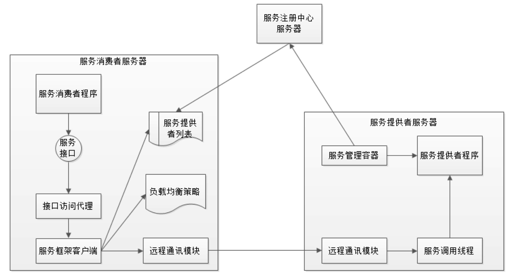

# 10周作业——微服务架构

## 根据微服务框架 Dubbo 的架构图，画出 Dubbo 进行一次微服务调用的时序图。

下图是从Dubbo官网找来的，看一下基于RPC层，服务提供方和服务消费方之间的调用关系：

节点角色说明：

Provider：    暴露服务的服务提供方
Consumer： 调用远程服务的服务消费方
Registry：    服务注册与发现的注册中心
Monitor：	统计服务的调用次数和调用时间的监控中心
Container：服务运行容器

蓝色的表示与业务有交互，绿色的表示只对Dubbo内部交互,调用关系说明

- 服务容器负责启动，加载，运行服务提供者。
- 服务提供者在启动时，向注册中心注册自己提供的服务。
- 服务消费者在启动时，向注册中心订阅自己所需的服务。
- 注册中心返回服务提供者地址列表给消费者，如果有变更，注册中心将基于长连接推送变更数据给消费者。
- 服务消费者，从提供者地址列表中，基于软负载均衡算法，选一台提供者进行调用，如果调用失败，再选另一台调用。
- 服务消费者和提供者，在内存中累计调用次数和调用时间，定时每分钟发送一次统计数据到监控中心。

微服务调用的时序图如下：

## 关于微服务架构（中台架构、领域驱动设计、组件设计原则），你有什么样的思考和认识？

- 微服务架构

  为了解决大型互联网应用（巨无霸系统）编译、部署困难、代码分支管理困难、数据库连接耗尽、新增业务困难等而产生的 。

  为了实现微服务架构，必须对业务有充分理解，将每一个服务组件化、领域化，才能真正的将功能微小化、服务化。

- 中台是指企业级能力复用平台

  通过对不同业务线解决相同问题域的解决方案进行抽象与封装，通过配置化、插件化、服务化等机制兼顾各条业务线的特性需求，实现对于不同业务线的业务支撑。

- 领域驱动设计

  从领域出发，分析领域内的模型及关系，并且驱动产生解决方案。

  领域驱动设计的战略设计与战术设计。领域模型合并了行为和数据的领域的对象模型。通过领域模型的交互完成业务逻辑的实现。设计好了领域模型的对象，就设计好了业务逻辑实现。

- 组件设计原则

  软件设计的核心目标就是高内聚、低耦合。
  
  在具体设计中组件内聚原则又有如下原则：
  
  - 复用发布等同原则
  
    软件复用的最小粒度应该等同于其发布的最小粒度。
  
  - 共同封闭原则
  
    指将那些会同时修改，并且为了相同目的而修改的类放到同一个组件中。
  
  - 共同复用原则
  
    不要强迫一个组件的用户依赖他们不需要的东西。

小结：

微服务架构可以以领域驱动指导（明确业务边界），以组件设计为原则（划分业务功能），以中台架构提供服务（企业级能力复用平台）。

## 参考

http://dubbo.apache.org/zh-cn/docs/user/preface/architecture.html

