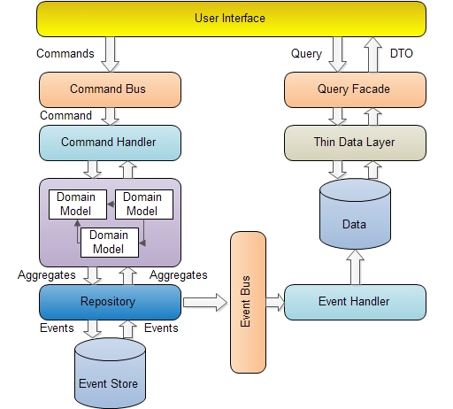
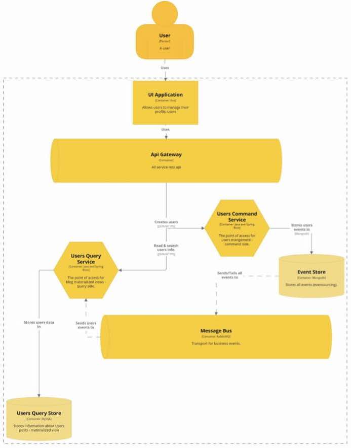

# 10周总结

* [微服务](#微服务)
    * [阿里早期微服务架构重构](#阿里早期微服务架构重构)
      * [巨无霸应用系统带来的问题](#巨无霸应用系统带来的问题)
          * [编译、部署困难](#编译部署困难)
          * [代码分支管理困难](#代码分支管理困难)
          * [数据库连接耗尽](#数据库连接耗尽)
          * [新增业务困难](#新增业务困难)
          * [解决方案](#解决方案)
    * [微服务框架](#微服务框架)
      * [Web Service 与企业级分布式服务](#web-service-与企业级分布式服务)
    * [微服务框架需求](#微服务框架需求)
      * [微服务框架Dubbo架构](#微服务框架dubbo架构)
      * [服务网格Service Mesh](#服务网格service-mesh)
      * [Service Mesh的边车模式Sidecar](#service-mesh的边车模式sidecar)
    * [微服务架构实践](#微服务架构实践)
      * [微服务架构落地](#微服务架构落地)
      * [命令与查询职责隔离（CQRS）](#命令与查询职责隔离cqrs)
      * [事件溯源（event sourcing）](#事件溯源event-sourcing)
      * [断路器](#断路器)
      * [服务重试及调用超时](#服务重试及调用超时)
      * [最重要的是需求](#最重要的是需求)
    * [服务器网关](#服务器网关)
      * [基于网关的微服务架构](#基于网关的微服务架构)
      * [网关管道技术](#网关管道技术)
      * [Flower异步网关与异步微服务框架](#flower异步网关与异步微服务框架)
      * [开放平台网关](#开放平台网关)
      * [开放授权协议OAuth2.0](#开放授权协议oauth20)
* [领域驱动设计DDD](#领域驱动设计ddd)
    * [为什么需要DDD](#为什么需要ddd)
    * [事务脚本](#事务脚本)
    * [领域模型](#领域模型)
      * [贫血模型 VS 充血模型](#贫血模型-vs-充血模型)
      * [子域](#子域)
      * [边界上下文](#边界上下文)
      * [上下文映射图](#上下文映射图)
      * [实体](#实体)
      * [值对象](#值对象)
      * [聚合](#聚合)
    * [DDD分层架构](#ddd分层架构)
    * [DDD六边形架构](#ddd六边形架构)
    * [DDD战略设计与战术设计](#ddd战略设计与战术设计)
    * [举例：一个DDD重构实践过程](#举例一个ddd重构实践过程)
* [组件设计原则](#组件设计原则)
    * [软件的复杂度和它的规模成指数关系](#软件的复杂度和它的规模成指数关系)
    * [组件内聚原则](#组件内聚原则)
    * [复用发布等同原则](#复用发布等同原则)
    * [共同封闭原则](#共同封闭原则)
    * [共同复用原则](#共同复用原则)
    * [组件耦合原则](#组件耦合原则)
    * [无循环依赖原则](#无循环依赖原则)
    * [稳定依赖原则](#稳定依赖原则)
    * [稳定抽象原则](#稳定抽象原则)
    * [组件的边界与依赖关系，不仅仅是技术问题](#组件的边界与依赖关系不仅仅是技术问题)
* [RPC协议实现](#rpc协议实现)
    * [远程过程调用 RPC](#远程过程调用-rpc)
    * [通信协议](#通信协议)
      * [为什么设计私有通信协议](#为什么设计私有通信协议)
      * [常见的协议模式](#常见的协议模式)
      * [Dubbo通信协议](#dubbo通信协议)
      * [SOFA-RPC通信协议](#SOFA-RPC通信协议)
      * [序列化协议](#序列化协议)
* [参考](#参考)

## 微服务

### 阿里早期微服务架构重构

#### 巨无霸应用系统带来的问题

##### 编译、部署困难

对于网站开发工程师而言，打包构建一个巨型应用是一件痛苦的事情。

##### 代码分支管理困难

复用代码模块有多个团队共同维护修改，代码合并的时候总会发生冲突。

##### 数据库连接耗尽

将整个应用部署到一个大规模的服务器集群上，应用与数据库的连接通常使用数据库连接池，假设每个应用占用10个数据库连接，那么一个数百台服务器集群的应用将需要在数据库上创建数千个连接。每个连接在数据库服务器上会占用些昂贵的系统资源，以至于数据库缺乏足够的系统资源进行一般数据操作。

##### 新增业务困难

##### 解决方案

面对这些困难的解决方案就是拆分，将模块独立部署，降低系统耦合性：

- 纵向拆分

  将一个大应用拆分为多个小应用，如果新增业务较为独立，那么就直接将其设计部署为一个独立的Web应用系统

- 横向拆分

  将复用的业务拆分出来，独立部署为微服务，新增业务只需要调用这些微服务即可快速搭建一个应用系统

### 微服务框架

#### Web Service 与企业级分布式服务

服务提供者通过WSDL向注册中心描述自身提供的服务接口属性，注册中心使用同一UDDI发布服务提供者提供的服务，服务请求者从注册中心检索到服务信息后，通过SOAP和服务提供者通信，使用相关服务。

- WSDL：Web服务描述语言 web service description language

- service broker：服务注册中心

- UDDI：描述、发现和集成 universal description, discovery and integration

- SOAP：简单对象访问协议 simple object access protocol

Web Service 虽然有者成熟的技术规范和产品实现，以及在企业应用领域有许多成功的案例，但是也有一些固有的缺点

- 臃肿的注册与发现机制
- 低效的XML序列化手段
- 开销相对较高的HTTP远程通信
- 复杂的部署与维护手段

这些问题导致Web Service难以满足大型网站对系统高性能、高可用、易部署、易维护的要求。

### 微服务框架需求

对于大型互联网系统，除了Web Service所规范的服务注册与发现、服务调用等标准功能，还需要微服务框架能够支持

- 失效转移

  对于大型网站的微服务而言，即使是很少访问的简单服务，也需要集群部署，同时微服务框架还需要支持服务提供者的失效转移机制，以实现服务高可用。

- 负载均衡

  对于集群部署的服务提供者，服务请求者可以使用加权轮询等手段访问，使服务提供者集群实现负载均衡。

- 高效的远程通信

  对于大型网站，核心服务每天的调用次数会达到数以亿计，如果没有高效的远程通信手段，服务调用可能会成为整个系统性能的瓶颈。

- 对应用最少侵入

  网站技术是为业务服务的，是否使用微服务需要根据业务发展规划，微服务也需要渐进式的演化，甚至会出现反复，即使用了微服务后又退回到集中式部署，微服务框架需要支持这种渐进式演化和反复。当然服务模块本身需要支持可集中式部署，也可分布式部署。

- 版本管理

  为了应对快速变化的需求，服务版本升级不可避免，如果仅仅是服务实现升级，那么这种升级对服务请求者而言是透明的，无需关注。但是如果服务的访问接口发生变化，就需要服务请求者和服务提供者同时升级才不会导致服务调用失败。企业应用系统可以申请停机维护，同时升级接口，而网站服务不可能中断，需要服务提供者先升级接口，并同时提供历史版本的服务请求者调用，当请求者访问接口升级后才可以关闭历史版本服务。

#### 微服务框架Dubbo架构

<div align=center>

</div>

#### 服务网格Service Mesh

Service Mesh 是一个基础设施层，用于处理服务间的通信，通常表现为一组轻量级网络代理，他们与应用程序部署在一起，而对应用程序透明。

<div align=center>

</div>

#### Service Mesh的边车模式Sidecar

<div align=center>

</div>

### 微服务架构实践

#### 微服务架构落地

- 业务先行，先理顺业务边界和依赖，技术是手段而不是目的
- 先有独立的模块，后有分布式的服务
- 业务耦合严重，逻辑复杂多变的系统进行微服务重构要谨慎
- 要搞清楚实施微服务的目的是什么，业务复用？开发边界清晰？分布式集群提升性能？

#### 命令与查询职责隔离（CQRS）

> Command Query Responsibility Segregation

在服务接口层面将查询（读操作）与命令（写操作）隔离，实现服务层的读写分离。

- 更清晰的领域模型
- 针对读写分别优化，实现更好的性能
- 查询服务不会修改数据，更好地保护数据

<div align=center>

</div>

#### 事件溯源（event sourcing）

将用户请求处理过程中的每次状态变化都记录到事件日志中，并按时间序列进行持久化存储。

- 利用事件溯源，可以精确复现任何用户状态，进行复核审计
- 利用事件溯源，可以有效监控用户状态变化，并在此基础上实现分布式事务

#### 断路器

当某个服务出现故障，响应延迟或者失败率增加，继续调用这个服务会导致调用者请求阻塞，资源消耗增加，进而出现服务级联失效，这种情况下使用断路器阻断对故障服务的调用。

断路器有如下三种状态：关闭、打开、半开

<div align=center>

</div>

#### 服务重试及调用超时

上游调用者超时时间要大于下游调用者超时时间之和。

#### 最重要的是需求

应用架构关键还是需求

### 服务器网关

#### 基于网关的微服务架构

<div align=center>

</div>

##### 网关作用

<div align=center>

</div>

##### 微服务网关


#### 网关管道技术

网关本身没有什么业务，主要职责是做各种校验和拦截，这些职责可以通过管道技术连接起来。

<div align=center>


<p>实现管道技术的职责链设计模式</p>
</div>


#### Flower异步网关与异步微服务框架

<div align=center>

</div>

#### 开放平台网关

<div align=center>

</div>

#### 开放授权协议OAuth2.0

<div align=center>

</div>

#### 授权码授权

OAuth2.0有四种授权方式，分别是授权码、隐式授权、资源所有者密码凭据和客户端凭据。

下图是授权码方式，是目前互联网上使用最多的、最安全的一种方式。

```text
     +----------+
     | Resource |
     |   Owner  |
     |          |
     +----------+
          ^
          |
         (B)
     +----|-----+          Client Identifier      +---------------+
     |         -+----(A)-- & Redirection URI ---->|               |
     |  User-   |                                 | Authorization |
     |  Agent  -+----(B)-- User authenticates --->|     Server    |
     |          |                                 |               |
     |         -+----(C)-- Authorization Code ---<|               |
     +-|----|---+                                 +---------------+
       |    |                                         ^      v
      (A)  (C)                                        |      |
       |    |                                         |      |
       ^    v                                         |      |
     +---------+                                      |      |
     |         |>---(D)-- Authorization Code ---------'      |
     |  Client |          & Redirection URI                  |
     |         |                                             |
     |         |<---(E)----- Access Token -------------------'
     +---------+       (w/ Optional Refresh Token)

   Note: The lines illustrating steps (A), (B), and (C) are broken into
   two parts as they pass through the user-agent.
```

> please refer to <https://tools.ietf.org/html/rfc6749>

## 领域驱动设计DDD

### 为什么需要DDD

目前很多项目的实际情况：

- 用户或者产品经理的需求零零散散，不断变更
- 工程师在各处代码中寻找可以实现这些需求变更的代码，修修补补
- 软件只有需求分析，并没有真正的设计，系统没有一个统一的领域模型维持其内在的逻辑一致性
- 功能特性并不是按照领域模型内在的逻辑设计，而是按照个人的主观想象设计

这样的情况导致项目时间一长，各种困难重重，需求不断延期，线上bug不断，管理者考虑是不是要推倒重来，而程序员则考虑是不是要跑路，吼吼。。。

### 事务脚本


### 领域模型


#### 贫血模型 VS 充血模型


#### 子域


#### 边界上下文


#### 上下文映射图


#### 实体


#### 值对象


#### 聚合


### DDD分层架构


### DDD六边形架构


### DDD战略设计与战术设计


### 举例：一个DDD重构实践过程


## 组件设计原则

**在没有编程语言的时候就已经有了软件组件**

### 软件的复杂度和它的规模成指数关系


### 组件内聚原则


### 复用发布等同原则


### 共同封闭原则


### 共同复用原则


### 组件耦合原则


### 无循环依赖原则


### 稳定依赖原则


### 稳定抽象原则


### 组件的边界与依赖关系，不仅仅是技术问题


## RPC协议实现

### 远程过程调用 RPC


### 通信协议


#### 为什么设计私有通信协议


#### 常见的协议模式


#### Dubbo通信协议


#### SOFA-RPC通信协议


#### 序列化协议


## 参考

[Introduction to CQRS](https://www.codeproject.com/Articles/555855/Introduction-to-CQRS)

[dubbo architecture](http://dubbo.apache.org/zh-cn/docs/user/preface/architecture.html)
