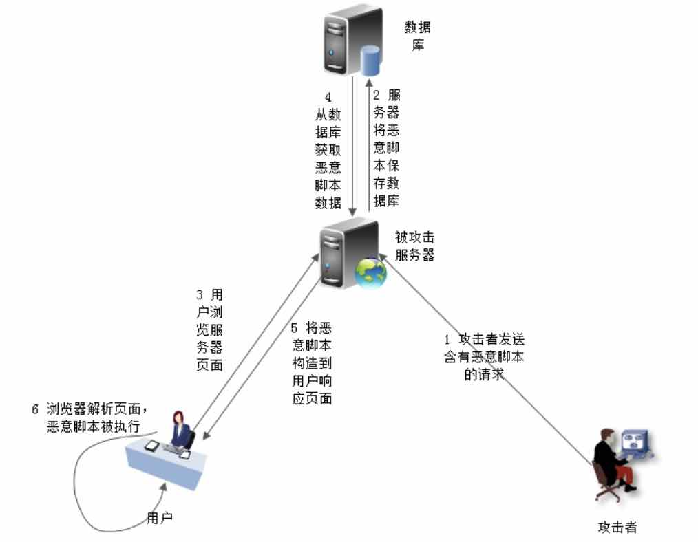

# 11周总结——安全稳定

* [安全架构](#安全架构)
    * [XSS 攻击](#xss-攻击)
      * [XSS 攻击防御手段](#xss-攻击防御手段)
    * [SQL 注入](#sql-注入)
      * [获取数据库表结构信息的手段](#获取数据库表结构信息的手段)
      * [注入攻击防御手段](#注入攻击防御手段)
    * [CSRF攻击](#csrf攻击)
      * [CSRF 攻击防御手段](#csrf-攻击防御手段)
    * [其他需要关注的攻击和漏洞](#其他需要关注的攻击和漏洞)
    * [Web应用防火墙](#web应用防火墙)
    * [网站安全漏洞扫描](#网站安全漏洞扫描)
    * [信息加密技术及密钥安全管理](#信息加密技术及密钥安全管理)
      * [单向散列加密](#单向散列加密)
      * [对称加密](#对称加密)
      * [非对称加密](#非对称加密)
    * [密钥安全管理与加密服务系统架构](#密钥安全管理与加密服务系统架构)
      * [反垃圾邮件](#发垃圾邮件)
      * [贝叶斯分类算法](#贝叶斯分类算法)
      * [布隆过滤黑名单](#布隆过滤黑名单)
    * [电子商务风险控制](#电子商务风险控制)
      * [规则引擎](#规则引擎)
      * [机器学习](#机器学习)
* [高可用架构的度量](#高可用架构的度量)
    * [可用性指标](#可用性指标)
    * [故障分管理](#故障分管理)
    * [故障处理流程及考核](#故障处理流程及考核)
    * [引起故障的原因](#引起故障的原因)
* [高可用系统的架构](#高可用系统的架构)
    * [解耦](#解耦)
    * [隔离](#隔离)
    * [异步](#异步)
    * [备份](#备份)
    * [失效转移](#失效转移)
    * [幂等](#幂等)
    * [事务补偿](#事务补偿)
    * [重试](#重试)
    * [熔断](#熔断)
    * [限流](#限流)
      * [计数器算法](#计数器算法)
      * [令牌桶算法](#令牌桶算法)
      * [漏桶算法](#漏桶算法)
    * [自适应限流](#自适应限流)
    * [降级](#降级)
    * [异地多活](#异地多活)
* [高可用系统的运维](#高可用系统的运维)
    * [发布](#发布)
      * [自动化测试](#自动化测试)
          * [手动测试和自动化测试的总体成本](#手动测试和自动化测试的总体成本)
      * [自动化部署](#自动化部署)
          * [持续部署三步走](#持续部署三步走)
          * [持续部署流程](#持续部署流程)
      * [预发布验证](#预发布验证)
      * [代码版本控制](#代码版本控制)
          * [主干开发，分支发布](#主干开发分支发布)
          * [分支开发，主干发布](#分支开发主干发布)
      * [自动化发布](#自动化发布)
      * [灰度发布](#灰度发布)
    * [网站运行监控](#网站运行监控)
      * [监控数据采集](#监控数据采集)
      * [用户行为日志收集](#用户行为日志收集)
      * [服务器性能监控](#服务器性能监控)
      * [业务运行数据报告](#业务运行数据报告)
      * [监控管理](#监控管理)
          * [报警](#报警)
          * [自动控制](#自动控制)
      * [监控系统架构](#监控系统架构)
    * [高可用的价值观](#高可用的价值观)
* [参考](#参考)

## 安全架构

下面列举互联网系统90%的攻击方式。

### XSS 攻击

#### XSS 攻击防御手段

消毒！消毒几乎是所有网站最必备的XSS防攻手段。

XSS攻击者一般都是通过在请求中嵌入恶意脚本达到攻击目的，这些脚本是一般用户输入中不使用的，如果进行过滤和消毒处理，即对某些HTML危险字符转义，就可以防止部分攻击。

消毒的过程要注意避免对不必要的内容错误转义，如“3<5”中的“<”，需要进行文本匹配后再转义，如“

#### 获取数据库表结构信息的手段

- 开源

  如果网站采用开源软件搭建，如用Discuz搭建论坛网站，那么网站数据库结构就是公开的，攻击者可以直接获得。

- 错误回显

  如果网站开启错误回显，攻击者故意构造非法参数，服务端异常信息会输出至浏览端，为攻击猜测数据库表结构提供了便利。

- 盲注

  网站关闭错误回显，攻击者根据页面变化情况判断SQL语句的执行情况，据此猜测数据库表结构，此种方式攻击难度较大。

#### 注入攻击防御手段

- 消毒！

  和防XSS攻击一样，请求参数消毒是一种比较简单粗暴由有效的手段。通过正则匹配，过滤请求数据中可能注入的SQL文字

  如，"drop table"、"\b(?:update\b.*?\bset|delete\b\W*?\bfrom)\b"等。

- SQL预编译参数绑定

  使用预编译手段，绑定参数是最好的防SQL注入方法。目前许多数据访问层框架，如myBatis，Hibernate等，都实现SQL预编译和参数绑定，攻击者的恶意SQL会被当作SQL参数，而不是SQL命令被执行。

### CSRF攻击

#### CSRF 攻击防御手段

- 表单Token

  CSRF是一个伪造用户请求的操作，所以需要构造用户请求的所有参数才可以。表单Token就是阻止攻击者获得所有请求参数的可能，在页面表单中增加一个随机参数Token，每次请求的Token都不相同，请求提交后检查Token的值是否正确以确定请求提交者是否合法。

- 验证码

  相对来说，验证码更加简单有效，即请求提交时，需要用户输入验证码，以避免在用户不知情的情况下被攻击者伪造请求。但是输入验证码是一个糟糕的用户体验，所以必要的时候才使用，如支付、交易等关键页面。

- Referer check

  HTTP请求头 referer 中记录着请求来源，可通过检查请求来源，验证其是否合法。但是该方法有一定的局限性，可以被伪造，且不一定总能得到。

### 其他需要关注的攻击和漏洞

- Error Code

  也称作错误回显，许多Web服务器默认是打开异常信息输出的，即服务器端未处理的异常堆栈信息会直接输出到客户端浏览器，这种方式虽然对程序调试和错误报告有好处，但同时也给黑客造成可乘之机。通过故意制造非法输入，使系统运行时出错，获得异常信息，从而寻找系统漏洞进行攻击。防御手段也很简单，通过配置Web服务器参数，跳转500页面到专门的错误页面即可，这个功能Web应用常用的MVC框架也可以做到。

- HTML注释

  为了程序调试方便或其他不恰当的原因，有的时候程序开发人员会在PHP、JSP等服务器页面程序中使用HTML注释语法进行程序注释，这些HTML注释就会显示在客户端浏览器，给黑客造成攻击便利。程序最终发布前需要进行代码review或自动扫描，避免HTML注释漏洞。

- 文件上传

  一般网站都会有文件上传功能，设置头像、分享视频、上传附件等。如果上传的是可执行程序，并通过该程序会的服务器端命令执行能力，那么攻击者几乎可以在服务器上为所欲为，并以此为跳板攻击集群环境的其他机器。最有效的防御手段是设置上传文件白名单，只允许上传可靠的文件类型。此外还可以修改文件名、使用专门的存储手段，保护服务器免受上传文件攻击。

- 路径遍历

  攻击者在请求的URL中使用相对路径，遍历系统未开放的目录和文件。防御方法主要是将Javascript、CSS等资源文件独立服务器、独立域名，其他文件不使用静态URL访问，动态参数不包含文件路径信息。

### Web应用防火墙

开源的Web应用防火墙ModSecurity

ModSecurity是一个开源的Web应用防火墙，探测攻击并保护Web应用程序，既可以嵌入到Web应用服务器中，也可以作为一个独立的应用程序启动。ModSecurity最早只是Apache的一个模块，现在已经有Java、.NET多个版本，并支持Nginx。

ModSecurity采用处理逻辑与规则集合分离的架构模式。处理逻辑负责请求和响应的拦截过滤，规则加载执行等功能。而规则集合则负责对具体的攻击规则定义、模式识别、防御侧露等功能。处理逻辑比较稳定，规则集合需要不断针对漏洞进行升级，这是一种可扩展的架构设计。

### 网站安全漏洞扫描

和电脑安全漏洞扫描一样，网站也需要安全漏洞扫描。

网站安全漏洞扫描工具是根据内置规则，模拟黑客攻击行为，用以发现网站安全漏洞的工具。许多大型网站的安全团队都有自己开发的漏洞扫描工具，不定期的对网站的服务器进行扫描，查漏补缺。

目前市场上也有很多商用的网站安全扫描平台。

 ### 信息加密技术及密钥安全管理

2011年12月被爆的CSDN密码泄露事故中，网站安全措施不力，导致数据库被黑客“拖库”并不稀奇，令人错愕的数据库中的用户密码居然是明文保存，导致密码泄露，成为地下黑市交易的商品。

通常，为了保护网站的敏感数据，应用需要对这些信息进行加码处理，信息加密技术可以分为以下三类：

#### 单向散列加密

#### 对称加密

#### 非对称加密

### 密钥安全管理与加密服务系统架构

### 反垃圾邮件

#### 贝叶斯分类算法

[参考](https://www.cnblogs.com/leoo2sk/archive/2010/09/17/naive-bayesian-classifier.html)

#### 布隆过滤黑名单

[参考1](https://juejin.im/post/6844903805209804807)

[参考2](https://zhuanlan.zhihu.com/p/72378274)

### 电子商务风险控制

电子商务网站给人们购物交易带来极大方便的同时，也将风险带给了对网络安全一无所知的人们。由于买卖双方的信息不对等，交易本来就存在风险，而当交易在网上发生的时候，买卖双方彼此一无所知，交易风险就更加难以控制。如果一个电商网站骗子横行，诚信的交易者屡屡被骗，那么网站就到了最危险的时候了，可以说，交易安全是电子商务网站的底线。

电子商务有多种形式：B2B、B2C、C2C，每种交易的场景都不相同，风险也各有特点，大致可以分为以下几种：

- 账户风险

  包括账户被黑客盗用，恶意注册账户等几种情况。

- 买家风险

  买家恶意下单占用库存进行不正当竞争；黄牛利用促销抢购低价商品；此外还有良品拒收、欺诈退款，以及常见于B2B交易的虚假询盘等。

- 卖家风险

  不良商家进行恶意欺诈行为，例如货不对板、虚假发货、炒作信用等，此外还有发布违禁商品、侵权产品等。

- 交易风险

  信用卡盗刷、支付欺诈、洗钱套现等。

大型电商网站都配有专门的风控团队进行风险控制，风控的手段也包括自动和人工两种方式。机器自动识别为高风险的交易和信息会发送给风控审核人员进行人工审核。机器自动风控的技术和方法也不断通过人工发现的新风险类型进行逐步完善。

下面介绍主要的机器自动风控的技术手段

#### 规则引擎

当交易的某些指标满足一定条件的时候，就会被认为具有高风险的欺诈可能性。比如：

- 用户来自欺诈高发地区
- 交易金额超过某个数值
- 用户登录的地址差距很大
- 用户第一次交易
- 。。。

大型网站在运营过程中，结合业界的最新发现，会总结出数以千计的此类高风险交易规则。一种方案是在业务逻辑中通过编程的方式使用 if...else...代码实现这些规则。这些代码非常庞大，而且由于运营过程中不断发现新的交易风险类型，需要不断调整规则，代码也需要不断修改。。。

#### 机器学习

规则引擎虽然技术简单，但是随着规则的逐渐增加，出现规则冲突，难以维护等情况，而且规则越多，性能也越差。大型互联网应用更倾向于使用机器学习模型进行风控

## 高可用架构的度量

### 可用性指标

业界通常用多少个9来衡量网站的可用性，如QQ的可用性是4个9，即QQ服务99.99%可用，这意味着服务要保证其在所有运行时间中，只有0.01%的时间不可用，也就是一年中大约53分钟不可用。

网站年度可用性指标=（1-网站不可用时间/年度总结时间）*100%

网站不可用时间（故障时间）= 故障修复时间-故障发现（报告）时间点

由于可用性影响因素很多，对于网站整体而言，达到4个9，乃至5个9的可用性，除了过硬的技术、大量的设备投入和工程师的责任心，还要有个好运气！

对可用性的定义描述如下：

|     |  定义    |  年度停机时间   |
| ---- | ---- | ---- |
| 1 | 2个9：基本可用 | 小于88小时 |
| 2    | 3个9：较高可用 | 小于9小时 |
| 3    | 4个9：有自动恢复能力的高可用 | 小于53分钟 |
| 4    | 5个9：极高可用性 | 小于5分钟 |

### 故障分管理

### 故障处理流程及考核

### 引起故障的原因

- 硬件故障
- 软件bug
- 系统发布
- 并发压力
- 网络攻击
- 外部灾害

## 高可用系统的架构

### 解耦

- 高内聚、低耦合的组件设计原则

- 面向对象基本设计原则

- 面向对象设计模式

- 领域驱动设计模式

### 隔离

- 业务与子系统隔离

- 微服务与中台架构

- 生产者消费者隔离

- 虚拟机与容器隔离

### 异步

- 多线程编程
- 反应式编程
- 异步通信网络编程
- 事件驱动异步架构

### 备份

- 集群设计
- 数据库复制
  - CAP原理

### 失效转移

- 数据库主主失效转移

- 负载均衡失效转移
- 如何确认失效，是否需要转移？
- 设计无状态的服务

### 幂等

应用调用服务失败后，会将调用请求重新发送到其他服务器，但是这个失败可能是虚假的失败。比如服务已经处理成功，但是因为网络故障应用没有收到响应，这时应用重新提交请求就导致服务重复调用，如果这个服务是一个转账操作，就会产生严重后果。

服务重复调用有时候是无法避免的，必须保证服务重复调用和调用一次产生的结果相同，即服务具有幂等性。有些服务天然具有幂等性，比如将用户性别设置为男性，不管设置多少次，结构都一样。但是对于交易等操作，问题就会比较复杂，需要通过交易编号等信息进行服务调用有效性验证，只有有效的操作才继续执行。

### 事务补偿

传统事务的ACID

- 原子性、一致性、隔离性、持久性

  分布式事务的BASE

- 基本可用、软状态、最终一致性

- 事务补偿：通过执行业务逻辑逆操作，使事务会滚到事务前状态

### 重试

远程服务可能会由于线程阻塞、垃圾回收或者网络抖动，而无法及时返还响应，调用者可以通过重试的方式修复单次调用的故障。

上游调用者超时时间要大于小游调用者超时时间之和。

### 熔断

当某个服务出现故障，响应延迟或者失败率增加，继续调用这个服务会导致调用者请求阻塞，资源消耗增加，进而出现服务级联失效，这种情况下使用断路器阻断对故障服务的调用。

- 断路器的三种状态：关闭、打开、半开
- sprint cloud 断路器实现：Hystrix

### 限流

在高并发场景下，如果系统的访问量超过了系统的承受能力，可以通过限流对系统进行保护。

限流是指对进入系统的用户请求进行流量限制，如果访问量超过了系统的最大处理能力，就会丢弃一部分用户请求，保证整个系统可用，保证大部分用户是可以访问系统的。这样虽然有一部分用户的请求被丢弃，产生了部分不可用，但还是好过整个系统崩溃，所有的用户不可用要好。

限流的几种算法

#### 计数器算法

- 固定窗口算法

  使用计数器在周期内累加访问次数，当达到设计的限流值时，触发限流策略。下一个周期开始时，进行清零，重新计数。

  

  
  

  固定窗口算法的临界点问题：假设1分钟内服务器的负载能力为100，因此一个周期的访问量限制在100，然而在第一个周期的最后5秒时间段内，分别涌入100的访问量，虽然没有超过每个周期的限制量，但是整体上10秒内已达到200的访问量，已远远超过服务器的负载能力

- 滑动窗口算法

  将时间周期分为N个小周期，分别记录每个小周期内访问次数，并且根据时间滑动删除过期的小周期。

  

  
  

  假设时间周期为1分钟，将1分钟再分为2个小周期，统计每个小周期的访问次数，则可以看到，第一个时间周期内，访问数量为75，第二个时间周期内，访问量为100，超过100的访问则被限流掉了。

#### 令牌桶算法

以固定的速度向令牌桶中增加令牌，直到令牌桶满，请求到达时向令牌桶请求令牌，如获取到令牌则通过请求，否则触发限流策略。

#### 漏桶算法

访问请求到达时直接放入漏桶，如当前容量已达到限流值，则进行丢弃。漏桶以固定的速率进行释放访问请求，直到漏桶为空。

### 自适应限流

没有提前的人工评估，便没有提前的评估过时与人的评估疏漏/错误！

- 实时自动评估QPS

- 业务流量的不确定性与技术方案的自适应性天生一对！

### 降级

有一些系统功能时非核心的，但是它也给系统产生了非常大的压力，比如说在电商系统中有确认收货这个功能，即便我们不去确认收货，系统也会超时自动确认收货。

但实际上确认收货这个操作是一个非常重要的操作，因为它会对数据库产生很大的压力：它要进行更改订单状态、完成支付确认，并进行评价等一系列操作。如果在系统高并发的时候去完成这些操作，那么会对系统雪上加霜，使系统的处理能力更加恶化。

解决办法就是在系统高并发的时候，比如说淘宝双11的时候，当天可能整天系统都处于一种极限的高并发访问压力之下，这时候就可以将确认收货、评价这些非核心的功能关闭，将宝贵的系统资源留下来，给正在购物的业务。

### 异地多活

如果整个数据中心都不可用，比如说数据中心所在城市遭遇了地震，机房遭遇了火灾或者停电，这样的话，不管我们的设计和系统多么的高可用，系统依然是不可用的。

为了解决这个问题，同时也为了提高系统的处理能力和改善用户体验，很多大型互联网应用都采用了异地多活的机房架构策略，也就是数据中心分布在多个不同地点的机房里，这些机房都可以对外提供服务，用户可以连接任何一个机房进行访问，这样每个机房都可以提供完整的系统服务，即使某一个机房不可用，系统也不会宕机，依然保持可用。

异地多活的难点是数据一致。

## 高可用系统的运维

### 发布

网站需要保证7✖️24高可用运行，同时网站有需要不断发布新功能吸引用户以保证在激烈的市场竞争中获得成功。许多大型网站每周都需要发布一到两次，而中小型网站则发布更加频繁，一些处于快速发展期的网站甚至每天都要发布几次。

不管发布的新功能是修改了一个按钮的布局还是增加了一个核心交易功能，都需要在服务器上关闭原有的应用，然后重新部署启动新的应用，整个过程还要求不影响用户的使用。这相当于是要求给飞行中的飞机换个引擎，既不能让飞机有剧烈晃动，也不能让飞机降落，更不能让飞机坠毁。

既然网站的发布过程事实上和服务器宕机效果相当，那么可以用服务器宕机的高可用方案来应付网站的发布。所以设计一个网站的高可用架构的时候，需要考虑的服务器宕机概率不是物理上的每年一两次，而是事实上每周一两次。也许你认为这个应用不重要，重启也非常快，用户可以忍受每年一到两次的宕机故障，因而不需要复杂的高可用设计。事实上，由于应用的不断发布，用户需要面对的是每周一到两次的宕机故障。。。

#### 自动化测试

代码在发布到线上服务器之前需要进行严格的测试。即使每次发布的新功能都是在原有关系功能上的小幅增加，但是为了保证系统没有引入未预料的BUG，网站测试还是需要对整个网站功能进行全面的回归测试。此外还需要测试各种浏览器的兼容性，在发布频繁的网站应用中，如果使用人工来进行，成本和时间都难以承受。

目前大部分网站都采用Web自动化测试技术，使用自动测试工具或脚本完成测试。比较流行的Web自动化测试工具是 ThoughtWorks 开发的 Selenium。Selenium 运行在浏览器中，模拟用户操作进行测试，因此 Selenium 可以同时完成Web功能测试和浏览器兼容测试。

##### 手动测试和自动化测试的总体成本

雇佣一个测试工程时，测试工程师在每次发布前进行应用测试。开始的时候，这种成本时非常小的，但是增长却很快。每次开发新功能需要对新功能进行测试，而前面已经发布的各种功能也需要进行测试，确保开发新功能不会破坏现有产品功能。也就是说，每次发布成本都比前一次发布的测试成本更高（测试效率随着时间推移逐步降低）。这也会时软件的版本的发布周期逐渐变长，因为随着软件规模的增长，测试需要越来越长的时间。

自动化测试需要一些前置投资，你需要安装自动化测试工具，部署持续集成服务器，但是后续投入却是相对便宜的。一旦完成初始成本安装，只需要为新功能创建测试就可以了，测试已经存在的功能几乎不需要花费任何成本。随着时间的推移，测试会变得越来越搞笑，每一次发布测试，已测试的代码和待测试的代码纸币都在增加。最终，会到达一个平衡点，然后自动化测试的总体成本会低于手工测试的成本。

#### 自动化部署

##### 持续部署三步走

- 持续集成

  允许工程师随时向公共分支提交代码，并立即进行自动化测试

- 持续交付

  除了跑单元测试及软件打包，持续交付机制会将软件部署到各种测试环境中

- 持续部署

  代码在没有人工干预的情况下被测试、构建、部署并推送到生产环境

##### 持续部署流程

#### 预发布验证

即使是经过严格的测试，软件部署到线上服务器之后还是经常会出现各种问题，甚至根本无法启动服务器。主要原因是测试环境和线上环境不相同，特别是应用需要依赖的其他服务，如数据库，缓存、公用业务服务等，以及一些第三方服务，如电信短信网关、银行网银接口等。也许是接口变化导致的通信失败；也许是配置错误导致连接失败；也许依赖的服务在线上环境没有准备好。。。

因此在网站发布的时候，并不是把测试通过的代码包直接发布到线上服务器，而是先发布到与发布机器上，开发工程师和测试工程师在预发布服务器上进行预发布验证，执行一两个典型的业务流程，确认系统没有问题后才正式发布。

预发布服务器是一种特殊用途的服务器，它和线上的正式服务器唯一的不同就是没有配置在负载均衡服务器上，外部用户无法访问。

#### 代码版本控制

对于大型互联网系统，核心应用系统和公用业务模块设计许多团队和工程师，需要对相同的代码进行共同开发和维护，而这些团队对同一个应用的开发维护，其开发周期和发布时间各不相同。如何进行代码管理，既能保证代码发布版本的稳定正确，同时又能保证不同团队的开发互不影响。

##### 主干开发，分支发布

代码修改都在主干上进行，需要发布的时候，从主干上拉一个分支发布，该分支即成为一个发布版本，如果该版本发现bug，继续在该分支上修改发布，并将修改合并回主干，直到下一个主干发布。

优点：主干代码反应当前整个应用的状态，一目了然，便于管理和控制，也利于持续集成。

##### 分支开发，主干发布

任何修改都不得在主干上直接进行，需要开发一个新功能或者修复一个bug的时候，从主干拉一个分支进行开发，开发完成测试通过后，合并回主干，然后从主干进行发布，主干上的代码永远是最新发布的版本。

优点：各个分支独立进行，互不干扰，可以使不同发布周期的开发在同一应用中进行。

目前互联网应用开发中主要使用：分支开发，主干发布方式。

#### 自动化发布

网站的版本发布频繁，整个发布过程需要许多团队合作，发布前，多个代码分支合并回主干可能回发生冲突，预发布验证也会带来风险，每次发布有相当于一次宕机事故。因此网站发布过程荆棘丛生，一不小心就踩雷。

#### 灰度发布

应用发布完成后，仍然可能会发现因为软件问题而引入的故障，这时候就需要做发布回滚，即卸载刚刚发布的软件，将上一个版本的软件包重新发布，使系统复原，消除故障。

大型网站的主要业务服务器集群规模非常庞大，比如QQ的服务器数量超过一万台。一旦发现故障，即使想要发布回滚也需要很长时间才能完成，只能眼睁睁看着故障时间在不断增加干着急。为了应付这种局面，大型网站会使用灰度发布模式，将集群服务器分成若干成分，每天只发布一部分服务器，观察运行稳定没有故障，第二天继续发布一部分服务器，持续几天的时间才把整个集群全部发布完毕，期间如果发现问题，就只需要回滚已发布的一部分服务器即可。

### 网站运行监控

“不允许没有监控的系统上线”，这是许多网站架构师在做项目上线评审的时候常说的一句话。网站运行监控对于网站运维和架构设计优化至关重要。

#### 监控数据采集

广义上的网站监控涵盖所有非直接业务行为的数据采集与管理，包括供数据分析师和产品设计师使用的网站用户行为日志，业务运行数据和系统性能数据等。

#### 用户行为日志收集

用户行为日志指用户在浏览器上所做所有操作及其所在的操作系统环境，包括用户操作系统与浏览器版本信息、IP地址、页面访问路径、页面停留时间等。这些数据对统计网站PV/UV指标，分析用户行为，优化网站设计，个性化营销与推荐等非常重要。

具体用户行为日志收集手段有两种：

- 服务器端日志收集

  这个方案比较简单，Apache等几乎所有Web服务器都具备日志记录功能，可以记录大部分用户行为日志，开启Web服务器的日志记录功能即可。其缺点是可能会出现信息失真，如IP地址是代理服务器地址而不是用户真实IP；多个链接指向同一个页面的情况下无法分辨访问路径等。

- 客户端浏览器日志收集

  浏览器可以收集用户真实的操作行为，因此此服务器日志收集更加精准。其缺点是比较麻烦，需要在页面嵌入特定的JS脚本来完成。

#### 服务器性能监控

收集服务器性能指标，如系统负载、内存占用、磁盘IO、网络IO等，对尽早作出故障预警，及时判断应用状况，防患于未然，将故障扼杀在萌芽时期非常重要。此外根据性能监控数据，运维工程师可以合理安排服务器集群规模，架构师及时改善系统性能及调整系统伸缩策略。

目前网站使用比较广泛的开源性能监控工具是Ganglia，支持大规模服务器集群，并支持以图形的方式在浏览器展示实时性能曲线。

#### 业务运行数据报告

除了服务器系统性能监控，网站哈需要监控一些具体业务场景相关的技术和业务指标，比如缓冲命中率、平均响应延迟时间、每分钟发送邮件数目、待处理的任务总数等。不同于服务器性能监控，网站运维人员可以在初始化系统的时候统一部署，业务运行数据需要在具体程序中国呢采集并报告，汇总后统一显示。

#### 监控管理

监控数据采集后，除了用于系统性能评估、集群规模伸缩预测等，还可以根据实时监控数据进行风险预警，并对服务器进行失效转移，自动负载调整，最大化利用集群所有机器的资源。

##### 报警

服务器运行正常的情况下，其各项监控指标基本稳定在一个特定水平，如果这些指标超过某个阀值，就意味着系统可能将要出现故障，这时候就需要对相关人员报警，及时采取措施，在故障还未真正发生就将其扼杀在萌芽状态。

监控管理系统可以配置报警阀值和值守人员的联系方式，报警方式除了邮件，即时通讯工具，还可以配置手机短信、语音报警，保证发生报警时，工程师即使在千里之外、夜里睡觉也能被及时通知，迅速响应。

##### 自动控制

- 自动失效转移

  除了应用程序访问失败时进行失效转移，监控系统也可以在发生故障的情况下主动通知应用，进行失效转移。

- 自动限流

  根据监控指标，自动控制访问流量。

#### 监控系统架构

### 高可用的价值观

- 保持简单，使问题易于发现，快速解决

- 目标明确，解决特定环境下的具体问题

- 价值回归，成本收益要合理

## 参考

[单向散列加密](https://baike.baidu.com/item/%E5%8D%95%E5%90%91%E6%95%A3%E5%88%97%E5%87%BD%E6%95%B0)

[互联网应对高峰流量控制](https://www.cnblogs.com/aspirant/p/9093437.html)

[什么是灰度发布，以及灰度发布 A/B 测试](https://testerhome.com/topics/15746)
