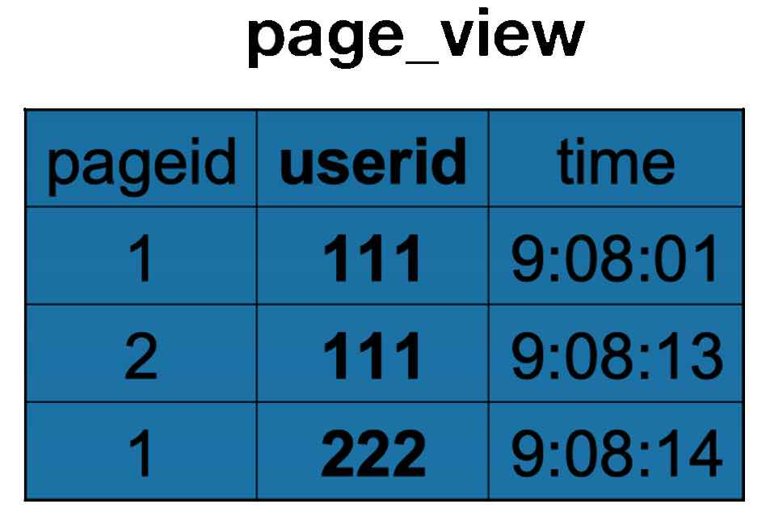
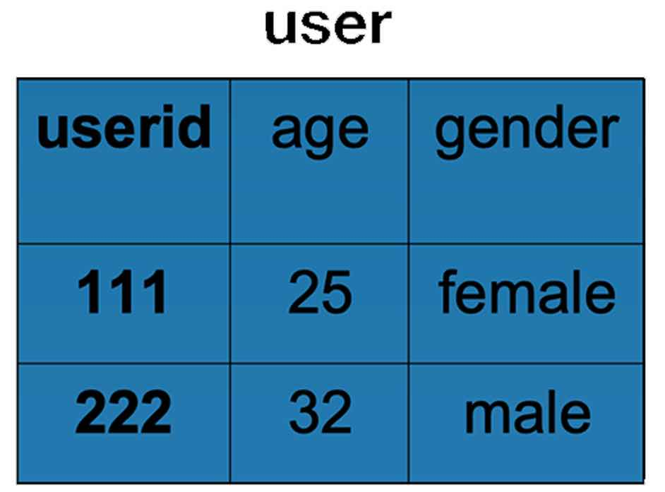

# 12周作业

1. 在你所在的公司（行业、领域），正在用大数据处理哪些业务？可以用大数据实现哪些价值？

   我所在的公司处于娱乐行业，我们使用的主要是Elastic的一整套，用户数据采集、日志收集、全文检索等。目前使用大数据的业务主要在业务报表、用户行为分析、风险控制及欺诈管理、反爬虫等。最初，使用是为了方便各管理层查看报表（有些是实时报表），及为客户服务和技术支持等部门提供日志服务和运维预警；随着业务的扩展和技术的成熟，以及收集的数据的多样化，推广了数据采集及分析，前端可以根据采集数据进行UX优化，风控部门可以利用数据分析和机器学习进行风险测评和预防。

2. 分析如下 HiveQL，生成的 MapReduce 执行程序，map 函数输入是什么？输出是什么，reduce 函数输入是什么？输出是什么？

```SQl
INSERT OVERWRITE TABLE pv_users
SELECT pv.pageid, u.age
FROM page_view pv
JOIN user u
ON (pv.userid = u.userid);
```

Page_view 表和 user 表结构与数据示例如下：
<div align=center>


</div>
- map函数的输入

  page_view 的行数据 和 user 的行数

- map函数的输出：

  - 输出以 JOIN ON 条件中的列作为 Key，如果有多个列，则 Key 是这些列的组合。如上 page_view 表的 userid 和 user 表的 userid

  - 输出以 JOIN 之后所关心的列作为 Value，当有多个列时， Value 是这些列的组合。在 Value 中还会包含表的 Tag 信息，用于标明此 Value 对应于哪个表。如上 page_view 表的 pageid 和 user 表的 age

    示例输出，粗体为 Tag信息
    1 -- page_view
    2 -- user

    page_view

    | key  | Value |
    | ---- | ----- |
    | 111  | <**1**,1> |
    | 111  | <**1**,2> |
    | 222  | <**1**,1> |

    user

    | Key  | Value  |
    | ---- | ------ |
    | 111  | <**2**,25> |
    | 222  | <**2**,32> |

- reduce函数输入
  
  map 的输出根据key 值排序

  | key  | Value |
  | ---- | ----- |
  | 111  | <**1**,1> |
  | 111  | <**1**,2> |
  | 111  | <**2**,25> |
  | 222  | <**1**,1> |
  | 222  | <**2**,32> |

- reduce函数的输出

  输出pv_users表

  | pageid  | age |
  | ---- | ----- |
  | 1  | 25 |
  | 2  | 25 |
  | 1  | 32 |

