# 12周总结——数据应用1

* [大数据概述](#大数据概述)
  * [大数据技术发展史](#大数据技术发展史)
  * [大数据应用发展史](#大数据应用发展史)
    * [大数据应用的搜索引擎时代](#大数据应用的搜索引擎时代)
    * [大数据应用的数据仓库时代](#大数据应用的数据仓库时代)
    * [大数据应用的数据挖掘时代](#大数据应用的数据挖掘时代)
    * [大数据应用的机器学习时代](#大数据应用的机器学习时代)
  * [大数据应用领域](#大数据应用领域)
    * [医学影像智能识别](#医学影像智能识别)
    * [病历大数据智能诊疗](#病历大数据智能诊疗)
    * [AI外语老师](#ai外语老师)
    * [智能解题](#智能解题)
    * [舆情监控与分析](#舆情监控与分析)
    * [大数据风控](#大数据风控)
    * [新零售](#新零售)
    * [无人驾驶](#无人驾驶)
* [HDFS](#hdfs)
  * [常用RAID技术](#常用raid技术)
  * [HDFS系统架构](#hdfs系统架构)
  * [HDFS设计目标](#hdfs设计目标)
    * [不适合HDFS的场景](#不适合hdfs的场景)
    * [设计目标](#设计目标)
  * [文件](#文件)
  * [分而治之](#分而治之)
  * [NameNode](#namenode)
  * [DataNode](#datanode)
  * [HDFS关键运行机制——高可用](#hdfs关键运行机制高可用)
  * [HDFS如何写文件？](#hdfs如何写文件)
  * [HDFS如何读文件？](#hdfs如何读文件)
  * [节点失效是常态](#节点失效是常态)
    * [DataNode的磁盘挂了怎么办？](#datanode的磁盘挂了怎么办)
    * [DataNode所在机器挂了怎么办？](#datanode所在机器挂了怎么办)
    * [NameNode挂了怎么办？](#namenode挂了怎么办)
    * [Client挂了怎么办？](#client挂了怎么办)
      * [HDFS一致性模型](#hdfs一致性模型)
    * [副本摆放策略](#副本摆放策略)
  * [压缩](#压缩)
  * [SequenceFile](#sequencefile)
  * [Hadoop文件系统](#hadoop文件系统)
  * [Java接口](#java接口)
* [MapReduce](#mapreduce)
  * [MapReduce 特性](#mapreduce-特性)
* [Yarn](#yarn)
* [Hive](#hive)
  * [架构](#架构)
  * [执行流程](#执行流程)
  * [编译器](#编译器)
* [参考](#参考)

## 大数据概述

### 大数据技术发展史

今天我们常说的大数据技术，起源于Google在2004年前后发表的三篇论文，也就是我们经常听到的大数据“三驾马车”。

- 分布式文件系统FGS
- 大数据分布式计算框架 MapReduce
- NoSQL数据库系统BigTable

搜索引擎主要就做两件事：网页抓取、索引构建和排序。而在这个过程中，有大量的数据需要存储和计算。“三驾马车”就是用来解决这个问题的。

浏览下Hadoop的代码，这个纯用Java编写的软件其实没有什么高深的技术难点，使用的也就是一些最基础的编程技术，没有什么出奇之处，但它却给社会带来了巨大的影响，甚至带动一场深刻的科技革命，推动了人工智能的发展进步。

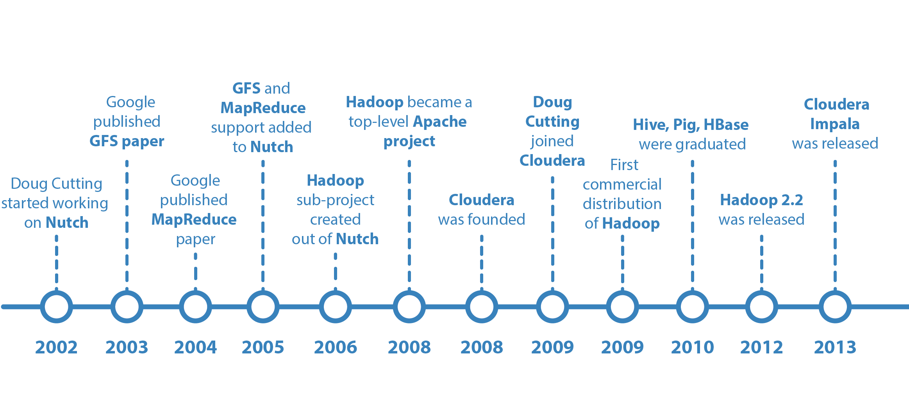

Lucene开源项目的创始人Doug Cutting，当时正在开发开源搜索引擎Nutch，阅读了Google的论文后，根据论文原理初步实现了类似GFS和MapReduce的功能。

2006年，Doug Cutting将这些大数据相关的功能从Nutch分类出来，启动了一个独立的项目专门开发维护大数据技术，这就是后来赫赫有名的Hadoop，主要包括了Hadoop分布式文件系统HDFS和大数据计算引擎MapReduce。

Hadoop发布之后，Yahoo首先用了起来。

大概又过了一年到了2007年，百度和阿里巴巴也开始使用Hadoop进行大数据存储与计算。

2008年，Hadoop正式成为Apache的顶级项目，后来Doug Cutting本人也成为Apache基金会的主席。自从，Hadoop作为软件开发领域的一颗明星冉冉升起。

同年，专门运营Hadoop的商业公司Cloudera成立，Hadoop得到了进一步的商业支持。

这个时候，Yahoo的一些人觉得用MapReduce进行大数据编程太麻烦了，于是开发了Pig。Pig是一种脚本语言，使用类似SQL的语法，开发者可以用Pig脚本描述对大数据集的操作，Pig经过编译后会生成MapReduce程序，然后在Hadoop上运行。

编写Pig脚本虽然比直接用MapReduce编程容易，但是依然需要学习新的脚本语法。于是Facebook又发布了Hive。Hive支持使用SQL语法进行大数据计算，比如说你可以写一个Select语句进行数据查询，然后Hive会把SQL语句转成MapReduce的计算程序。这样，熟悉数据库的数据分析师和工程师便可以无门槛使用大数据进行数据分析和处理了。

Hive出现后极大程度地降低了Hadoop的使用难度，迅速得到开发者和企业的追捧。据说，2011年的时候，Facebook大数据平台上运行的作用90%都来源于Hive。

随后，众多Hadoop周边产品开始出现，大数据生态体系逐渐形成，其中包括：

- 专门将关系数据库中的数据导入导出到Hadoop平台的Sqoop
- 针对大规模日志进行分布式收集、聚合和传输的Flume
- MapReduce工作流调度引擎Oozie

在Hadoop早期，MapReduce既是一个执行引擎，又是一个调度框架，服务器集群的资源调度管理由MapReduce自己完成。但是这样不利于资源复用，也使得MapReduce非常臃肿。于是一个新项目启动了，将MapReduce执行引擎和资源调度分离开来，这就是Yarn。2012年，Yarn成为一个独立的项目开始运营，随后被各类大数据产品支持，成为大数据平台上最主流的资源调度系统。

同样是在2012年，UC伯克利AMP实验室开发的Spark开始崭露头角。当时AMP实验室的马铁博士发现使用MapReduce进行机器学习的时候性能非常差，因为机器学习算法通常需要进行很多次的迭代计算，而MapReduce每执行一次Map和Reduce计算都需要重新启动一次作业，带来大量的无谓消耗。还有一点就是MapReduce主要使用磁盘作为存储介质，而2012年的时候内存已经突破容量和成本限制，成为数据运行过程中主要的存储介质。Spark一经推出，立即受到业界的追捧，并逐步替代MapReduce在企业应用中的地位。

一般来说，像MapReduce、Spark这类计算框架处理的业务场景都被称作批处理计算，因为它们通常针对以“天”为单位产生的数据进行一次计算，然后得到需要的结果，这中间计算需要花费的时间大概是几十分钟甚至更长的时间。因为计算的数据是非在线得到的实时数据，而是历史数据，所以这类计算也被称为大数据离线计算。

而在大数据领域，还有另一类应用场景，它们需要对实时产生的大量数据进行即时计算，相应地，有Storm、Flink、Spark Streaming等流计算框架来满足此类大数据应用的场景。流式计算要处理的数据是实时在线产生的数据，所以这类计算也被称为大数据实时计算。

NoSQL系统处理的主要也是大规模海量数据的存储与访问，所以也被归为大数据技术。NoSQL曾经在2011年左右非常火爆，涌现出HBase、Cassandra等许多优秀的产品，其中HBase是从Hadoop中分离出来的，基于HDFS的NoSQL系统。

上面这些基本上都可以归类为大数据引擎或者大数据框架。而大数据处理的主要应用场景包括数据分析、数据挖掘与机器学习。数据分析主要使用Hive、Spark SQL等SQL引擎完成；数据挖掘与机器学习则有专门的机器学习框架TensorFlow、Mahout以及MLlib等，内置了主要的机器学习和数据挖掘算法。

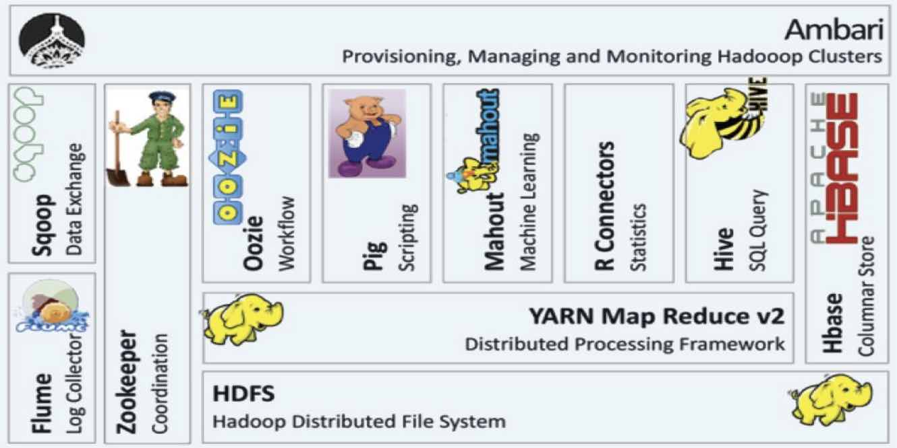

Hadoop 生态系统

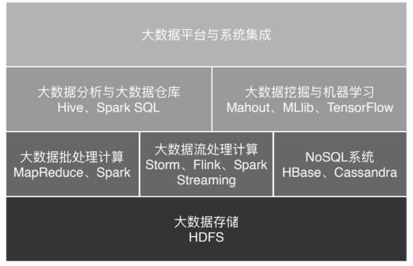

### 大数据应用发展史

#### 大数据应用的搜索引擎时代

作为全球最大的搜索引擎公司，Google也是我们公认的大数据鼻祖，它存储着世界几乎所有可访问的网页，数目可能超过万亿规模，全部存储起来大约需要数万块磁盘。为了将这些文件存储起来，Google开发了GFS（Google File System），将数千台服务器上的数万块磁盘统一管理起来，然后当作一个文件系统，统一存储所有这些网页文件。

Google得到这些网页文件是要构建搜索引擎，需要对所有文件中的单词进行词频统计，然后根据PageRank算法计算网页排名。这中间，Google需要对这数万块磁盘上的文件进行计算处理，也正是这些需求，Google又开发了MapReduce大数据计算框架。

#### 大数据应用的数据仓库时代

曾经人们在进行数据分析与统计是，仅仅局限于数据库，在数据库的计算环境中对数据库中的数据表进行统计分析。并且受数据量和计算能力的限制，只能对最重要的数据进行统计和分析。这里所谓最重要的数据，通常指的是给老板看的数据和财务相关的数据。

而Hive可以在Hadoop上进行SQL操作，失效数据统计与分析。也就是说，可以用更低廉的价格获得比以往多的多的数据存储与计算能力。可以把运行日志、应用采集数据、数据库数据放到一起进行计算分析，获得以前无法得到的数据结果，企业的数据仓库也随之呈指数级膨胀。

不仅是老板，公司中每个普通员工，比如产品经理、运营人员、工程师，只要有数据访问权限，都可以提出分析需求，从大数据仓库中获得自己想要了解的数据分析结果。

#### 大数据应用的数据挖掘时代

很早以前商家就通过数据发现，买尿不湿的人通常也会买啤酒，于是精明的商家就把这两样商品放在一起，以促进销售。除了商品和商品有关系，还可以利用人和人之间的关系推荐商品。如果两个人购买的商品有很多都是类似甚至相同的，不管这两个人天南海北相隔多远，他们一定有某种关系，比如可能有差不多的教育背景、经济收入、兴趣爱好。根据这些关系，可以进行关联推荐，让他们看到自己感兴趣的商品。

大数据还可以将每个人身上的不同特性挖掘出来，打上各种各样的标签：90后、生活在一线城市、月收入1～2万、宅。。。这些标签组成用户画像，并且只要这样的标签足够多，就可以完整的描绘出一个人。除了商品销售，数据挖掘还可以用于人际关系挖掘。

#### 大数据应用的机器学习时代

人们很早就发现，数据中蕴含着规律，这个规律是所有数据都遵循的，过去发生的事情遵循这个规律，将要发生的事情也遵循这个规律。一旦找到这个规律，对于正在发生的事情，就可以按照这个规律进行预测。

在过去，受数据采集、存储、计算能力的限制，只能通过抽样的方式获取小部分数据，无法得到完整的、全局的、细节的规律。而现在有了大数据，可以把全部的历史数据都收集起来，统计其规律，进而预测正在发生的事情。

这就是机器学习。

### 大数据应用领域

#### 医学影像智能识别

图像识别是机器学习获得的重大突破之一，使用大量的图片数据进行深度机器学习训练，机器可以识别出特定的图像元素，比如猫或者人脸，当然也可以识别出病理特征。

比如X光片里的异常病灶位置，是可以通过机器学习智能识别出来的。甚至可以说医学影像智能识别在某些方面已经比一般医生拥有更高的读图识别能力。

#### 病历大数据智能诊疗

病历，特别是专家写的病历，本身就是一笔巨大的知识财富，利用大数据技术将这些知识进行处理、分析、统计、挖掘，可以构成一个病历知识库，可以分享给更多人，即构成一个智能辅助诊疗系统。

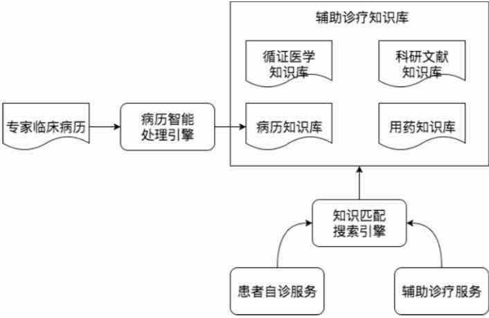

#### AI外语老师

得益于语音识别和语音合成技术的成熟（语音识别与合成技术同样是利用大数据技术进行机器学习与训练），一些在线教育网站尝试用人工智能外语老师进行外语教学。这里面的原理其实并不复杂，聊天机器人技术已经普遍应用，只要将学习的知识点设计进聊天的过程中，就可以实现一个简单的AI外语老师。

#### 智能解题

比较简单的智能解题系统其实是利用搜索引擎技术，在收集大量的试题以及答案的基础上，进行试题匹配，将匹配成功的答案返回。这个过程看起来就像智能做题一样，表面看给个题目就能解出答案，而实际上只是找到答案。

进阶一点的智能解题系统，通过图像识别与自然语言处理（这两项技术依然使用大数据技术实现），进行相似性匹配。更改试题的部分数字、文字表述，但是不影响实质性解答思路，依然可以解答。

高阶的智能解题系统，利用神经网络机器学习技术，将试题的自然语言描述转化成形式语言，然后分析知识点和解题策略，进行自动推导，从而完成实质性的解题。

#### 舆情监控与分析

编写数据爬虫，实时爬取哥哥社交新媒体上的各种用户内容和媒体信息，然后通过自然语言处理，就可以进行情感分析、热点事件追踪等。舆情实时监控可用于商业领域，引导智能广告投放；可用于金融领域，辅助执行自动化股票、期权、数字货币交易；可用于社会管理，及时发现可能引发社会问题的舆论倾向。

在美国总统大选期间，候选人就曾雇佣大数据公司利用社交媒体的数据进行分析，发现选票可能摇摆的地区，有针对性前去进行竞选演讲。并利用大数据分析选民关注的话题，包装自己的竞选主张。

#### 大数据风控

在金融借贷中，如何识别出高风险用户，要求其提供更多抵押、支付更高利息、调整更低额度，甚至拒绝贷款，从而降低金融机构的风险。事实上，金融行业已经沉淀了大量的历史数据，利用这些数据进行计算，可以得到用户特征和风险指数的曲线（即风控模型）。当新用户申请贷款的时候，将该用户特征带入曲线进行计算，就可以得到该用户的风险指数，进而自动给出该用户的贷款策略。

#### 新零售

亚马逊Go无人店使用大量的摄像头，实时捕捉用户行为，判断用户取出还是放回商品、取了何种商品等。这实际上市大数据流计算与机器学习的结合，最终实现的购物效果是，无需排队买单，进去就拿东西，拿好了就走。

#### 无人驾驶

无人驾驶就是在人的驾驶过程中实时采集车辆周边数据和驾驶控制信息，然后通过机器学习，获得周边信息与驾驶方式的对应关系（自动驾驶模型）。然后将这个模型应用到无人驾驶汽车上，传感器获得车辆周边数据后，就可以通过自动驾驶模型计算出车辆控制信息（转向、刹车等）。

计算自动驾驶模型需要大量的数据，所以我们看到，这些无人驾驶创业公司都在不断攀比自己的训练数据有几十万公里、几百万公里，因为训练数据的量意味着模型的完善程度。

## HDFS

### 常用RAID技术

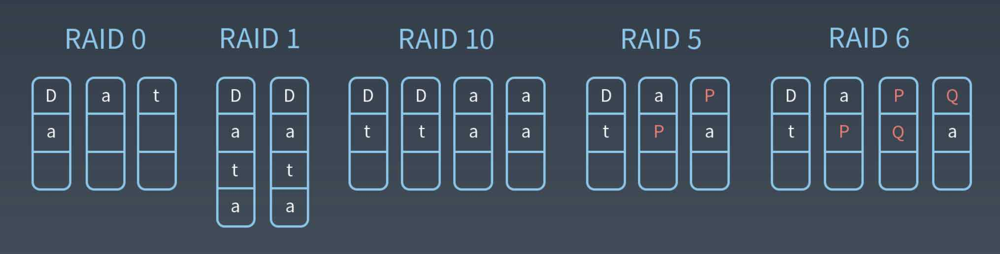

### HDFS系统架构

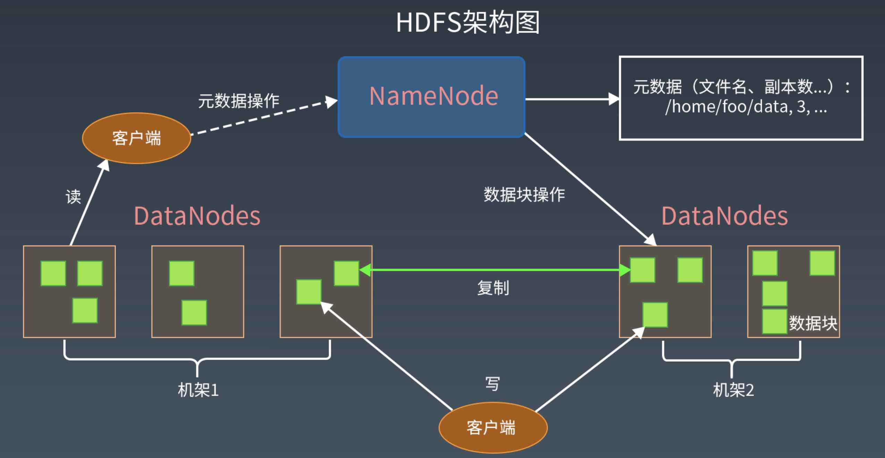
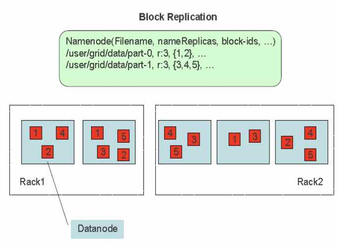

### HDFS设计目标

HDFS 以**流式数据访问模式**存储**超大文件**，运行于**商用硬件**集群上。

#### 不适合HDFS的场景

- 低延迟的数据访问

- 大量小文件：超过NameNode的处理能力

- 多用户随机写入修改文件

HDFS为了做到可靠性（reliability）创建了多份数据块（data blocks）的复制（replicas），并将它们放置在服务器群的计算节点中（compute nodes），MapReduce就可以在它们所在节点上处理这些数据了。

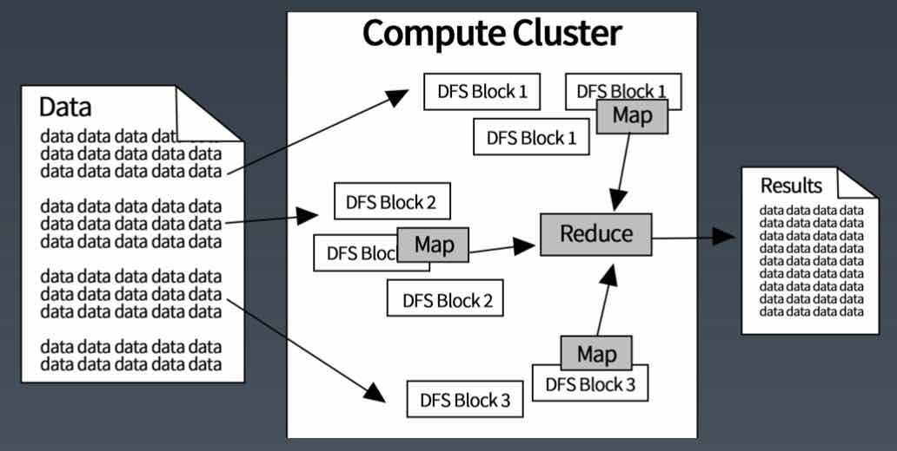

#### 设计目标

假设：节点失效是常态

理想：

1. 任何一个节点失效，不影响HDFS服务
2. HDFS可以自动完成副本的复制

### 文件

文件切分成块（默认大小64M），以块为单位，每个块有多个副本存储在不同的机器上，副本数可以在文件生成时指定（默认值3）。

NameNode是主节点，存储文件的元数据如文件名，文件目录结构，文件属性（生成时间，副本数，文件权限），以及每个文件的块列表以及块所在的DataNode等。

DataNode在本地文件系统存储文件块数据，以及块数据的校验和。可以创建、删除、移动或重命名文件，当文件创建、写入和关闭之后不能修改文件内容。

### 分而治之

TBD

### NameNode

NameNode是一个中心服务器，负责管理文件系统的名字空间（namespace）以及客户端对文件的访问。

文件操作，NameNode负责文件元数据的操作，DataNode负责处理文件内容的读写请求，与文件内容相关的数据流不经过NameNode，只会询问它与哪个DataNode联系。这样避免NameNode成为系统的瓶颈。

副本存放在哪些DataNode上由NameNode来控制，根据全局情况做出块放置决定，读取文件时NameNode尽量让用户先读取最近的副本，降低带块消耗的读取时延

NameNode全权管理数据块的复制，它周期性地从集群中的每个DataNode接收心跳信号和块状态报告（blockreport）。接收到心跳信号意味着该DataNode节点工作正常。块状态报告包含了一个该DataNode上所有数据块的列表。

### DataNode

一个数据块DataNode以文件存储在磁盘上，包括两个文件，一个是数据本身，一个是元数据包括数据块的长度，块数据的校验和，以及时间戳。

DataNode启动后向NameNode注册，通过后，周期性（每小时）的向NameNode上报所有的块信息。

心跳是每3秒一次，心跳返回结果带有NameNode给该DataNode的命令如复制块数据到另一台机器，或删除某个数据块。如果超过10分钟没有收到某个DataNode的心跳，则认为该节点不可用。

集群运行中可以安全加入和退出一些机器。

### HDFS关键运行机制——高可用

集群由一个NameNode和多个DataNode组成

- 数据复制（冗余机制）
- 故障检测
- DataNode

  - 心跳包

  - 块报告

  - 数据完整性检测
- NameNode
  - 日志文件
  - 镜像文件
- 空间回收机制

### HDFS如何写文件？

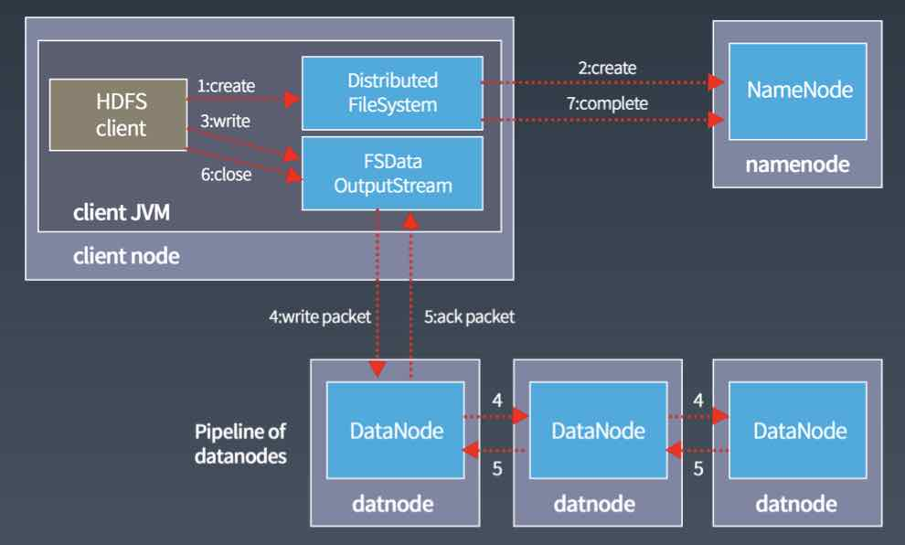
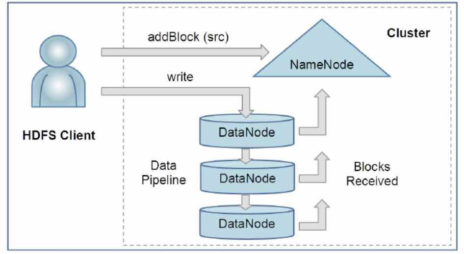

- 使用HDFS提供的客户端开发库Client，向远程的NameNode发起RPC请求；
- NameNode会检查要创建的文件是否已经存在，创建者是否有权限进行操作，成功则会为文件创建一个记录，否则会让客户端抛出异常；
- 当客户端开始写入文件的时候，开发库会将文件切分成多个packets，并在内部以数据队列“data queue”的形式管理这些packets，并向NameNode申请新的blocks，获取用来存储replicas的合适的DataNode列表，列表的大小根据在NameNode中对replication的设置而定。
- 开始以pipeline的形式将packets写入所有的replicas中。开发库把packet以流的方式写入第一个DataNode，该DataNode把这个packet存储之后，再将它传递给在此pipeline中的下一个DataNode，直到最后一个DataNode，这种写数据的方式呈流水线的形式。
- 最后一个DataNode成功存储之后会返回一个ack packet，在pipeline里传递至客户端，在客户端的开发库内部维护着“ack queue”，成功收到DataNode返回的ack packet后会从“ack queue”移除相应的packet。
- 如果传输过程中，有某个DataNode出现了故障，那么当前的pipeline会被关闭，出现故障的DataNode会从当前的pipeline中移除，剩余的block会继续在剩下的DataNode中以pipeline的形式传输，同时NameNode会分配一个新的DataNode，保持replicas设定的数量。

### HDFS如何读文件？

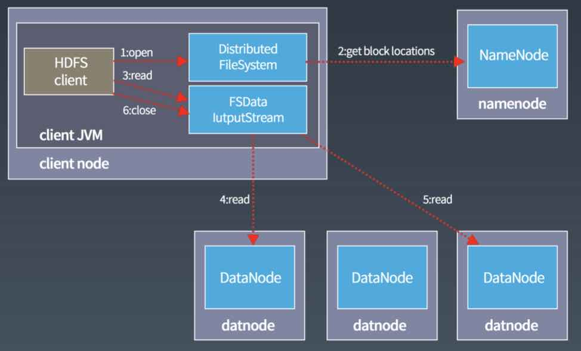

- 使用HDFS提供的客户端开发库Client，向远程的NameNode发起RPC请求；
- NameNode会视情况返回文件的部分或者全部block列表，对于每个block，NameNode都会返回有该block拷贝的DataNode地址；
- 客户端开发库Client会选取离客户端最接近的DataNode来读取block；如果客户端本身就是DataNode，那么将从本地直接获取数据。
- 读取完当前block的数据后，关闭与当前的DataNode连接，并为读取下一个block寻找最佳的DataNode；
- 当读取列表的block后，且文件读取还没有结束，客户端开发库会继续向NameNode获取下一批的block列表；
- 读取完一个block都会进行checksum验证，如果读取DataNode时出现错误，客户端会通知NameNode，然后再从下一个拥有该block拷贝的DataNode继续读。

### 节点失效是常态

#### DataNode的磁盘挂了怎么办？

- DataNode正常服务
- 坏掉的磁盘上的数据尽快通知NameNode

#### DataNode所在机器挂了怎么办？

DataNode每3秒向NameNode发送心跳，如果10分钟DataNode没有向NameNode发送心跳，则NameNode认为该DataNode已经挂了，NameNode将取出该DataNode上对应的block，对其进行复制。

#### NameNode挂了怎么办？

持久化元数据

- 操作日志edit log
  - 记录文件创建、删除、修改文件属性下等操作
- fsimage
  - 包含完整的命名空间
  - file - block的映射关系
  - 文件的属性（ACL、quota、修改时间等）

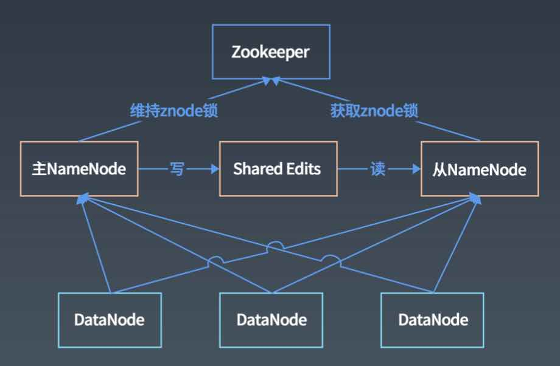

#### Client挂了怎么办？

一致性问题

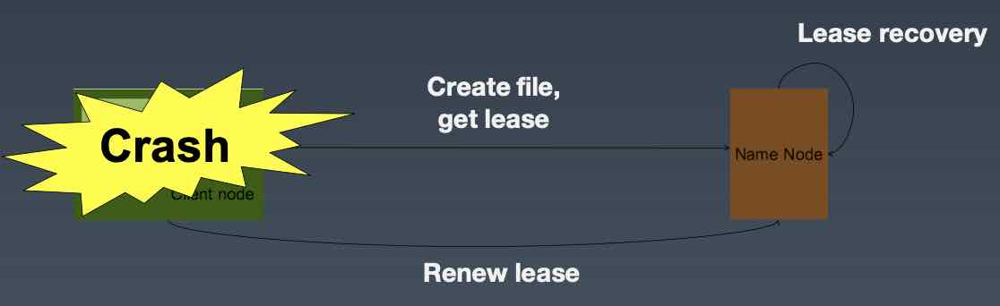

##### HDFS一致性模型

- 文件创建以后，不保证在NameNode立即可见，即使文件刷新并存储，文件长度依然可能为0；
- 当写入数据超过一个block后，新的reader可以看见第一个block，reader不能看见当前正在写入的block；
- HDFS提供sync()方法强制缓存与数据节点同步，sync()调用成功后，当前写入数据对所有reader可见且一致；
- 调用sync()会导致额外的开销。

#### 副本摆放策略

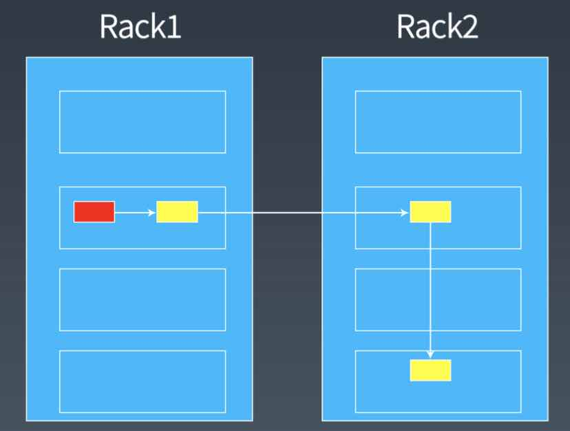

### 压缩

减少存储所需的磁盘空间

加速数据在网络和磁盘上的传输

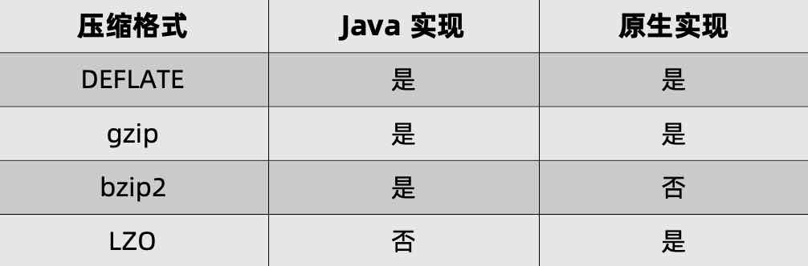

### SequenceFile

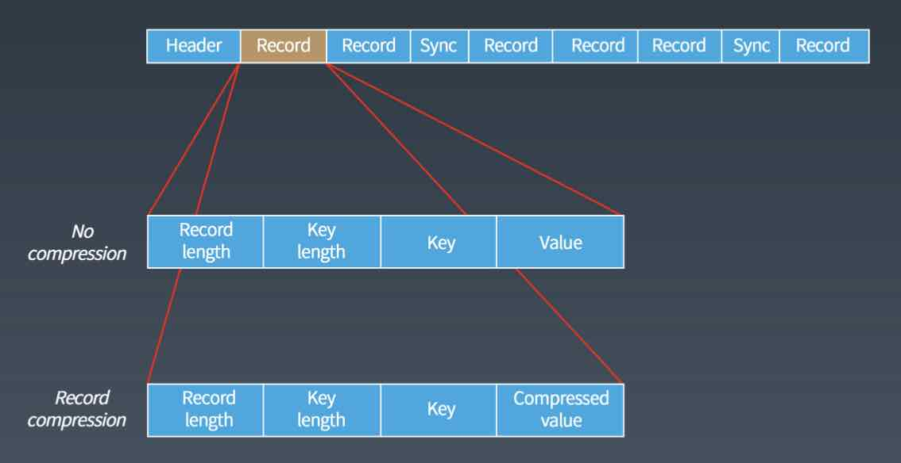

### Hadoop文件系统

### Java接口

## MapReduce

- 处理海量数据（TB级别）
- 成百上千CPU实现并行处理

### MapReduce 特性

## Yarn

全称 Yet Another Resource Negotiator

是下一代MapReduce框架

不再是一个传统的MapReduce框架，甚至与MapReduce无关

一个通用的运行时框架，用户可以编写自己的计算框架，在该运行环境中运行

MapReduce的架构，在MapReduce应用程序的启动过程中，最重要的就是把MapReduce程序分发到大数据集群的服务器上，在Hadoop 1中，这个过程主要是通过TaskTracker和JobTracker通信来完成。

这种架构方案的主要缺点是，服务器集群资源调度管理和MapReduce执行过程耦合在一起，如果想在当前集群中运行其他计算任务，比如Spart或者Storm，就无法统一使用集群中的资源了。

在Hadoop早期的时候，大数据技术就只有Hadoop一家，这个缺点并不明显。但随着大数据技术的发展，各种新的计算框架不断出现，我们不可能为每一种计算框架部署一个服务器集群，而且就算能部署新集群，数据还是在原来集群的HDFS上。所以我们需要把MapReduce的资源管理和计算框架分开，这也是Hadoop 2最主要的变化，就是将Yarn从MapReduce中分离出来，成为一个独立的资源调度框架。

## Hive

### 架构

### 执行流程

- 操作符是Hive的最小处理单元
- 每个操作符处理代表HDFS操作或MR作业
- 编译器把Hive SQL转换成一组操作符

### 编译器

## 参考

