# 13周总结——数据应用2

* [Spark](#spark)
  * [Spark VS Hadoop](#spark-vs-hadoop)
  * [Spark 特点](#spark-特点)
    * [作为编程模型的RDD](#作为编程模型的rdd)
    * [作为数据分片的RDD](#作为数据分片的rdd)
  * [Spark的计算阶段](#spark的计算阶段)
  * [Spark的作业管理](#spark的作业管理)
  * [Spark的执行过程](#spark的执行过程)
  * [Spark生态体系](#spark生态体系)
* [流计算](#流计算)
  * [Storm 实时的Hadoop](#storm-实时的hadoop)
  * [Storm的基本概念](#storm的基本概念)
  * [示例](#示例)
  * [Stream Groupings](#stream-groupings)
  * [Storm应用场景](#storm应用场景)
  * [Spark Streaming](#spark-streaming)
  * [Flink](#flink)
    * [Flink流处理计算](#flink流处理计算)
    * [Flink批处理计算](#flink批处理计算)
* [大数据可视化](#大数据可视化)
  * [互联网运营常用数据指标](#互联网运营常用数据指标)
    * [新增用户数](#新增用户数)
    * [用户留存率](#用户留存率)
    * [活跃用户数](#活跃用户数)
    * [页面浏览量PV](#页面浏览量pv)
    * [成交总额GMV](#成交总额gmv)
    * [转化率](#转化率)
  * [数据可视化图表与数据监控](#数据可视化图表与数据监控)
    * [折线图](#折线图)
    * [散点图](#散点图)
    * [热力图](#热力图)
    * [漏斗图](#漏斗图)
* [大数据算法与机器学习](#大数据算法与机器学习)
  * [网页排名算法PageRank](#网页排名算法pagerank)
    * [PageRank让链接来投票](#pagerank让链接来投票)
  * [KNN分类算法](#knn分类算法)
  * [贝叶斯分类算法](#贝叶斯分类算法)
  * [K-Means 聚类算法](#k-means-聚类算法)
  * [推荐引擎算法](#推荐引擎算法)
    * [基于人口统计的推荐](#基于人口统计的推荐)
    * [基于商品属性的推荐](#基于商品属性的推荐)
    * [基于用户的协同过滤推荐](#基于用户的协同过滤推荐)
    * [基于商品的协同过滤推荐](#基于商品的协同过滤推荐)
  * [机器学习系统架构](#机器学习系统架构)
    * [样本](#样本)
    * [模型](#模型)
    * [算法](#算法)
    * [机器学习的数学原理](#机器学习的数学原理)
    * [感知机](#感知机)
    * [神经网络](#神经网络)
* [参考](#参考)

## Spark

### Spark VS Hadoop

<div align=center>
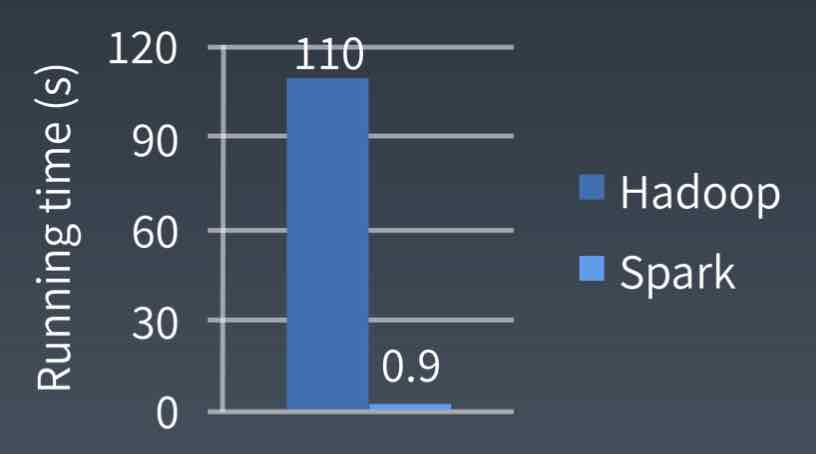
</div>


### Spark 特点

——快

- DAG切分的多阶段计算过程更快速

- 使用内存存储中间计算结果更高效

- RDD的编程模型更简单

#### 作为编程模型的RDD

RDD 是Spark的核心概念，是弹性分布式数据集（Resilient Distributed Datasets）的缩写。RDD既是Spark面向开发者的编程模型，又是Spark自身架构的核心元素。

大数据计算就是在大规模的数据集上进行一系列的数据计算处理。MapReduce针对输入数据，将计算过程分为两个阶段，一个Map阶段，一个Reduce阶段，可以理解成是面向过程的大数据计算。我们在用MapReduce编程的时候，思考的是，如何将计算逻辑用Map和Reduce两个阶段实现，Map和Reduce函数的输入和输出是什么，MapReduce是面向过程的。

而Spark则直接针对数据进行编程，将大规模数据集合抽象成一个RDD对象，然后在这个RDD上进行各种计算处理，得到一个新的RDD，继续计算处理，直到得到最后的结果数据。所以Spark可以理解成是面向对象的大数据计算。我们在进行Spark编程的时候，思考的是一个RDD对象需要经过怎样的操作，转换成另一个RDD对象，思考的重心和落脚点都在RDD上。

#### 作为数据分片的RDD

与MapReduce一样，Spark也是对大数据进行分片计算，Spark分布式计算的数据分片、任务调度都是以RDD为单位展开的，每个RDD分片都会分配到一个执行进行去处理。

RDD上转换操作又分成两种，一种转换操作产生的RDD不会出现新的分片，比如map、filter等，也就是说一个RDD数据分片，经过map或者filter转换操作后，结果还在当前分片。就像用map函数对每个数据加1，得到的还是这样一组数据，只是值不同。Spark并不是按照代码写的操作顺序去生成RDD，比如，

rdd2 = rdd1.map(func)

这样的代码并不会在物理上生成一个新的RDD。物理上，Spark只有在产生新的RDD分片时候，才会在物理上真的生成一个RDD，Spark的这种特性也被称作**惰性计算**。

另一种转换操作产生的RDD则会产生新的分片，比如reduceByKey，来自不同分片的相同Key必须聚合在一起进行操作，这样就会产生新的RDD分片。然而，实际执行的过程中，是否会产生新的RDD分片，并不是根据转换函数名就能判断出来的。

### Spark的计算阶段

和MapReduce一个应用一次只运行一个map和一个reduce不同，Spark可以根据应用的复杂程度，分割成更多的计算阶段，这些计算阶段组成一个有向无环图DAG，Spark任务调度器可以根据DAG的依赖关系执行计算阶段。

例如，

<div align=center>
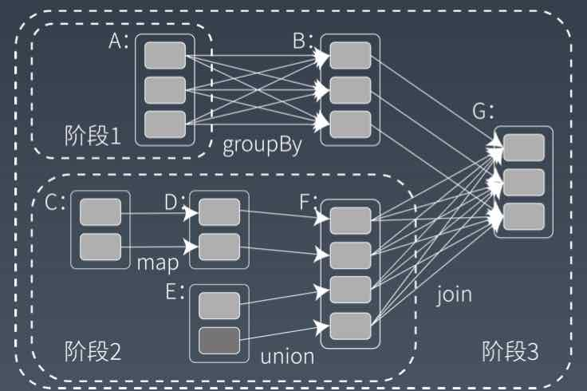
</div>

这个DAG对应的Spark程序伪代码如下

```SPARQL
rddB = rddA.groupBy(key)
rddD = rddC.map(func)
rddF = rddD.union(rddE)
rddG = rddB.join(rddF)
```

> 整个应用被切分成3个阶段，阶段3需要依赖阶段1和阶段2，阶段1和阶段2互不依赖。Spark在执行调度的时候，先执行阶段1和阶段2，完成以后，再执行阶段3.如果有更多的阶段，Spark的策略也是一样的。只要根据程序初始化好DAG，就建立了依赖关系，然后根据依赖关系顺序执行各个计算阶段，Spark大数据应用的计算就完成了。

Spark作业调度执行的核心是DAG，有了DAG，整个应用被切分成

哪些阶段，每个阶段的依赖关系就很清楚了。之后再根据每个阶段要处理的数据量生成相应的任务集合（TaskSet），每个任务都分配一个任务进程去处理，Spark就实现了大数据的分布式计算。

负责Spark应用DAG生成和管理的组建时DAGScheduler，DAGScheduler根据程序代码生成DAG，然后将程序分发到分布式计算集群，按计算阶段的先后关系调度执行。

那么Spark划分计算阶段的依据是什么？显然并不是RDD上的每个转换函数都会生成一个计算阶段，比如上面的例子有4个转换函数，但只有3个阶段。

当RDD之间的转换连接线呈现多对多交叉连接的时候，就会产生新的阶段。一个RDD代表一个数据集，图中每个RDD里面都包含了多个小块，每个小块代表RDD的一个分片。

Spark也需要通过shuffle将数据进行重新组合，相同Key的数据放在一起，进行聚合、关联等操作，因而每次shuffle都产生新的计算阶段。这也是为什么计算阶段会有依赖关系，它需要的数据来源于前面一个或多个计算阶段产生的数据，必须等待前面的阶段执行完毕才能进行shuffle，并得到数据。

计算阶段划分的依据是shuffle，不是转换函数的类型，有的函数有时候有shuffle，有时候没有。

### Spark的作业管理

Spark里面的RDD函数有两种，一种是转换函数，调用以后得到的还是一个RDD，RDD的计算逻辑主要通过转换函数完成。

另一种是action函数，调用以后不再返回RDD。比如count()函数，返回RDD中数据的元素个数；saveAsTextFile(path)将RDD数据存储到path下。Spark的DAGSchuduler在遇到shuffle的时候，会生成一个计算阶段，在遇到action函数的时候，会生成一个作业（job）。

RDD里面的每个数据分片，Spark都会创建一个计算任务去处理，所以一个计算阶段会包含很多个计算任务。

### Spark的执行过程

Spark支持Standalone、Yarn、Mesos、Kubernetes等多种部署方案，几种部署方案原理也都是一样，只是不同的组件角色命名不同，但是核心功能和运行流程都差不多。

<div align=center>
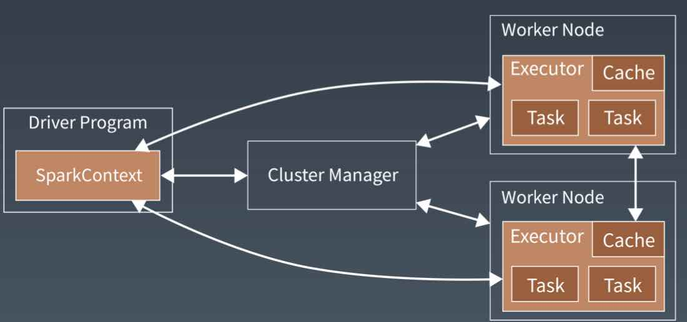
</div>

首先，Spark应用程序启动在自己的JVM进程里，即Driver进程，启动后调用SparkContext初始化进行配置和输入数据。SparkContext启动DAGSchudler构造执行DAG图，切分成最小的执行单位，也就是计算任务。

然后Driver向Cluster Manager请求计算资源，用于DAG的分布式计算。Cluster Manager收到请求以后，将Driver的主机地址等信息通知给集群的所有计算节点Worker。

Worker收到信息以后，根据Driver的主机地址，跟Driver通信并注册，然后根据自己的空虚资源向Driver通报自己可以领用的任务数。Driver根据DAG图开始向注册的Worker分配任务。

Worker收到任务后，启动Executor进程开始执行任务。Executor先检查自己是否有Driver的执行代码，如果没有，从Driver下载执行代码，通过Java反射加载后开始执行。

### Spark生态体系

<div align=center>
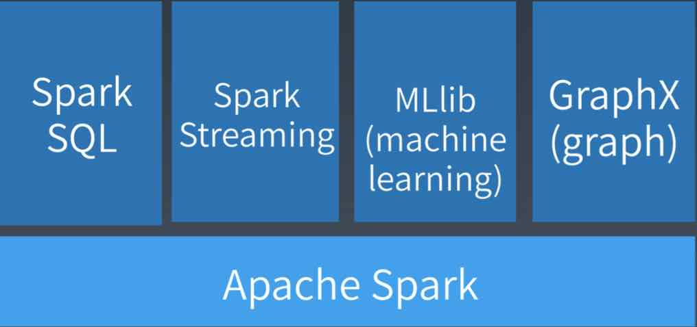
</div>


## 流计算

### Storm 实时的Hadoop

实时计算系统

- 低延迟
- 高性能
- 分布式
- 可伸缩
- 高可用

### Storm的基本概念

<div align=center>
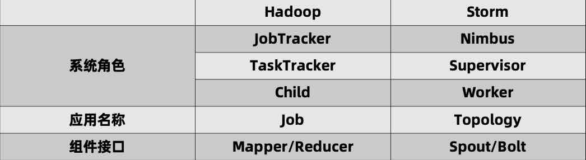
</div>

- Nimbus：负责资源分配和任务调度
- Supervisor：负责接收Nimbus分配的任务，启动和停止属于自己管理的Worker进程
- Worker：运行具体处理组件逻辑的进程
- Task：Worker中每一个Spout/Bolt的线程称为一个Task
- Topology：Storm中运行的一个实时应用程序，因为各个组件间的消息流动形成逻辑上的一个拓扑结构。
- Spout：在一个Topology中产生源数据流的组件。通常情况下Spout会从外部数据源中读取数据，然后转换为Topology内部的源数据。Spout是一个主动的角色，其接口中有个nextTuple()函数，Storm框架会不停地调用此函数，用户只要子啊其中生成源数据即可。
- Bolt：在一个Topology中接受数据然后执行处理的组件。Bolt可执行过滤、函数操作、合并、写数据库等，任何操作。Bolt是一个被动的角色，其接口中又个execute(Tuple input)函数，在接受到消息后会调用此函数，用户可以在其中执行自己想要的操作。
- Tuple：一次消息传递的基本单元。本应该是一个key-value的map，但是由于各个组件间传递的tuple的字段名称已经事先定义好，所以tuple中只要按序填入各个value就行了，所以就是一个value list。
- Stream：源源不断传递的tuple就组成了stream

### 示例

当车辆超越80公里每小时，则记录。

使用一个类型日志，其中包含车辆数据信息有：车牌号、车辆行驶的速度以及数据获取的位置。

<div align=center>
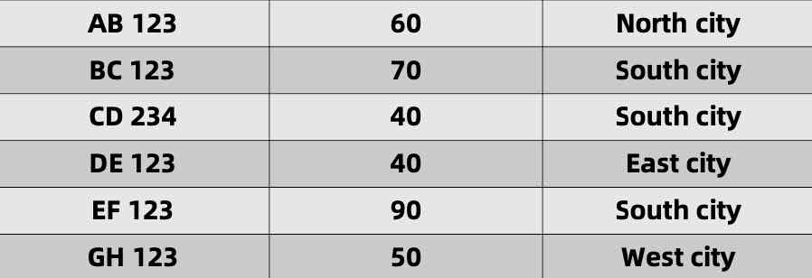
</div>

#### topology

<div align=center>
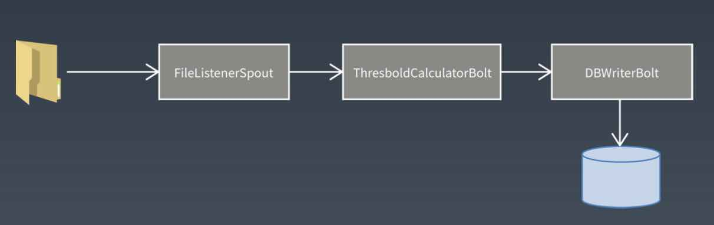
</div>

#### spout

<div align=center>
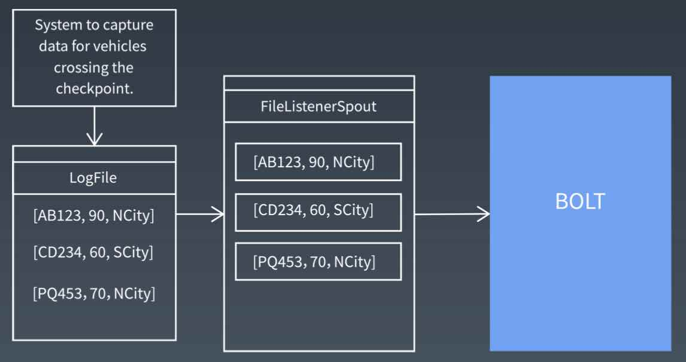
</div>

#### bolt

<div align=center>
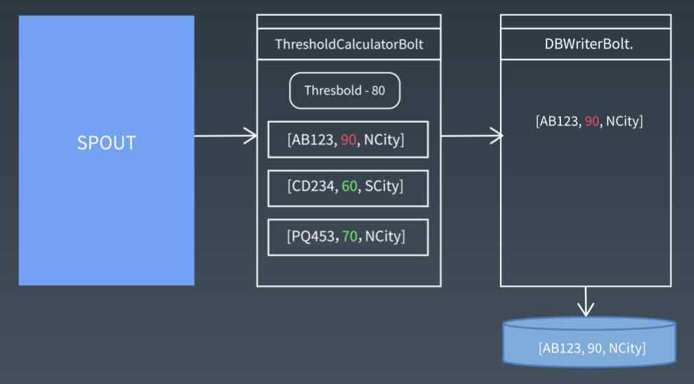
</div>

### Stream Groupings

它定义了一个流在Bolt任务间该被如何切分。6个类型

- 随机分组
- 字段分组
- 全部分组
- 全局分组
- 无分组
- 直接分组
- 还可以实现CustomStreamGrouping接口自定义分组

### Storm应用场景

Storm被广泛用来进行实时日志处理，出现在实时统计、实时风控、实时推荐等场景中。

一般来说，我们从类Kafka的metaq或者基于HBase的TimeTunnel中读取实时日志消息，经过一系列处理，最终将处理结果写入到一个分布式存储中，提供给应用程序访问。我们每天的实时消息量从几百万到几十亿不等，数据总量达到TB级。对于我们来说，Storm往往会配合分布式存储服务一起使用。在我们正在进行的个性化搜素实时分析项目中，就是用了TimeTunnel+HBase+Storm+UPS的架构，每天处理几十亿的用户日志信息，从用户行为发生到完成分析延迟在秒级。

### Spark Streaming

<div align=center>
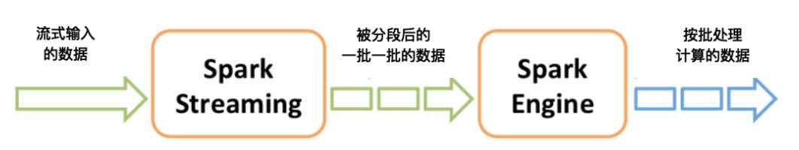
</div>

### Flink

#### Flink流处理计算

#### Flink批处理计算

<div align=center>
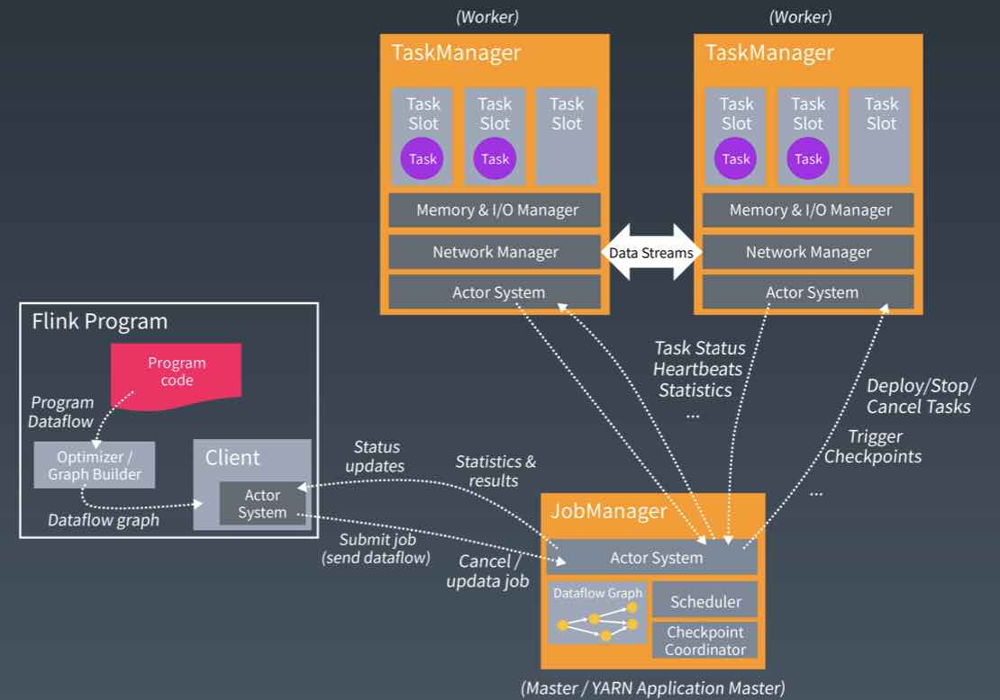
</div>

## 大数据可视化

### 互联网运营常用数据指标

#### 新增用户数

新增用户数网站增长性的关键指标，指新增加的访问网站的用户数（或者新下载App的用户数）。对于一个处于爆发期的网站，新增用户数会在短期内出现倍增的走势，是网站的战略机遇期，很多大型网站都经历过一个甚至多个短期内用户暴增的阶段。新增用户数有日新增用户数、周新增用户数、月新增用户数等几种统计口径。

#### 用户留存率

新增的用户并不一定总是对网站（App）满意，在使用网站后感到不满意，可能会注销账户，这些辛苦获取来的用户就流失掉了。网站把经过一段时间依然没有流失的用户称作留存用户，留存用户数比当期新增用户数就是用户留存率。

用户留存率=留存用户数/当期新增用户数

计算留存有时间窗口，即和当期数据比，3天前新增用户留存，称作3日留存；相应的，还有5日留存、7日留存等。新增用户可以通过广告、促销、病毒营销等手段获取，但是要让用户留存下来，就必须要使用产品有实打实的价值。用户留存率是反映用户体验和产品价值的一个重要指标，一般来说，3日留存率能做到40%以上就算好了。和用户留存率对应的是用户流失率。

用户流失率= 1 - 用户留存率

#### 活跃用户数

用户下载注册，但是很少打开产品，表示产品缺乏黏性和吸引力。活跃用户数表示打开使用产品的用户数，根据统计口径不同，有日活跃用户数、月活跃用户数等。提升活跃是网站运营的重要目标，各类App常用推送优惠促销消息给用户的手段促使用户打开产品。

#### 页面浏览量PV

打开产品就是活跃，打开以后是否频繁操作，就是PV这个指标衡量，用户每次点击，每个页面跳转，被称为一个PV page view。PV是网页访问统计的重要指标，在移动App上，需要进行一些变通来进行统计。

#### 成交总额GMV

 Gross Merchandise Volume，是电商网站统计营业额（流水）、反映网站营收能力的重要指标。和GMV配合使用的还有订单量（用户下单总量）、客单价等。

#### 转化率

指在电商网站产生购买行为的用户与访问用户之比。

转化率=有购买行为的用户数/总访问用户数

用户从进入网站到最后购买成功，可能需要经过复杂的访问路径，每个环节都有可能会离开。。。

网站必须要想尽各种办法：个性化推荐、打折促销、免运费、送红包、分期支付等以留住用户，提高转化率。

### 数据可视化图表与数据监控

#### 折线图

用的最多的可视化图表之一，斜率直观表示趋势。

#### 散点图

数据分析的时候，散点图可以有效帮助分析师快速发现数据分布上的规律和趋势

#### 热力图

分析网站页面被用户访问额热的区域，以更好进行页面布局和视觉展示。在地图上展示的热力图则表示了该地区的拥堵和聚集状态，方便用户进行出行规划。

#### 漏斗图

网站数据分析重要的图表，表示用户的整个访问路径中每一步的转化率。

<div align=center>
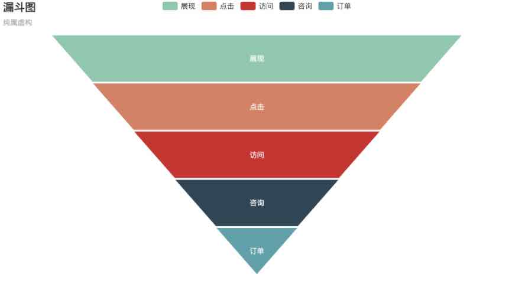
</div>

## 大数据算法与机器学习

### 网页排名算法PageRank

PageRank，网页排名，又称网页级别，Google左侧排名或佩奇排名，是一种由搜素引擎根据网页之间相互的超级链接计算的技术，而作为网页排名的要素之一，以Google公司创办人拉里佩奇姓氏来命名。

#### PageRank让链接来投票

PageRank通过网络浩瀚的超级链接关系来确定一个页面的等级。Google把从A页面到B页面的链接解释为A页面给B页面投票，Google根据投票来源（甚至来源的来源，即链接到A页面的页面）和投票目标的等级来决定新的等级。简单的说，一个高等级的页面可以使其他低等级页面的等级提升。

一个页面的得票数由所有链向它的页面的重要性来决定，到一个页面的超级链接相当于对该页投一票。一个页面的PageRank是由所有链向它的页面的重要性经过递归算法得到的。一个有较多链入的页面会有较高的等级，相反如果一个页面没有任何链入页面，那么它没有等级。

### KNN分类算法

K近邻分类算法

<div align=center>
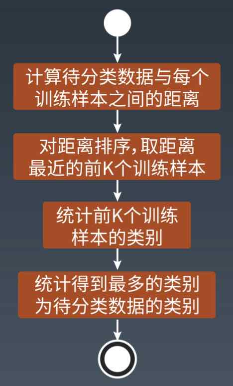
</div>


### 贝叶斯分类算法

<div align=center>
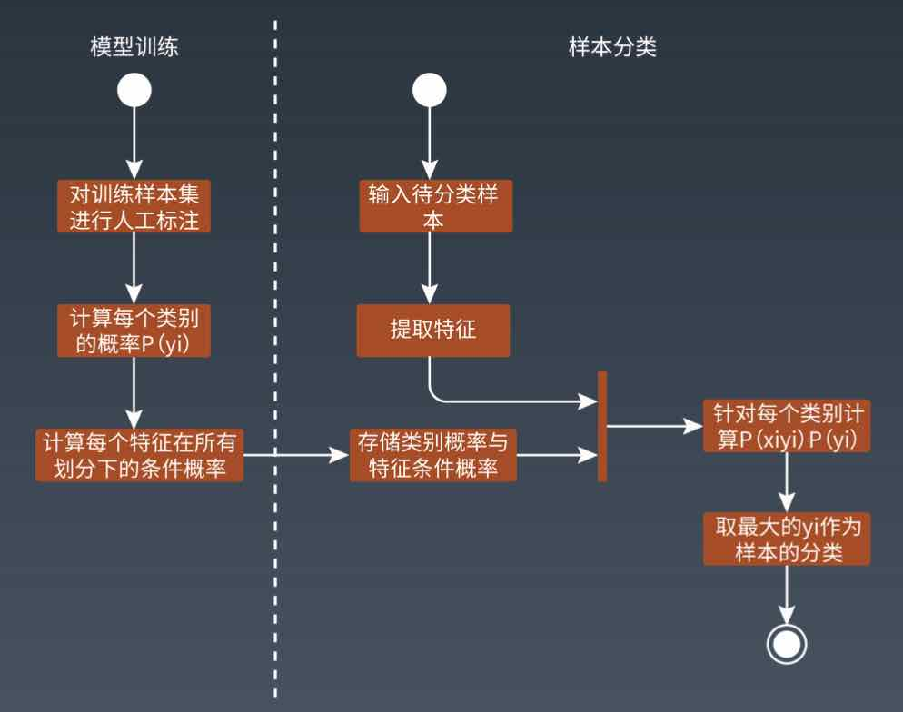
</div>
### K-Means 聚类算法

K均值聚类算法

### 推荐引擎算法

#### 基于人口统计的推荐

<div align=center>
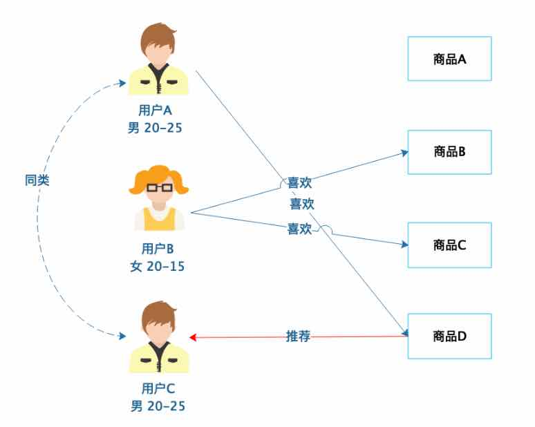
</div>

#### 基于商品属性的推荐

<div align=center>
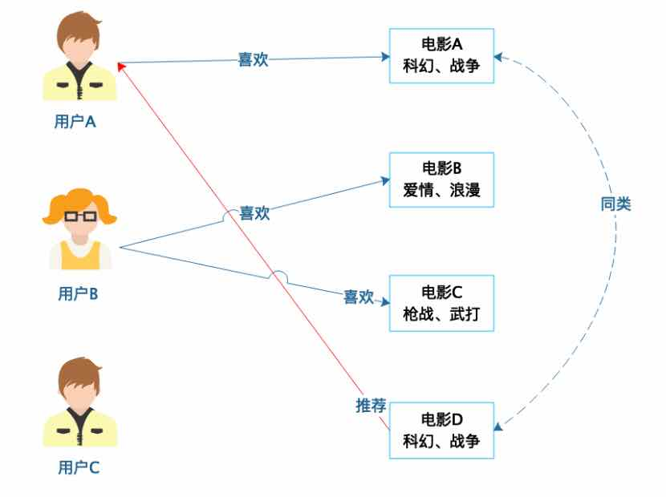
</div>

#### 基于用户的协同过滤推荐

<div align=center>
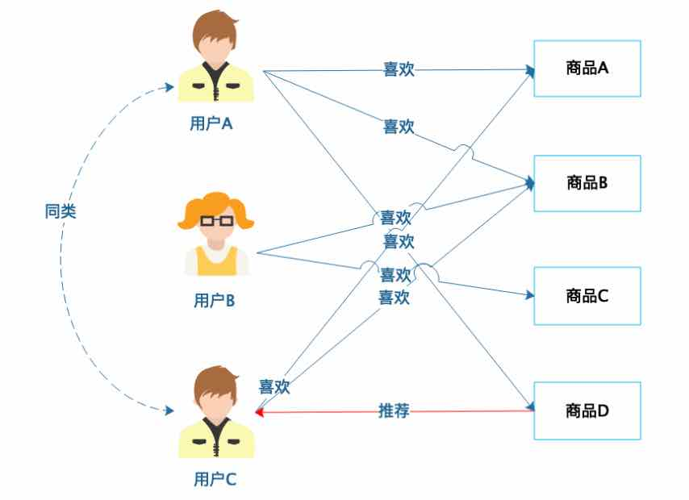
</div>

#### 基于商品的协同过滤推荐

<div align=center>
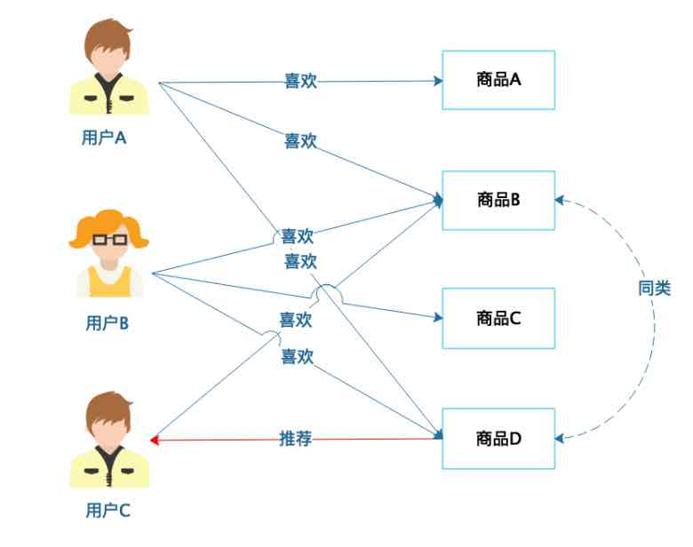
</div>

### 机器学习系统架构

<div align=center>
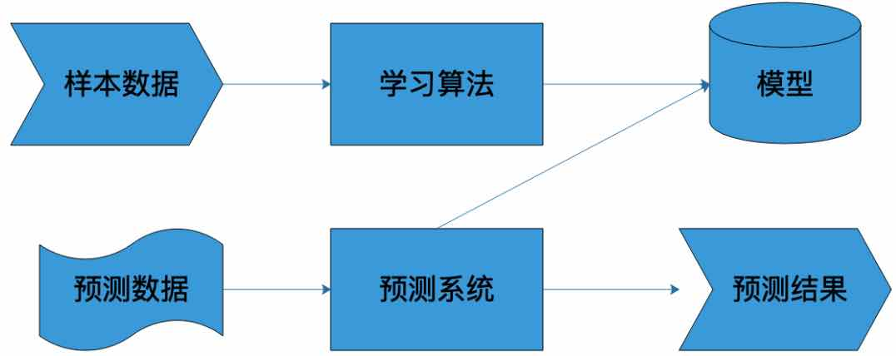
</div>

#### 样本

#### 模型

#### 算法

#### 机器学习的数学原理

#### 感知机

#### 神经网络


## 参考

[推荐引擎初探](https://developer.ibm.com/zh/articles/1103-zhaoct-recommstudy1/)

[分类算法之朴素贝叶斯分类(Naive Bayesian classification)](https://www.cnblogs.com/leoo2sk/archive/2010/09/17/naive-bayesian-classifier.html)

