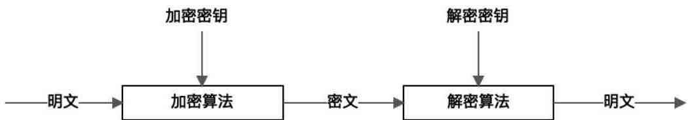

# 14周总结——技术创新

* [大数据平台](#大数据平台)
    * [大数据技术应用的挑战](#大数据技术应用的挑战)
    * [大数据架构](#大数据架构)
    * [数据采集与导入](#数据采集与导入)
    * [数据处理](#数据处理)
    * [数据输出与展示](#数据输出与展示)
    * [大数据平台Lamda架构原理](#大数据平台lamda架构原理)
    * [Sqoop导入/导出数据库数据](#sqoop导入导出数据库数据)
    * [Canal实时导入MySQL数据](#canal实时导入mysql数据)
    * [Flume从日志导入数据](#flume从日志导入数据)
      * [Flume级联部署](#flume级联部署)
      * [Flume分布式部署](#flume分布式部署)
    * [前端埋点采集数据](#前端埋点采集数据)
    * [网络爬虫收集外部数据](#网络爬虫收集外部数据)
    * [淘宝大数据平台](#淘宝大数据平台)
      * [淘宝大数据平台导入/导出数据](#淘宝大数据平台导入导出数据)
    * [美团大数据平台](#美团大数据平台)
    * [滴滴实时 大数据平台](#滴滴实时-大数据平台)
* [物联网平台](#物联网平台)
    * [物联网平台架构](#物联网平台架构)
    * [物联网大数据处理](#物联网大数据处理)
* [区块链](#区块链)
    * [为什么是比特币造就了区块链技术？](#为什么是比特币造就了区块链技术)
      * [货币起源 -&gt; 通货膨胀](#货币起源---通货膨胀)
      * [数字货币的挑战](#数字货币的挑战)
    * [区块链技术用什么办法，解决了什么问题？](#区块链技术用什么办法解决了什么问题)
      * [交易](#交易)
      * [区块链](#区块链-1)
      * [工作量证明](#工作量证明)
      * [矿工](#矿工)
    * [区块链技术有什么用？](#区块链技术有什么用)
      * [以太坊（Ethereum）](#以太坊ethereum)
      * [Facebook的数字货币Libra](#facebook的数字货币libra)
      * [联盟链技术HyperLedger](#联盟链技术hyperledger)
      * [以太坊 vs 联盟链](#以太坊-vs-联盟链)

## 大数据平台

### 大数据技术应用的挑战

大数据计算的海量分布式计算方案，必然导致计算速度不是很快，即使在一个规模不大的数据集上进行一次简单的计算，MapReduce也可能需要几分钟，Spark快一点，也至少需要数秒的时间。

互联网产品处理用户请求，通常需要毫秒级的响应，也就是说，要在1秒内完成计算，大数据计算必然不能实现这样的响应要求。但是互联网应用有需要使用大数据，实现统计分析、数据挖掘、关联推荐、用户画像等一系列功能。

那如何才能弥补互联网和大数据之间的差异呢？

### 大数据架构

### 数据采集与导入

将应用程序产生的数据和日志等同步到大数据系统中，由于数据源不同，这里的数据同步系统实际上是多个相关系统的组合。数据库同步通常用Sqoop，日志同步可以选择Flume，打点采集的数据经过格式化转换后通过Kafka等消息队列进行传递。

不同的数据源产生的数据质量可能差别很大，数据库的数据也许可以直接导入大数据系统就可以使用了，而日志和爬虫产生的数据就需要进行大量的清洗、转化处理才能有效使用。

### 数据处理

这部分是大数据存储与计算的核心，数据同步系统导入的数据存储在HDFS。MapReduce、Hive、Spark等计算任务读取HDFS上的数据进行计算，再将计算结果写入HDFS。

MapReduce、Hive、Spark等进行的计算处理被称作是离线计算，HDFS存储的数据被称为离线数据。在大数据系统上进行的离线计算通常是针对全体数据，比如针对历史上所有订单进行商品关联性挖掘，这时候数据规模非常大，需要较长的运行时间，这类计算就是离线计算。

除了离线计算，还有一些场景，数据规模也比较大，但是要求处理的时间却比较短。比如淘宝要统计每秒产生的订单数，以便进行监控和宣传。这种场景被称为大数据流式计算，通常用Storm、Spark Streaming等流式大数据引擎来完成，可以在秒级甚至毫秒级时间内完成计算。

### 数据输出与展示

大数据计算产生的数据写入到HDFS中，但应用程序可不能到HDFS中读取数据，所以必须要将HDFS中的数据导出到数据库中。数据同步导出相对比较容易，计算产生的数据都比较规范，稍作处理就可以用Sqoop之类的系统导出到数据库。

这样，应用程序就可以直接访问数据库中的数据，实时展示给用户，比如展示给用户关联推荐的商品。淘宝卖家的量子魔方之类的产品，其数据都来自大数据计算产生的。

除了给用户访问提高数据，大数据还需要给运营和决策层提供各种统计报告，这些数据也写入数据库，被相应的后台运营和管理人员访问，查看数据报表，看业务是否正常。

### 大数据平台Lamda架构原理

### Sqoop导入/导出数据库数据

### Canal实时导入MySQL数据

### Flume从日志导入数据

#### Flume级联部署

#### Flume分布式部署

### 前端埋点采集数据

### 网络爬虫收集外部数据

### 淘宝大数据平台

#### 淘宝大数据平台导入/导出数据

### 美团大数据平台

### 滴滴实时 大数据平台

## 物联网平台

### 物联网平台架构

### 物联网大数据处理

## 区块链

### 为什么是比特币造就了区块链技术？

#### 货币起源 -> 通货膨胀

#### 数字货币的挑战

数字货币的发行不是问题，问题是如何保证数字货币安全，获得信任

- 如何相信数字货币是有价值的，即发行安全
- 如何相信货币交易是安全的

比特币的解决方案

- 构建一个无中心，去信任的交易系统
- 《比特币：一个点对点的电子现金系统》

### 区块链技术用什么办法，解决了什么问题？

#### 交易

记账者可以使用发起者的公钥对签名进行验证，保证交易是真正发起者提交的，而不是其他人伪造的交易

#### 区块链

将交易放入区块，将区块构成单向链表，即区块链，以避免双花

什么是双花？

#### 工作量证明

比特币要求计算出来的区块Hash值必须具有一定的难度，比如Hash值的前几位必须是0.具体做法是在区块头部引入一个随机数nonce值，记账者通过修改这个nonce值，不断碰撞计算区块Hash值，直到算出的Hash值满足难度要求。

工作量证明可以极大增加区块链伪造的成本，除非发动51%攻击。

#### 矿工

比特币系统为每个计算出区块Hash的记账者赠送一定数量的比特币。这个赠送不是交易，而是凭空从系统中产生的，这其实就是比特币的发行机制。

当“矿工们”为了争夺比特币，争相加入“挖矿”大军时，比特币区块链就变成一个分布式账本了。

矿工为比特币的发行支付了对价，某种程度保证了比特币的价值。

### 区块链技术有什么用？

#### 以太坊（Ethereum）

下一代智能合约和去中心化应用平台

Ethereum是一个平台和一种编程语言，使开发人员能够建立和发布下一代分布式应用。Ethereum可以用来编程、分散、担保和交易任何事物：投票、域名、金融交易所、众筹、公司管理、合同和大部分协议、知识产权、还有得益于硬件集成的智能资产。

#### Facebook的数字货币Libra

Libra是一种稳定币

Libra是一种许可型区块链

#### 联盟链技术HyperLedger

#### 以太坊 vs 联盟链

以太坊应用于企业级开发存在的问题

在准入机制上，使用以太坊构建的区块链网络允许任何节点接入，也意味着区块数据是完全公开的，而大多数企业级的应用场景则要求仅联盟成员可以接入网络，非成员拒绝入网，并且数据也仅供联盟成员访问，对非联盟成员保密。

在共识算法上，以太坊使用工作量证明（PoW）的方式对区块打包进行算力证明，除非恶意节点获取了以太坊整个网络51%的计算能力，否则无法篡改伪造区块数据，保证区块数据安全可靠。但是工作量证明需要花费巨大的计算资源进行算力证明，造成算力极大浪费，也影响了区块链的交易吞吐能力。联盟链场景下，由于各个参与节点是经过联盟认证的，背后有实体组织背书，所以在区块打包的时候不需要进行工作量证明，大大减少算力浪费，提高交易吞吐能力。

在区块链运维管理上，以太坊作为公有链，节点之间通过P2P协议自动组网，无需运维管理。而联盟链需要对联盟成员进行管理，对哪些节点可以被授权打包区块也需要进行管理，以保证联盟链的有效运行。

