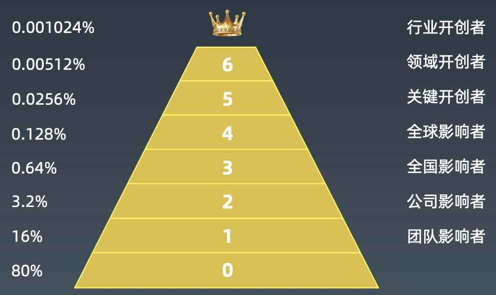
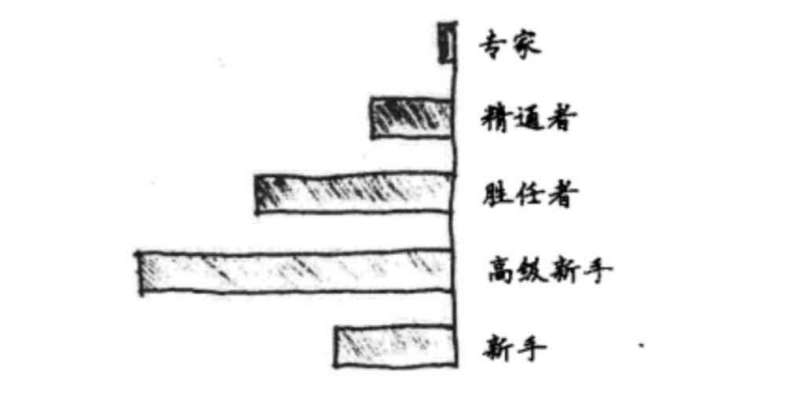

# 15周总结——技术管理

* [如何成为专家？](#如何成为专家)
    * [技术等级体系](#技术等级体系)
    * [德雷福斯模型](#德雷福斯模型)
      * [德雷福斯模型的启示](#德雷福斯模型的启示)
    * [如何在工作中成长，成为技术专家](#如何在工作中成长成为技术专家)
    * [最重要的是在工作中实践](#最重要的是在工作中实践)
    * [彼得定律](#彼得定律)
* [软件开发技术的第一性原理](#软件开发技术的第一性原理)
* [架构师的三板斧](#架构师的三板斧)
    * [设计文档](#设计文档)
    * [设计模式](#设计模式)
    * [架构模式](#架构模式)
      * [分布式架构](#分布式架构)
      * [微服务架构](#微服务架构)
      * [大数据架构](#大数据架构)
* [发现问题的真正所在](#发现问题的真正所在)
    * [问题发行模式](#问题发行模式)
    * [问题提出模式](#问题提出模式)
    * [问题解决模式](#问题解决模式)
* [技术领导者的7种武器](#技术领导者的7种武器)
    * [交际](#交际)
    * [情景](#情景)
    * [目标](#目标)
    * [资源](#资源)
    * [评估](#评估)
    * [导师](#导师)
    * [赞美](#赞美)
* [架构师之道](#架构师之道)

## 如何成为专家？

### 技术等级体系

### 德雷福斯模型

#### 德雷福斯模型的启示

- 一个人不会因为工作经验增加就自动成为专家，只有非常少的人能成为专家

- 专家不一定做得更好，但是一定做得更轻松

- 大部分人终其一生停留在高级新手阶段，而阻碍他继续发展的一个重要原因就是：他不知道自己是一个高级新手。

### 如何在工作中成长，成为技术专家

- 勇于承担责任，在悬崖边思考

- 在实践中保持技能，1万小时定律

- 警惕银弹陷阱，关注问题场景

### 最重要的是在工作中实践

- 工作任务要明确，具体产出是什么？结果如何衡量？用OKR管理工作目标
- 工作任务要有适当难度，摘跳起来够的着的苹果
- 任务过程中积极接受各种反馈，针对反馈采取行动
- 允许自己犯错误

### 彼得定律

在一个成熟有效的组织中，当一个员工在其岗位能够出色完成工作，就会得到晋升，被提拔到更高一级的职位。如果这个职位，他能够继续出色完成工作，就会继续得到晋升，直到他晋升到某个职位以后，无法出色完成工作为止。

结论：在一个层级组织中，每个员工都会趋向于晋升到他所不能够胜任的职位。

推论：一个成熟的组织中，所有的职位都被不能够胜任他的人承担着

当一个人位于他不能胜任的职位时，他必须投入全部的精力才能有效完成工作，这个职位也就被称作这个人的彼得高地。一个处于彼得高地的人，精疲力尽于他手头的工作，就无法再进行进一步的思考和学习，他的个人能力提升和职业进步都将止于此。

## 软件开发技术的第一性原理

用第一性原理分析一个新技术的来龙去脉

- 这个技术的核心关键点是什么？要解决的问题是什么？
- 过往有没有类似的技术？核心设计是否想通？
- 这些问题是应该使用何种模式解决？

不要去学习软件如何使用，而是去猜测软件如何设计

- 5分钟阅读Hello World级的文档恶化Demo
- 30分钟做个Hello World，体验一下
- 2个小时阅读关键设计文档和代码
- 如果我来开发这个软件，将如何设计、关键技术点如何处理？

## 架构师的三板斧

### 设计文档

没有软件设计文档没有软件设计

- 让自己停一下，思考下软件的设计，有没有更好的方案
- 给软件开发的合作者、维护者提供一些必要资料

UML软件建模设计

- 部署图：描述系统整体蓝图
- 组件图：描述系统模块关系
- 类图：关键类的设计和领域模型
- 用例图：功能与场景
- 活动图/泳道图：逻辑与流程
- 时序图：参与对象之间的调用关系
- 状态图：复杂对象的状态变迁

### 设计模式

低耦合、高内聚：软件设计的核心驱动力和目标

设计原则：SOLID - 开闭、依赖倒置、李氏置换、单一职责、接口隔离

设计模式：工厂、适配器、策略、观察者、组合、模板方法、装饰

开发框架：Spring、Mybatis、反应式

### 架构模式

#### 分布式架构

- 分布式缓存、消息队列、负载均衡
- 分布式关系数据库、NoSQL、搜索引擎
- 分布式一致性ZooKeeper

#### 微服务架构

- 领域区域设计、服务复用与中台化
- 微服务框架与RPC

#### 大数据架构

- 大数据平台架构
- 数据采集与分析
- 数据推荐与智能化

## 发现问题的真正所在

《你的灯亮着吗？》

### 问题发行模式

- 人们经常会把解决方案当作问题的定义，而解决方案往往来自口才最好的那个人（或者最有权威的那个人）。

- 绝大多数人只知道自己要执行的解决方案，而不知道自己面对的问题是什么 。

- 问题 = 期望 - 体验

  处理关系优先于解决问题。

- 大多数的问题被人们的适应能力忽略掉了，直到有人解决了这些问题。

### 问题提出模式

- 如果某人能够解决问题，而他自己却感受不到问题，那么就让他感受一下。

- 如果想解决一个问题，试试“让情况变得更糟”

- 把“我的问题”表述成“我们的问题”

- 给上司提封闭式问题，给下属提开放式问题

- 直言**有**讳

- 批评而不是责难，对事不对人

### 问题解决模式

- 你没有解决问题，你只是用另一个问题代替这个问题。

- 解决问题之前先想想这是谁的问题，你要取悦谁？

- 许多时候你不需要提出解决方案，你只要提醒问题的存在。

- 以赞成的方式表示反对。
- 把“我的问题”变成“你的问题”
- 把“他的问题”变成“我的问题”
- 适当的逃避问题（这个idea非常好，让我们组织一个会议好好讨论一下）
- 如果你不填写老师想要的答案，你就是个傻瓜（一个管理者想要什么样的下属，就会带出什么样的下属）
- 如果明天早上所有困扰你的问题都消失了，你打算干什么？

**问题不重要，未来才重要！**

聚焦目标，而不是问题，不是所有问题都需要解决，不是所有问题都要分析清楚才能解决。

关注问题解决后发生什么，不要关注问题如何发生的

多问自己：我到底想要什么；少问自己：我究竟有什问题。

## 技术领导者的7种武器

### 交际

创建舒适的工作环境，让员工有更好的积极性、创造性去解决问题

### 情景

调节员工情绪，让员工从积极角度看问题，找到合理的解决方案

### 目标

帮员工把目标分解成一个个动作，让目标清晰有效

- 没有目标，就无法成功
- 给员工设定的目标必须有效

### 资源

调用你的资源，帮员工解决问题，达到目标

### 评估

让员工对工作进度做自我评估，自己找到完成剩余工作的方法

### 导师

引导员工向前看，少问为什么，多问怎么办

### 赞美

赞美员工的某个行为，而不是泛泛赞美

- 多数时候，赞美并不充足
- 赞美不是奉承
- 赞美与批评并不矛盾

## 架构师之道

一个杰出的架构师，团队几乎感觉不出他的存在

次一点的架构师，大家都爱戴他

再次一点的，大家都怕他

而最糟糕的，大家都鄙视他

架构师任事物按照自身的规律发展

他让自己的行为符合事物的本质

同时他又跳出束缚

让他的设计照亮自己

架构师用心旁观这个世界，

而他坚信他内心的映像。

他的心像天空一样开阔，

任世相万物来来往往。

优秀的架构师不会夸夸其谈，

他只是做。

当任务完成的时候，

整个团队都会说：“天哪，我们居然做到了，全都是我们自己做的！”

架构师的权力是这样的：

他让事物自然发展，毫不费力，也不强求。

他从不失望，他的精神也就不会衰老。

优秀架构师乐于用一个例子说明想法，而不是强加他的意愿。

他会指出问题而不是戳穿它们。

他是坦率的，也是柔顺的。

他的眼睛闪着锋芒，却依然温和。

如果你想成为一个杰出的领导，就不要去试图控制什么。

带着一个弹性的计划和概念推进，团队会管好他们自己。

你越是强加禁令，队伍越是没有纪律。

你越是强制，大家越是没有安全感。

你越是从外面寻求帮助，团队越是不能独立自主。

